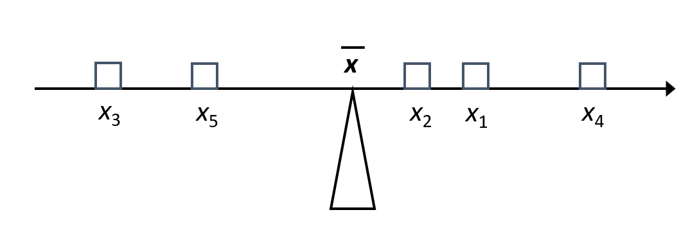
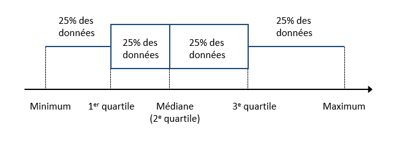

```{r setup, include=FALSE}
knitr::opts_chunk$set(echo = FALSE, message = FALSE,
                      fig.dim = c(8, 5))
library(tidyverse)
library(cowplot)
theme_set(
  theme_cowplot(font_size = 18) +
    theme(panel.background = element_rect(fill = "#fafafa"),
          plot.background = element_rect(fill = "#fafafa"))
)
set.seed(7102)
```


# Objectifs

- Décrire le rôle des statistiques dans la méthode scientifique.

- Connaître les types de données couramment utilisés en statistiques.

- Choisir des statistiques sommaires et des représentations graphiques appropriées pour différentes questions et différents types de données.

---

class: inverse, middle, center

# Rôle des statistiques

---

# Question

Quels sont des exemples de problèmes où nous devons faire appel aux statistiques ?

---

# Importance des statistiques

- Systèmes complexes

    + Plusieurs types d'entités / individus qui interagissent
    + Chaînes de cause à effet, rétroaction, etc.
    
--

- Variation entre individus

--

- Observations incomplètes

    + Nombre limité de variables
    + Nombre limité d'individus (échantillonnage)
    + Erreurs d'observation

---

# Méthode scientifique

.center[]

---

# Méthode scientifique

En pratique...

- Chaque étude scientifique ne contient pas toutes les étapes des la méthode scientifique classique.

--

- Toutes les questions scientifiques ne sont pas des tests d'hypothèse, par exemple:
    + Combien y a-t-il d'espèces d'oiseaux uniques à cette région?
    + Quelle est l'aire de répartition du pin gris? Comment sera-t-elle modifiée par les changements climatiques au 21e siècle?

---

# Rôles des statistiques

- *Décrire* les caractéristiques sommaires d'un ensemble de données.

--

- À partir de mesures prises sur un échantillon d'individus, *estimer* les caractéristiques d'une variable, ou d'une relation entre variables, au niveau de la population.

--

- *Tester* une hypothèse portant sur ces variables ou relations entre variables.

--

- *Prédire* la valeur d'une variable pour un nouvel individu hors de l'échantillon.

---

# Exemples

- Quel est le diamètre moyen des arbres mesurés dans une parcelle?

--

- Combien y a-t-il d’orignaux dans le Parc de la Vérendrye? 

--

    + La population est-elle en croissance par rapport à l’année précédente?
    
--

    + Quelle sera la population dans 10 ans? 
    
--

Les trois dernières tâches (estimation, test d'hypothèse et prédiction) demandent de généraliser les connaissances acquises à partir d'un nombre limité d'observations.

---

class: inverse, middle, center

# Statistiques descriptives

---

# Exemple

Arbres sur des parcelles de 20m x 20m au Parc national de Kejimkujik (Nouvelle-Écosse) 

```{r apercu_donnees}
kejim <- read.csv("../donnees/cours1_kejimkujik.csv")
head(kejim)
```

- *num_arbre* est le numéro d'identification de l'arbre.
- *nb_tiges* est le nombre de tiges.
- *dhp* est le diamètre à hauteur de poitrine en cm.

---

# Types de données

## Variables numériques

- Continues: Nombre infini de valeurs possibles dans un intervalle  (ex. diamètre).

--
    
- Discrètes: Seulement certaines valeurs numériques possibles dans un intervalle, généralement des nombres entiers (ex.: année, nombre de tiges).

---

# Types de données
    
## Variables catégorielles

- Nominales: Catégories sans ordre établi (ex. site, espèce).

--

- Ordinales: Catégories ordonnées (ex. classe de drainage: xérique, mésique, hydrique).

--

En quoi une variable ordinale diffère-t-elle d'une variable numérique discrète?
    
---

class: inverse, middle, center

# Visualiser la distribution d'une variable catégorielle

---

# Graphique à barres

```{r bar_espece, warning = FALSE}
compte_esp <- group_by(kejim, espece) %>%
    summarize(compte = n()) %>%
    mutate(espece = reorder(espece, compte))
ggplot(compte_esp, aes(x = espece, y = compte)) +
    geom_col(fill = "darkblue") +
    scale_y_continuous(expand = c(0, 0)) +
    coord_flip()
```

---

# Graphique circulaire (*pie chart*)

```{r circ_espece, fig.dim = c(7, 5)}
compte_esp5 <- kejim %>%
    mutate(espece = ifelse(espece %in% c("TSCA", "ACRU", "PIST", "BEPA", "PIRU"), 
                           espece, "Autres")) %>%
    group_by(espece) %>%
    summarize(compte = n()) %>%
    mutate(espece = factor(espece, 
                  levels = c("TSCA", "ACRU", "PIST", "BEPA", "PIRU", "Autres")))

ggplot(compte_esp5, aes(x = factor(1), y = compte, fill = espece)) +
    geom_col(position = position_stack(), color = "white") +
    coord_polar(theta = "y") +
    theme(axis.line = element_blank(), axis.title = element_blank(), 
          axis.text = element_blank())

```
    
--

Quels sont les avantages et inconvénients de ces deux types de graphiques?

---

# Distribution d'une variable catégorielle

- Visuellement, il est plus facile de comparer des longueurs que des surfaces.

- Le graphique circulaire est utile dans des cas très spécifiques, ex.: comparer des proportions à des fractions simples (1/2, 1/4, etc.).

--

- Pour une variable nominale, ordonner les valeurs d'après leur fréquence. Pour une variable ordinale, suivre l'ordre des valeurs de la variable.

---

class: inverse, middle, center

# Visualiser la distribution d'une variable numérique continue

---

# Histogramme

Obtenu en comptant le nombre d'observations dans des intervalles de taille égale sur l'axe de la variable observée.

```{r histo_dhp, warning = FALSE}
dhp_histo <- ggplot(kejim, aes(x = dhp)) +
    geom_histogram(color = "white", fill = "darkblue", binwidth = 5) +
    scale_x_continuous(expand = c(0, 0), breaks = seq(0, 90, 10),
                       limits = c(0, 90)) +
    scale_y_continuous(expand = c(0, 0))
dhp_histo
```

---

# Histogramme

Obtenu en comptant le nombre d'observations dans des intervalles de taille égale sur l'axe de la variable observée.

- Quelles propriétés de la distribution du DHP apparaissent clairement dans le graphique précédent?

--

- Attention: L'apparence de la distribution dépend du choix de la taille de l'intervalle (*bin width*), donc il est important de tester plusieurs valeurs.

---

# Graphique de densité

Estime la densité de probabilité (probabilité par unité sur l'axe des *x*) pour une variable continue.

```{r dens_dhp}
ggplot(kejim, aes(x = dhp)) +
    geom_density(color = "orange", fill = "orange", alpha = 0.4) +
    scale_x_continuous(breaks = seq(0, 90, 10)) +
    scale_y_continuous(expand = c(0, 0))
```

---

class: inverse, middle, center

# Statistiques sommaires d'une variable numérique

---

# Moyenne

Prenons une série de données $x_1$, $x_2$, ..., $x_n$ provenant de $n$ observations d'une variable $x$.

--

La moyenne de $x$ est notée $\bar{x}$ et définie comme:

$$\bar{x} = \frac{x_1 + x_2 + ... + x_n}{n} = \frac{\sum_{i = 1}^{n} x_i}{n}$$

---

# Moyenne

La moyenne constitue le "centre de gravité" d'une distribution.

.center[]

---

# Écart à la moyenne

.center[]

La somme des écarts à la moyenne est égale à zéro.

---

# Variance

La moyenne du *carré* des écarts à la moyenne est la variance, une mesure de la dispersion des données.

$$\sigma_x^2 = \frac{\sum_{i = 1}^{n} (x_i - \bar{x})^2}{n}$$

---

# Écart-type

La racine carrée de la variance, ou *écart-type*, a l'avantage d'avoir les même unités que les données originales (ex.: cm plutôt que cm<sup>2</sup>).

$$\sigma_x = \sqrt{\frac{\sum_{i = 1}^{n} (x_i - \bar{x})^2}{n}}$$
--

**Note**: Lorsqu'on veut estimer la variance ou l'écart-type d'une population à partir d'un échantillon, on divise par $n-1$ plutôt que $n$. Plus de détails au prochain cours.

---

# Visualiser la moyenne et l'écart-type

```{r histo_moy_dhp, fig.dim = c(7, 5), warning = FALSE}
dhp_histo_moy <- ggplot(kejim, aes(x = dhp)) +
    geom_histogram(color = "white", fill = "darkblue", binwidth = 5) +
    geom_point(x = mean(kejim$dhp), y = 100, color = "orange", size = 4) +
    geom_segment(x = mean(kejim$dhp) - sd(kejim$dhp), y = 100,
         xend = mean(kejim$dhp) + sd(kejim$dhp), yend = 100, color = "orange", size = 2) +
    scale_x_continuous(expand = c(0, 0), breaks = seq(0, 90, 10),
                       limits = c(0, 90)) +
    scale_y_continuous(expand = c(0, 0))
dhp_histo_moy
```

--

La moyenne et l'écart-type ne nous indiquent pas que la distribution est asymétrique.

---

# Statistiques de rang

Basées sur la position des observations classées en ordre croissant (leur rang)

--

- Minimum et maximum

--

- Médiane: plus grande que la moitié des observations et plus petite que l'autre moitié.

--

- Quantiles: divisent les données en $m$ groupes contenant le même nombre d'observations.

    + Exemples: quartiles si $m$ = 4, quintiles si $m$ = 5, centiles si $m$ = 100.

---

# Boîte à moustaches (*boxplot*)

Représentation graphique basée sur les quartiles



--

La distance entre les 1er et 3e quartiles se nomme écart interquartile (*interquartile range* ou IQR).

---

# Boîte à moustaches (*boxplot*)

```{r boxplot_dhp, fig.dim = c(8, 4)}
dhp_boxplot <- ggplot(kejim, aes(x = 0, y = dhp)) +
    geom_boxplot(fill = "grey70", width = 0.1) +
    labs(x = "") +
    scale_y_continuous(limits = c(0, 90), expand = c(0, 0), breaks = seq(0, 90, 10)) +
    coord_flip() +
    theme(axis.text.y = element_blank(), axis.line.y = element_blank(),
          axis.ticks.y = element_blank())
dhp_boxplot + scale_x_continuous(limits = c(-0.1, 0.2))
```

--

- Les valeurs extrêmes sont souvent représentées par des points à l'extérieur de la moustache. (Critère de Tukey: Valeur à 1.5 IQR du 1er ou 3e quartile.)

---

# Histogramme et boîte à moustaches

```{r histo_boxplot, fig.dim = c(7, 5), warning = FALSE}
plot_grid(dhp_histo_moy, dhp_boxplot + theme_nothing(), 
          rel_heights = c(0.8, 0.2), align = "v", ncol = 1)
```

---

# Sensibilité aux valeurs extrêmes

```{r val_extr, fig.dim = c(7, 5), warning = FALSE}
kejim_max65 <- filter(kejim, dhp <= 65)
dhp_nonextr_histo <- ggplot(kejim_max65, aes(x = dhp)) +
    geom_histogram(color = "white", fill = "darkblue", binwidth = 5) +
    geom_point(x = mean(kejim_max65$dhp), y = 100, color = "orange", size = 4) +
    geom_segment(x = mean(kejim_max65$dhp) - sd(kejim_max65$dhp), y = 100,
                 xend = mean(kejim_max65$dhp) + sd(kejim_max65$dhp), yend = 100, 
                 color = "orange", size = 2) +
    scale_x_continuous(expand = c(0, 0), breaks = seq(0, 90, 10),
                       limits = c(0, 90)) +
    scale_y_continuous(expand = c(0, 0))

dhp_nonextr_boxplot <- ggplot(kejim_max65, aes(x = 0, y = dhp)) +
    geom_boxplot(fill = "grey70", width = 0.1) +
    labs(x = "") +
    scale_y_continuous(limits = c(0, 90), expand = c(0, 0), breaks = seq(0, 90, 10)) +
    coord_flip() +
    theme(axis.text.y = element_blank(), axis.line.y = element_blank(),
          axis.ticks.y = element_blank())

plot_grid(dhp_nonextr_histo, dhp_nonextr_boxplot + theme_nothing(), 
          rel_heights = c(0.8, 0.2), align = "v", ncol = 1)
```

--

L'exclusion de 18 arbres à dhp > 65 cm affecte davantage la moyenne (-4%) 
et l'écart-type (-16%) que la médiane (-1%) et l'écart interquartile (-2%).

---

# Comparer plusieurs distributions

```{r box_mult}
ggplot(filter(kejim, espece %in% c("PIRU", "BEPA", "PIST", "ACRU", "TSCA")), 
              aes(x = espece, y = dhp)) +
    geom_boxplot(fill = "grey70")
```

--

Comment pourrait-on améliorer ce graphique ?

---

# Comparer plusieurs distributions

```{r box_mult2}
kejim_sub <- filter(kejim, espece %in% c("PIRU", "BEPA", "PIST", "ACRU", "TSCA")) %>%
    mutate(espece = reorder(espece, dhp, FUN = function(x) -median(x)))

ggplot(kejim_sub, aes(x = espece, y = dhp)) +
    labs(x = "", y = "Diamètre à hauteur de poitrine (cm)") +
    geom_boxplot(fill = "grey70") +
    scale_x_discrete(labels = c("Bouleau blanc", "Pin blanc", "Pruche du Canada",
                                "Érable rouge", "Épinette rouge")) +
    coord_flip()
```

---

# Résumé: Variables numériques

- Visualiser la distribution: boîte à moustaches, histogramme, graphique de densité

--

- Mesures de tendance centrale: médiane, moyenne

--

- Mesures de dispersion: étendue (max - min), écart interquartile, écart-type

--

- Pour des séries de données à différentes échelles, on peut comparer la dispersion relative en calculant le *coefficient de variation* (ratio de l'écart-type sur la moyenne, souvent exprimé en %).

---

# Résumé: Variables catégorielles

- Visualiser la distribution: graphique à barres.

--

- Variable nominale: Comme tendance centrale, on peut seulement définir le *mode* (valeur la plus commune). 

--

- Variable ordinale: Puisque les catégories sont ordonnées, on peut aussi définir la valeur médiane.

---

class: inverse, middle, center

# Relation entre deux variables numériques

---

# Nuage de points

### Exemple 

Jeux de données sur le sommeil de 83 mammifères, provenant de l'étude de Savage et West (2004) et inclus avec le package *ggplot2* dans R.

```{r nuage_point, fig.dim = c(7, 5)}
data(msleep)

nuage_pts <- ggplot(msleep, aes(x = log(bodywt), y = sleep_total)) +
    geom_point() +
    labs(x = "Logarithme de la masse corporelle", y = "Heures de sommeil")
nuage_pts
```

---

# Covariance

- Prenons deux variables $x$ et $y$ mesurées sur les mêmes unités d'observation.

- On se souvient que la variance est la moyenne du carré des écarts à la moyenne d'une variable.

$$\sigma_x^2 = \frac{\sum_{i = 1}^{n} (x_i - \bar{x})^2}{n}$$

--

- La covariance est la moyenne du produit des écarts de $x$ et $y$ à leur moyenne respective.

$$\sigma_{xy} = \frac{\sum_{i = 1}^{n} (x_i - \bar{x}) (y_i - \bar{y})}{n}$$

---

# Covariance

$$\sigma_{xy} = \frac{\sum_{i = 1}^{n} (x_i - \bar{x}) (y_i - \bar{y})}{n}$$

- Lorsque les variables tendent à être simultanément au-dessus (ou sous) leur moyenne, la covariance est positive. Lorsque les écarts tendent à être de signe opposé, la covariance est négative.

---

# Corrélation

- Il est pratique de normaliser la covariance en la divisant par le produit des écarts-type. Le résultat est le coefficient de corrélation de Pearson.

$$\rho_{xy} = \frac{\sigma_{xy}}{\sigma_x \sigma_y}$$ 

- Le coefficient de corrélation a l'avantage d'être toujours compris entre -1 et 1.

---

# Corrélation

- Le coefficient de corrélation de Pearson mesure l'association *linéaire* entre deux variables. Une relation linéaire exacte a une corrélation de 1 (si positive) ou -1 (si négative).

--

- Deux variables sont dites *indépendantes* si connaître l'une n'apporte aucune information sur l'autre.

--

- Pour deux variables indépendantes, la corrélation est zéro. Cependant, l'inverse n'est pas nécessairement le cas.

---

# Corrélation

Coefficients de corrélation pour différents nuages de points.


.font70[Source: Wikipédia]

---

# Corrélation

Dans notre exemple, la corrélation entre les heures de sommeil et la masse corporelle des mammifères est de -0.57.

```{r nuage_point2}
nuage_pts
```

---

# Analyse initiale des données

- Visualiser les données avant de modéliser.

--

Pour les variables catégorielles:

- Combien de catégories y a-t-il? 
- Certaines catégories sont-elles très rares?

--

Pour les variables numériques:

- Quelle est l'étendue des valeurs? 
- La distribution est-elle fortement asymétrique? 
- Y a-t-il des valeurs extrêmes? 

---

# Analyse initiale des données

Pour tous les types de variables:

- Y a-t-il des valeurs manquantes et combien?
- Y a-t-il des valeurs implausibles qui pourraient être des erreurs? 

---

# Références

Manuels en-ligne sur la visualisation des données: 

- Healy, K. *Data Visualization: A practical introduction*. [https://socviz.co/](https://socviz.co/)
(aussi disponible en format papier à la bibliothèque de l'UQAT)

- Wilke, C.O. *Fundamentals of Data Visualization*. [https://clauswilke.com/dataviz/](https://clauswilke.com/dataviz/)