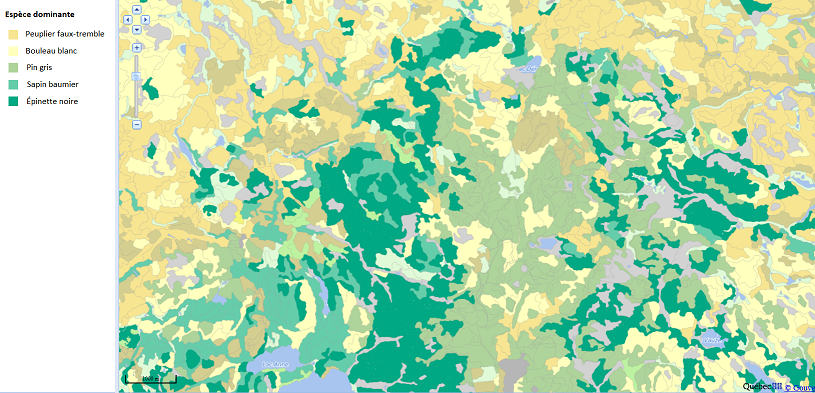
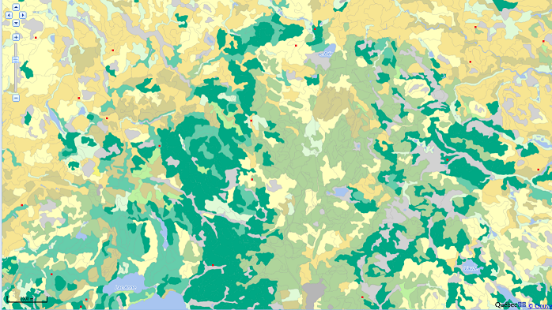

```{r setup, include=FALSE}
knitr::opts_chunk$set(echo = FALSE, message = FALSE,
                      fig.dim = c(8, 5))
library(tidyverse)
library(cowplot)
theme_set(
  theme_cowplot(font_size = 18) +
    theme(panel.background = element_rect(fill = "#fafafa"),
          plot.background = element_rect(fill = "#fafafa"))
)
set.seed(7102)
```

# Objectifs

- Estimer la moyenne et la variance d'une population à partir d'un échantillon.

- Définir le biais et l'erreur-type d'un estimateur.

--

- Calculer les propriétés d'un estimateur en simulant l'échantillonnage.

- Décrire les avantages et inconvénients de différentes méthodes d'échantillonnage.

- Choisir une méthode d'échantillonnage en fonction des caractéristiques de la population à étudier.

---

class: center, inverse, middle

# Estimation de paramètres 

---

# Statistiques, paramètres et estimateurs

- Une *statistique* est une quantité calculée à partir d'observations de variables aléatoires. 

- Un *paramètre* est une caractéristique de la population qui n'est pas mesurée directement.

- Un *estimateur* est une statistique qui vise à estimer un paramètre.

---

# Statistiques, paramètres et estimateurs

## Exemple

Si on mesure le poids d'écureuils roux et qu'on fait la moyenne de ces mesures (une statistique), quel est notre estimé du poids moyen de la population locale d'écureuils roux (un paramètre)? Quelle est sa marge d'erreur? 

---

# Estimation de la moyenne

- On mesure une variable $x$ sur un échantillon aléatoire de taille $n$.

--

- La moyenne de l'échantillon est un estimateur de $\mu$, la moyenne de la population.

$$\bar{x} = \frac{1}{n} \sum_{i = 1}^{n} x_i$$

---

# Simulation d'échantillonnage

Imaginons que les 1161 arbres du tableau de données Kejimkujik représentent la population entière et que nous échantillonnons une partie de ces arbres. 

```{r, echo = TRUE}
kejim <- read.csv("../donnees/cours1_kejimkujik.csv")
dhp <- kejim$dhp
hist(kejim$dhp)
```

---

# Simulation d'échantillonnage

Imaginons que les 1161 arbres du tableau de données Kejimkujik représentent la population entière et que nous échantillonnons une partie de ces arbres. 

Moyenne et écart-type du DHP dans la population:

```{r, echo = TRUE}
c(mean(kejim$dhp), sd(kejim$dhp))
```

---

# Simulation d'échantillonnage

Dans R, la fonction `sample` sert à tirer un échantillon aléatoire des éléments d'un vecteur.

```{r, echo = TRUE}
mean(sample(dhp, 20)) # moyenne d'un échantillon de n = 20 arbres
```

--

La fonction `replicate` permet de répéter la même commande plusieurs fois.

```{r, echo = TRUE}
# le premier argument de replicate donne le nombre de répétitions
replicate(5, mean(sample(dhp, 20)))  
```

---

# Simulation d'échantillonnage

Simulons 10 000 échantillons pour différentes valeurs de $n$.

--

```{r, warning = FALSE}
df <- data.frame(n = c(10, 20, 40)) %>%
    mutate(x = map(n, ~ replicate(1E4, mean(sample(dhp, size = .))))) %>%
    unnest(cols = c(x))

ggplot(df, aes(x = x)) +
     geom_histogram(color = "white") +
     labs(x = "DHP moyen de l'échantillon", y = "Nombre de réplicats") +
     scale_y_continuous(expand = c(0, 0)) +
     facet_wrap(~ n, scales = "free", labeller = function(x) label_both(x, sep = " = ")) +
     theme(strip.background = element_blank(), strip.text = element_text(face = "bold"))
```

---

# Erreur-type de la moyenne

- Prenons une variable $x$ dont la distribution a une moyenne $\mu$ et une variance $\sigma^2$.

--

- On peut démontrer que $\bar{x}$ a une moyenne égale à $\mu$ et une variance égale à $\sigma^2 / n$. 

--

- L'écart-type de $\bar{x}$, qui dans ce contexte se nomme l'*erreur-type* (*standard error*), est donc inversement proportionnel à la racine carrée de $n$:
    
$$\sigma_{\bar{x}} = \frac{\sigma_{x}}{\sqrt{n}}$$

---

# Erreur-type de la moyenne

Moyenne et erreur-type de $\bar{x}$ calculées à partir des 10 000 échantillons.

|  n|  Moyenne (cm)| Erreur-type (cm)| $\sigma / \sqrt{n}$|
|--:|--------:|-----------:|--------:|
| 10|    21.77|        3.86| 3.87|
| 20|    21.76|        2.74| 2.74|
| 40|    21.76|        1.89| 1.94|

--

La moyenne de l'estimateur correspond à la valeur du paramètre $\mu$, donc $\bar{x}$ est un estimateur *non-biaisé* de $\mu$.

---

# Écart-type ou erreur-type

- Écart-type de $x$: mesure la dispersion des valeurs individuelles par rapport à la moyenne.

- Erreur-type de $\bar{x}$: mesure la dispersion de la moyenne d'un échantillon.

--

    + Diminue avec la taille de l'échantillon.
    
    + Ne dépend pas de la taille de la population (sauf si l'échantillon s'en approche).
    
---
    
# Erreur-type en fonction de $n$

```{r echo = FALSE}
ggplot(NULL, aes(x = c(10, 100))) +
    stat_function(fun = function(x) x^(-0.5), geom = "line", size = 1) +
    labs(x = "n", y = expression(1/sqrt(n))) +
    geom_segment(aes(x = 0, xend = 20, y = 1/sqrt(20), yend = 1/sqrt(20)),
                 linetype = "dotted") +
    geom_segment(aes(x = 20, xend = 20, y = 0, yend = 1/sqrt(20)),
                 linetype = "dotted") +
    geom_segment(aes(x = 0, xend = 40, y = 1/sqrt(40), yend = 1/sqrt(40)),
                 linetype = "dotted") +
    geom_segment(aes(x = 40, xend = 40, y = 0, yend = 1/sqrt(40)),
                 linetype = "dotted") +
    geom_segment(aes(x = 0, xend = 80, y = 1/sqrt(80), yend = 1/sqrt(80)),
                 linetype = "dotted") +
    geom_segment(aes(x = 80, xend = 80, y = 0, yend = 1/sqrt(80)),
                 linetype = "dotted") +
    scale_x_continuous(breaks = seq(10, 80, 10), limits = c(0, 90), expand = c(0, 0)) +
    scale_y_continuous(breaks = seq(0, 0.3, 0.05), limits = c(0, 0.35), expand = c(0, 0))
```

---

# Estimation de la variance

$$s^2 = \frac{1}{n} \sum_{i = 1}^n \left( x_i - \bar{x} \right)^2$$

--

- $s^2$ est-il est un bon estimateur de la variance $\sigma^2$?

--

- Comme plus tôt, simulons 10 000 échantillons du vecteur `dhp` avec différentes valeurs de $n$.

---

# Estimation de la variance

Moyenne de $s^2$ et son ratio avec la valeur de $\sigma^2$ pour la population, soit 150.1 cm<sup>2</sup>.

|  n| Moyenne de $s^2$ | Moyenne de $s^2$ / $\sigma^2$ |
|--:|--------:|-----------:|
| 10|    136.3|        0.90|
| 20|    143.1|        0.95|
| 40|    146.6|        0.97|

--

- L'estimateur $s^2$ est biaisé, sous-estime systématiquement la variance.

---

# Estimation de la variance

- L'estimateur est basé sur la moyenne de l'échantillon $\bar{x}$ plutôt que $\mu$.

--

- La sous-estimation correspond exactement au ratio $(n - 1)/n$ et peut donc être corrigée en multiplant $s^2$ par $n/(n-1)$.

$$s^2 = \frac{1}{n - 1} \sum_{i = 1}^n \left( x_i - \bar{x} \right)^2$$

---

# Estimation de l'écart-type

- Pour l'écart-type, on prend la racine carrée de $s^2$.

$$s = \sqrt{\frac{1}{n - 1} \sum_{i = 1}^n \left( x_i - \bar{x} \right)^2}$$

--

- Contrairement à $s^2$, cet estimateur est biaisé, mais on l'utilise quand même.

- Cet estimateur est aussi utilisé pour obtenir l'erreur-type de $\bar{x}$ (égale à $s / \sqrt{n})$. 

---

# Degrés de liberté

Le nombre de degrés de liberté correspond au nombre de données indépendantes utilisées dans le calcul d'une statistique.

--

Autre façon d'expliquer la division par $n - 1$ dans le calcul de $s^2$.

- $s^2$ est calculée à partir des déviations entre chaque observation de $x$ et leur moyenne $(x_i - \bar{x})$.

- La définition de $\bar{x}$ assure que la somme de ces déviations est égale à 0.

- Lorsqu'on connaît les $n - 1$ premières déviations, on peut automatiquement déduire la dernière, qui n'est donc pas une donnée indépendante.

---

# Biais et erreur-type d'un estimateur

- Contexte: On estime un paramètre $\theta$ avec l'estimateur $\hat{\theta}$. 

- L'erreur carrée moyenne correspond à la moyenne des écarts entre l'estimateur et le paramètre. Elle se divise en deux parties.

$$E[(\hat{\theta} - \theta)^2] = E[(\hat{\theta} - E[\hat{\theta}])^2] + (E[\hat{\theta}] - \theta)^2$$

--

- Le premier terme à droite est la variance de l'estimateur (le carré de l'erreur-type).

--

- Le deuxième terme est le carré du biais.

---

# Biais et erreur-type d'un estimateur

- L'erreur-type est due à la taille limitée de l'échantillon et diminue lorsque $n$ augmente. 

--

- Le biais est une erreur systématique qui ne dépend pas de la taille de l'échantillon, mais peut être dû à un estimateur biaisé où à un échantillonnage non représentatif de la population. 

---

# Exercice

Afin d'estimer la densité moyenne du bois de pin gris sur un site, vous échantillonnez d'abord 9 arbres, qui ont une densité moyenne de 450 kg/m<sup>3</sup> avec un écart-type de 90 kg/m<sup>3</sup>. 

(a) Quelle est l'erreur-type de cette moyenne?

(b) Si vous vouliez connaître la moyenne avec une erreur-type d'au plus 10 kg/m<sup>3</sup>, combien d'arbres vous attendez-vous à devoir échantillonner?

---

class: center, inverse, middle

# Méthodes d'échantillonnage

---

# Méthodes d'échantillonnage

- Visent à obtenir un échantillon *représentatif* d'une population pour la variable qu'on souhaite mesurer. 

- Plus une méthode d'échantillonnage nous permet d'estimer une variable précisément pour une quantité de ressources donnée, plus elle est *efficace*.

---

# Exercice

Le chaga (*Inonutus obliquus*) est un champignon parasite du bouleau qu’on retrouve en forêt boréale.


--

Vous devez estimer l'abondance du chaga pour une région de 120 km<sup>2</sup> au nord-ouest de Rouyn-Noranda. Comment disposerez-vous des unités d'échantillonnage (placettes) dans ce territoire?

---

# Carte écoforestière



---

# Échantilonnage aléatoire simple

Chaque individu ou unité d'observation a la même probabilité de faire partie de l'échantillon. 



---

# Échantilonnage aléatoire simple

*Avantages*

- C'est la méthode la plus simple permettant d'obtenir un échantillon représentatif. 

- Elle ne requiert pas de connaissances particulières sur la structure de la population.

--

*Inconvénients*

- Par hasard, les points d'un échantilon donné peuvent être concentrés dans une certaine partie de la population. 

- Comme nous allons le voir, d'autres méthodes peuvent être plus efficaces selon la situation.

---

# Échantillonnage stratifié

- On divise la population ou l'aire d'étude en strates, puis on effectue un échantillonnage aléatoire simple dans chaque strate. 

--

- Si on divise en $m$ strates et qu'on calcule la moyenne de $x$ pour l'échantillon de chaque strate, la moyenne globale de $x$ est la moyenne pondérée:

$$\bar{x} = \sum_{j = 1}^{m} w_j \bar{x}_j$$

---

# Échantillonnage stratifié

- Si on divise en $m$ strates et qu'on calcule la moyenne de $x$ pour l'échantillon de chaque strate, la moyenne globale de $x$ est la moyenne pondérée:

$$\bar{x} = \sum_{j = 1}^{m} w_j \bar{x}_j$$

--

- Son erreur-type est égale à:

$$s_{\bar{x}} = \sqrt{\sum_{j = 1}^{m} w_j^2 \frac{s_j^2}{n_j}}$$

--

- Plus $x$ est homogène dans chaque strate et variable entre les strates, plus l'échantillonnage stratifié sera efficace par rapport à l'échantillonnage aléatoire simple.

---

# Échantillonnage stratifié

*Comment répartir l'échantillon entre les strates?*

--

- On peut échantillonner chaque strate en proportion de son poids $w_j$ dans la population. C'est le choix optimal si la variance de $x$ est identique dans chaque strate.

--

- Si on sait que la variable varie davantage dans certaines strates, on peut sur-échantillonner celles-ci par rapport à leur poids $w_j$.

--

- Si certaines strates sont plus difficiles ou coûteuses à échantillonner, il est possible qu'on doive les sous-échantillonner par rapport à leur poids.

--

- Si on s'intéresse non seulement à la moyenne globale, mais aussi à la moyenne par strate, les plus petites strates peuvent être sur-échantillonnées par rapport à leur poids.

---

# Échantillonnage stratifié

*Avantages*

- Estimation plus efficace lorsque la distribution de la variable mesurée diffère de façon importante entre les strates.

- Avec un échantillon suffisant, on obtient non seulement un bon estimé de la moyenne globale, mais aussi par strate. 

--

*Inconvénients*

- Cette méthode demande une certaine connaissance de la variation de la variable dans la population afin d'établir des strates pertinentes.

- Le résultat peut être biaisé si les poids utilisés ne correspondent pas aux proportions réelles de chaque strate dans la population. 

---

# Échantillonnage systématique

Les points d'échantillonnage sont pris à intervalles réguliers dans l'espace, sur une grille. L'origine de la grille est aléatoire.


---

# Échantillonnage systématique

*Avantages*

- Plus efficace que l'échantillonnage aléatoire simple si la variable est influencée par un gradient spatial.

--

*Désavantages*

- Il n'est parfois pas pratique de placer les points à intervalles réguliers.

- Si on veut une estimation non seulement de la moyenne, mais aussi de la variance de $x$, alors il faut répéter l'échantillonnage systématique avec une autre grille (origine aléatoire différente).

- Plus rarement, si l'habitat varie de façon périodique, ce type d'échantillonnage peut être non représentatif. 

---

# Échantillonnage par grappe

On divise la population ou l'aire d'étude en grappes et on choisit aléatoirement certaines grappes. On peut ensuite choisir un échantillon aléatoire à l'intérieur de ces grappes (multi-stade).


---

# Échantillonnage par grappe

*Avantages*

- Réduit les coûts liés à l'échantillonnage, permettant d'augmenter la taille de l'échantillon pour un budget donné.

--

*Désavantages*

- Échantillonnage moins efficace (estimation moins précise) si la région d'étude est hétérogène. Ce désavantage peut être en partie compensé par l'augmentation de $n$.

---

# Échantillonnage adaptatif

- Utile pour l'échantillonnage d'une espèce rare. 

- Échantillonnage adaptatif par grappes (*adaptive cluster sampling*): On commence par échantillonner une nombre de placettes indépendantes, mais lorsqu'on détecte l'espèce voulue, on poursuit l'échantillonnage avec des placettes adjacentes à celle où l'espèce a été détectée.

--

- Puisque l'échantillonnage est concentré sur les régions où l'espèce est abondante, il faut appliquer une correction statistique (voir références dans les notes de cours).

---

# Résumé

- Un estimateur est biaisé lorsque sa moyenne sur l'ensemble des échantillons possibles diffère de la valeur du paramètre à estimer. 

- L'erreur-type mesure la dispersion d'un estimateur d'un échantillon à l'autre, elle diminue avec la taille de l'échantillon.

---

# Résumé

En plus de l'échantillonnage aléatoire simple, il existe d'autres techniques qui peuvent être plus efficaces dépendamment de la structure de la population / de l'aire d'étude:

- l'échantillonnage stratifié lorsqu'on peut définir des groupes (strates) où la variable mesurée varie grandement d'un groupe à l'autre;

- l'échantillonnage systématique en présence d'un gradient spatial qui a un effet sur la variable mesurée;

- l'échantillonnage par grappe ou multi-stade s'il faut pour des raisons pratiques échantillonner les individus en groupes rapprochés;

- l'échantillonnage adaptatif pour estimer l'abondance d'une espèce rare.
