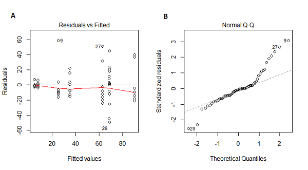

```{r setup, include=FALSE}
knitr::opts_chunk$set(echo = TRUE, fig.dim = c(7, 5))
library(dplyr)
library(ggplot2)
library(cowplot)
```

```{css echo  = FALSE}
.small { font-size: 70% }
```

# Question éclair



Ces graphiques de diagnostic ont été produits à partir du résultat d’une ANOVA comparant une variable réponse en fonction de 8 différents traitements. Qu’est-ce que chaque graphique nous indique sur le respect ou non des suppositions du modèle d’ANOVA?

---

# Objectifs

- Effectuer une analyse de variance à deux facteurs (deux variables catégorielles).

- Déterminer si deux facteurs ont des effets additifs ou une interaction.

- Appliquer l'ANOVA à une expérience réalisée en blocs complets aléatoires.

- Reformuler le modèle d'ANOVA comme modèle de régression linéaire en codant les variables catégorielles au moyen de contrastes.

---

# Rappel: ANOVA à un facteur

$$y_{ik} = \mu + \alpha_i + \epsilon_{ik}$$

$$\epsilon_{ik} \sim N(0, \sigma)$$

- $y_{ik}$ est la réponse de l'individu $k$ du groupe $i$. 
- $\mu$ est la moyenne générale de la réponse.
- $\alpha_i$ est la différence entre la moyenne du groupe $i$ et la moyenne générale.
- $\epsilon_{ik}$ est le résidu, qui suit une distribution normale.

---

# ANOVA à deux facteurs sans interaction

## Exemple

Gain de poids de 48 animaux suivant trois types de régime avec quatre types de supplément. Quatre réplicats pour chacune des 12 combinaisons des deux facteurs.

```{r}
growth <- read.csv("../donnees/growth.csv")
str(growth)
```

---

# ANOVA à deux facteurs sans interaction

## Exemple

```{r, echo = FALSE}
ggplot(growth, aes(x = supplement, y = gain, color = diet)) +
    # position_dodge décale les points de différentes couleurs
    geom_point(position = position_dodge(width = 0.3)) + 
    scale_color_brewer(palette = "Dark2")
```

---

# Modèle d'ANOVA à deux facteurs

Dans ce modèle, les effets sont **additifs**. L'effet combiné d'un régime et d'un supplément est la somme des deux effets pris séparément.

$$y_{ijk} = \mu + \alpha_i + \beta_j + \epsilon_{ijk}$$

--

- $y_{ijk}$ est la réponse de l'individu $k$ suivant le régime $i$ avec le supplément $j$. 

--

- $\alpha_i$ est l'effet du traitement $i$ du facteur A (régime).

--

- $\beta_j$ est l'effet du traitement $j$ du facteur B (supplément).

---

# Estimation des coefficients

- Moyenne générale: $\hat{\mu} = \bar{y}$

- Effet du traitement $i$ du facteur A: $\hat{\alpha_i} = \bar{y_i} - \bar{y}$

- Effet du traitement $j$ du facteur B: $\hat{\beta_j} = \bar{y_j} - \bar{y}$

--

- Résidu: $y_{ijk} - \bar{y} - (\bar{y_i} - \bar{y}) - (\bar{y_j} - \bar{y})$

--
    + en simplifiant: $y_{ijk} - \bar{y_i} - \bar{y_j} + \bar{y}$

---

# Tableau d'ANOVA à deux facteurs

On a $l$ traitements du facteur A, $m$ traitements du facteur B et $n$ réplicats pour chaque combinaison des traitements, donc $lmn$ observations totales.

.small[

| Composante | Somme des carrés (SS) | Degrés de liberté (df) | Carré moyen (MS) |
|-|------|------|------|
| Facteur A | $SSA = \sum_{i = 1}^l mn (\bar{y_i} - \bar{y})^2$ | $l - 1$ | $MSA = \frac{SSA}{l - 1}$ |
| Facteur B | $SSB = \sum_{j = 1}^m ln (\bar{y_j} - \bar{y})^2$ | $m - 1$ | $MSB = \frac{SSB}{m - 1}$ |
| Résidu | $SSE = \sum_{i = 1}^l \sum_{j = 1}^m \sum_{k = i}^n (y_{ijk} - \bar{y_i} - \bar{y_j} + \bar{y})^2$ | $lmn - l - m + 1$ | $MSE = \frac{SSE}{lmn - l - m + 1}$  |
| Total | $SST = \sum_{i = 1}^l \sum_{j = 1}^m \sum_{k = i}^n (y_{ijk} - \bar{y})^2$ | $lmn - 1$ | |

]

--

- Nombre de degrés de liberté pour la MSE: nombre total d'observations, moins 1 degré de liberté par moyenne estimée.

---

# Tableau d'ANOVA à deux facteurs

On a $l$ traitements du facteur A, $m$ traitements du facteur B et $n$ réplicats pour chaque combinaison des traitements, donc $lmn$ observations totales.

.small[

| Composante | Somme des carrés (SS) | Degrés de liberté (df) | Carré moyen (MS) |
|-|------|------|------|
| Facteur A | $SSA = \sum_{i = 1}^l mn (\bar{y_i} - \bar{y})^2$ | $l - 1$ | $MSA = \frac{SSA}{l - 1}$ |
| Facteur B | $SSB = \sum_{j = 1}^m ln (\bar{y_j} - \bar{y})^2$ | $m - 1$ | $MSB = \frac{SSB}{m - 1}$ |
| Résidu | $SSE = \sum_{i = 1}^l \sum_{j = 1}^m \sum_{k = i}^n (y_{ijk} - \bar{y_i} - \bar{y_j} + \bar{y})^2$ | $lmn - l - m + 1$ | $MSE = \frac{SSE}{lmn - l - m + 1}$  |
| Total | $SST = \sum_{i = 1}^l \sum_{j = 1}^m \sum_{k = i}^n (y_{ijk} - \bar{y})^2$ | $lmn - 1$ | |

]

- Un test $F$ séparé pour chaque facteur, basé sur $MSA/MSE$ ou $MSB/MSE$.

---

# Coefficient de détermination

- Pour l'ANOVA à deux facteurs, on a la relation: 
$$SST = SSA + SSB + SSE$$

--

- Ratios $SSA/SST$ et $SSB/SST$ sont les fractions de la variance totale de la réponse expliquées par le facteur A et le facteur B, respectivement.

--

- Le ratio $SSE/SST$ est la fraction de la variance inexpliquée par le modèle (erreur résiduelle).

---

# Coefficient de détermination

Dans notre exemple, $SST = 287.17 + 91.88 + 65.30 = 444.35$.

```{r, include = FALSE}
growth <- read.csv("../donnees/growth.csv")
aov_growth_add <- aov(gain ~ diet + supplement, data = growth)
```

```{r}
summary(aov_growth_add)
```

--

- $SSA/SST = 0.647$
- $SSB/SST = 0.207$
- $SSE/SST = 0.147$

---

# Coefficient de détermination

La fraction de la variance expliquée par les facteurs inclus dans le modèle est égale à:

$$R^2 = 1 - \frac{SSE}{SST}$$
--

- $R^2$ se nomme **coefficient de détermination**. Dans l'exemple précédent, $R^2 = 0.853$. 

---

# Coefficient de détermination

- Dans le cours sur les tests d'hypothèse, il était recommandé de présenter trois types de résultats suite à un test:

    + la probabilité que l'effet mesuré soit dû au hasard (valeur $p$);
    + l'estimé et l'intervalle de confiance de l'effet mesuré; et
    + la magnitude de l'effet comparée à la variance des données individuelles.
    
--

- Le coefficient de détermination $R^2$ répond à la troisième question: Quelle partie de la variation observée est due à l'effet des traitements ou prédicteurs mesurés?

---

# Note

- Quand on parle de l'*effet* d'un prédicteur ou de la fraction de la variance *expliquée*, cela ne signifie pas toujours qu'il existe une relation de cause à effet.

--

- Notre capacité à interpréter une association statistique (ou une corrélation) comme représentant un lien de cause à effet dépend des contrôles établis lors du plan expérimental, ex.:
    + variation indépendante des facteurs;
    + utilisation d'un groupe témoin;
    + assignation aléatoire des traitements.

---

# Estimation de l'interaction

Pour représenter l'interaction, on ajoute un terme $\gamma_{ij}$ au modèle d'ANOVA.

$$y_{ijk} = \mu + \alpha_i + \beta_j + \gamma_{ij} + \epsilon_{ijk}$$

--

- Effet $\gamma_{ij}$: différence entre l'effet moyen des traitements $i$ et $j$ appliqués ensemble, et la somme des effet moyens de ces deux traitements pris séparément.

---

# Estimation de l'interaction

$$\hat{\gamma_{ij}} = (\bar{y_{ij}} - \bar{y}) - (\bar{y_i} - \bar{y}) - (\bar{y_j} - \bar{y})$$

--

En simplifiant:
$$\hat{\gamma_{ij}} = \bar{y_{ij}} - \bar{y_i} - \bar{y_j} + \bar{y}$$

--

- Dans cette équation, $\bar{y_{ij}}$ est la moyenne des observations qui font partie à la fois du groupe $i$ du facteur A et du groupe $j$ du facteur B. 

--

- Le résidu du modèle pour une observation $y_{ijk}$ est égal à $y_{ijk} - \bar{y_{ij}}$.

---

# Tableau d'ANOVA avec interaction

.small[

| Composante | Somme des carrés (SS) | df | Carré moyen (MS) |
|-|------|------|------|
| Facteur A | $SSA = \sum_{i = 1}^l mn (\bar{y_i} - \bar{y})^2$ | $l - 1$ | $MSA = \frac{SSA}{l - 1}$ |
| Facteur B | $SSB = \sum_{j = 1}^m ln (\bar{y_j} - \bar{y})^2$ | $m - 1$ | $MSB = \frac{SSB}{m - 1}$ |
| Interaction AB | $SSI = \sum_{i = 1}^l \sum_{j = 1}^m n (\bar{y_{ij}} - \bar{y_i} - \bar{y_j} + \bar{y})^2$ | $(l - 1)(m - 1)$ | $MSI = \frac{SSI}{(l-1)(m-1)}$  |
| Résidu | $SSE = \sum_{i = 1}^l \sum_{j = 1}^m \sum_{k = i}^n (y_{ijk} - \bar{y_{ij}})^2$ | $lm(n - 1)$ | $MSE = \frac{SSE}{lm(n-1)}$  |
| Total | $SST = \sum_{i = 1}^l \sum_{j = 1}^m \sum_{k = i}^n (y_{ijk} - \bar{y})^2$ | $lmn - 1$ | |

]

--

- L'interaction a sa propre statistique $F$ égale au ratio $MSI/MSE$. (Hypothèse nulle: effets additifs, aucune interaction.)

---

# Doit-on toujours estimer l'interaction?

- Principal désavantage du modèle avec interaction: il faut estimer plus de paramètres.

--

- On a besoin d'un nombre suffisant d'observations avec la même valeur des deux facteurs (réplicats). 
    + Pour les jeux de données montrés ici, il y a 4 ou 5 réplicats par combinaison des deux facteurs.
    
--

- Il est impossible d'estimer l'interaction s'il n'y a qu'une observation pour chaque combinaison de facteurs.

---

# Expérience par blocs

- Blocs complets aléatoires: les unités d'observation sont divisées en blocs, les traitements sont assignés aléatoirement dans chaque bloc.

--

- Ce type de plan est avantageux lorsque les conditions dans chaque bloc sont plus homogènes qu'entre les blocs.

--

- Équivalent d'une expérience à échantillons appariés pour plus de deux traitements.

---

# Effets fixes ou aléatoires

- Dans le modèle présenté ici, les effet des blocs sont fixes. Ils sont estimés séparément pour chaque bloc.

--

- On pourrait aussi modéliser des observations groupées en terme d'une distribution des effets de blocs. Il s'agirait alors d'effets aléatoires.

--

- Les effets aléatoires feront partie des modèles mixtes que nous verrons plus tard dans la session.

---

class: inverse, middle

# Régression linéaire et contrastes

---

# Modèle linéaire - prédicteur numérique

Modèle avec un prédicteur numérique $x$ et une réponse numérique $y$.

$$y = \beta_0 + \beta_1 x + \epsilon$$ 

--

- $\beta_0$ est l'ordonnée à l'origine (*intercept*) du graphique de $y$ vs. $x$, soit la valeur moyenne de $y$ lorsque $x = 0$. 

---

# Codage d'une variable catégorielle

Imaginons une expérience avec un groupe témoin et deux traitements. Créons deux variables numériques: 

--

- $T_1$ = 1 si l'individu a reçu le traitement 1, 0 sinon.
- $T_2$ = 1 si l'individu a reçu le traitement 2, 0 sinon.

--

Nous obtenons donc le modèle: 

$$y = \beta_0 + \beta_1 T_1 + \beta_2 T_2 + \epsilon$$

---

# Codage d'une variable catégorielle

$$y = \beta_0 + \beta_1 T_1 + \beta_2 T_2 + \epsilon$$

En remplaçant les valeurs de $T_1$ et $T_2$, calculons la moyenne de $y$ pour chaque groupe:

--

- Groupe témoin ( $T_1 = 0, T_2 = 0$ ): $\mu_{tém} = \beta_0$

--

- Traitement 1 ( $T_1 = 1, T_2 = 0$ ): $\mu_{tr1} = \beta_0 + \beta_1$

--

- Traitement 2 ( $T_1 = 0, T_2 = 1$ ): $\mu_{tr2} = \beta_0 + \beta_2$
    
---

# Codage d'une variable catégorielle

$$y = \beta_0 + \beta_1 T_1 + \beta_2 T_2 + \epsilon$$

- L'ordonnée à l'origine est égale à la moyenne du groupe témoin.

--

- Les autres coefficients représentent la différence entre chaque traitement et le groupe témoin.

--

- C'est le codage utilisé par défaut dans R.

---

# Contrastes

- En statistiques, un *contraste* est une variable numérique définie à partir d'un variable catégorielle (ou facteur) qui représente une comparaison entre catégories. 

--

- Pour un facteur avec $k$ catégories, on peut définir $k - 1$ contrastes indépendants. 

---

# Codage d'effet

Dans le modèle de régression: $y = \beta_0 + \beta_1 T_1 + \beta_2 T_2$ avec codage d'effet:

--

- Catégorie 1 ( $T_1 = 1, T_2 = 0$ ): $\mu_1 = \beta_0 + \beta_1$

--

- Catégorie 2 ( $T_1 = 0, T_2 = 1$ ): $\mu_2 = \beta_0 + \beta_2$

--

- Catégorie 3 ( $T_1 = -1, T_2 = -1$ ): $\mu_3 = \beta_0 - \beta_1 - \beta_2$

--

- Moyenne générale: $\mu = \frac{\mu_1 + \mu_2 + \mu_3}{3} = \beta_0$

---

# Codage d'effet

- L'ordonnée à l'origine donne à la moyenne générale.

--

- Les autres coefficients donnent la différence entre la moyenne de la catégorie et la moyenne générale. 

--

- L'effet de la dernière catégorie est l'opposé de la somme des autres effets, donc $-(\beta_1 + \beta_2)$ ici.

---

# Contrastes avec plusieurs facteurs

- On peut utiliser différents codages pour différents facteurs dans la même régression.

--

- Le codage de traitement (défaut) est utile pour comparer les catégories à une catégorie de référence.

--

- Le codage d'effet (`contr.sum`) est utile pour comparer le catégories à la réponse moyenne.

--

- Si les deux facteurs avaient un codage d'effet, l'ordonnée à l'origine serait égale à la moyenne générale (tous les régimes et suppléments).

---

# Résumé

- L'ANOVA à deux facteurs permet d'évaluer l'effet de deux variables catégorielles (ex.: deux types de traitement) et de déterminer si ces effets sont additifs ou s'il y a une interaction.

--

- Une expérience à blocs complets aléatoires s'analyse comme une ANOVA à deux facteurs sans interaction. La division en blocs permet de contrôler une partie de la variation pour mieux estimer l'effet des traitements.

---

# Résumé

- Le modèle d'ANOVA est un exemple de régression linéaire. Les variables catégorielles sont représentées dans un modèle de régression au moyen de contrastes. 

--

- Nous avons vu deux des types de contrastes possibles dans R: le codage de traitement (option par défaut) compare l'effet de chaque catégorie à une catégorie de référence, tandis que le codage d'effet compare l'effet de chaque catégorie à la moyenne de toutes les catégories.

