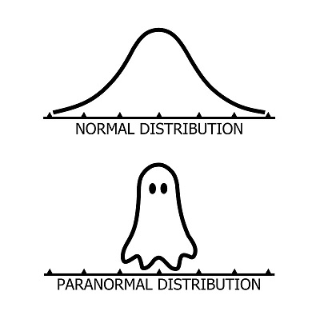

```{r setup, include=FALSE}
knitr::opts_chunk$set(echo = FALSE, message = FALSE,
                      fig.dim = c(8, 5))
library(tidyverse)
library(cowplot)
theme_set(
  theme_cowplot(font_size = 18) +
    theme(panel.background = element_rect(fill = "#fafafa"),
          plot.background = element_rect(fill = "#fafafa"))
)
set.seed(7102)
```

# Objectifs

- Connaître les composantes d'un modèle linéaire généralisé.

- Utiliser la régression logistique pour modéliser une réponse binaire (0 ou 1) ou binomiale (nombre de 0 et 1).

- Interpréter les résultats d'une régression logistique et visualiser les effets des prédicteurs.

---

# Motivation

Les données ne sont pas toujours normalement distribuées.



---

# Motivation

Modèles avec une réponse catégorique binaire (non/oui, 0/1)

- survie ou mort d'individus dans un intervalle de temps donné;

- présence ou absence d'une espèce sur différents sites;

- décision d'un animal de demeurer au même site ou migrer à un autre site.

---

# Motivation

Est-ce qu'on peut modéliser la relation entre la réponse moyenne $\hat{y}$ et des prédicteurs au moyen d'une régression linéaire?

$$\hat{y} = \beta_0 + \sum_{i = 1}^m \beta_i x_i$$

--

- Prédictions peuvent être <0 ou >1.

- Variance non homogène: $y$ moins variable si $\hat{y}$ près de 0 ou 1.

---

class: center, inverse, middle

# Modèles linéaires généralisés (GLM)

---

# Modèles linéaires généralisés

Extensions de la régression linéaire

- différentes distributions de la réponse (pas seulement normale);

- différentes transformations des prédictions linéaires.

---

# Composantes d'un GLM

- Prédicteur linéaire

- Fonction de lien entre le prédicteur linéaire et la réponse moyenne

- Distribution des réponses individuelles

---

# Composantes d'un GLM

**Exemple**: Régression linéaire

$$\hat{y} = \beta_0 + \sum_{i = 1}^m \beta_i x_i$$

--

- Prédicteur linéaire: $\eta = \beta_0 + \sum_{i = 1}^m \beta_i x_i$

--

- Lien entre la réponse moyenne et la valeur du prédicteur: $\hat{y} = \eta$

--

- Distribution des réponses individuelles: $y \sim N(\hat{y}, \sigma)$.

---

# Types de GLM vus dans ce cours

- Régression logistique (une ou plusieurs observations d'une réponse binaire)

- Régression de Poisson (données de comptage)

---

class: center, inverse, middle

# Modèle de régression logistique

---

# Modèle de régression logistique

Dans ce modèle:

- la réponse suit une distribution binomiale (codée 0/1) et

- la fonction *logit* permet de relier la probabilité d'obtenir $y = 1$ à la valeur du prédicteur linéaire.

---

# Distribution binomiale

- Expérience répétée $n$ fois, probabilité $p$ qu'un événement soit présent.

--

- Le nombre de présences $y$ sur $n$ essais suit une distribution binomiale: $y \sim B(n, p)$. 

--

- Selon cette distribution, la probabilité d'obtenir $y$ présences et $n-y$ absences correspond à:

$$\frac{n!}{y!(n-y)!} p^y (1-p)^{n-y}  = \binom{n}{y} p^y(1-p)^{n-y}$$

---

# Propriétés de la distribution binomiale

- Nombre de présences $y$: moyenne $np$, variance $np(1-p)$.

--

- Proportion de présences $y/n$: moyenne $p$, variance $p(1-p)/n$

--

- Dans les deux cas, la variance est maximale si $p = 0.5$ est tend vers 0 lorsqu'on approche $p = 0$ et $p = 1$.

--

- Cas particulier $n = 1$: distribution de Bernoulli. Moyenne de $p$ et variance de $p(1-p)$.

---

# Distribution binomiale dans R

Fonctions `rbinom`, `dbinom`, `pbinom` et `qbinom`.

--

Exemple: Probabilité d'obtenir 2 présences sur 5 essais, avec $p$ = 0.3.

```{r, echo = TRUE}
dbinom(2, 5, 0.3)
```

--

```{r, echo = FALSE, fig.dim = c(4, 3)}
ggplot(NULL, aes(x = as.character(rbinom(1000, 5, 0.3)))) +
    labs(x = "# présences", y = "fréquence") +
    geom_bar(fill = "blue") +
#    scale_x_discrete(limits = c(0, 5), breaks = 0:5) +
    scale_y_continuous(expand = c(0, 0))
```

---

# Lien logit

$$\eta = \text{logit}(p) = \log \left( \frac{p}{1-p} \right)$$

--

Inverse du logit: fonction logistique

$$p = \frac{1}{1 + e^{-\eta}}$$

--

.center[

```{r, echo = FALSE, fig.dim = c(5, 4)}
graph_invlogit <- ggplot(data.frame(x = seq(-5,5,0.1)), aes(x = x)) +
    labs(x = expression(eta), y = "p") +
    stat_function(fun = plogis) +
    geom_segment(x = -5, xend = 0, y = 0.5, yend = 0.5, linetype = "dotted") +
    geom_segment(x = 0, xend = 0, y = 0, yend = 0.5, linetype = "dotted") +
    scale_x_continuous(expand = c(0, 0)) +
    scale_y_continuous(expand = c(0, 0), breaks = seq(0, 1, 0.25), limits = c(0, 1))
graph_invlogit
```

]

---

# Propriétés du lien logit

.pull-left[

```{r, echo = FALSE, fig.dim = c(5, 5)}
graph_invlogit
```

]


- Si $\eta = 0$, $p = 0.5$.

--

- La fonction est symétrique autour de ce point central: $p(-\eta) = 1 - p(\eta)$.

--

- $p \rightarrow 0$ lorsque $\eta \rightarrow -\infty$ et $p \rightarrow 1$ lorsque $\eta \rightarrow +\infty$.

--

- La pente de la courbe est plus prononcée au centre et plus faible (tendant vers 0) aux extrémités.

---

# Résumé du modèle

Distribution binomiale: 

$$y \sim B(n, p)$$

--

Lien logit:

$$\text{logit}(p) = \beta_0 + \sum_{i = 1}^m \beta_i x_i$$ 

--

équivalent à

$$p = \frac{1}{1 + e^{-(\beta_0 + \sum_{i = 1}^m \beta_i x_i)}}$$

---

# Maximum de vraisemblance

- L'estimation des coefficients $\beta$ d'un modèle linéaire généralisé n'est pas basée sur les moindres carrés, mais plutôt sur le maximum de vraisemblance (*maximum likelihood*). 

--

- Les valeurs des coefficients $\beta$ choisies maximisent la probabilité conjointe de l'ensemble des observations de $y$.

---

# Interprétation des coefficients

$\text{logit}(p) = -1 + 0.4x$

```{r, echo = FALSE, fig.dim = c(5, 4)}
ex_logit <- ggplot(data.frame(x = seq(-10,10,0.1)), aes(x = x)) +
    labs(y = "p") +
    stat_function(fun = function(x) plogis(-1 + 0.4*x)) +
    scale_x_continuous(expand = c(0, 0)) +
    scale_y_continuous(expand = c(0, 0), breaks = seq(0, 1, 0.25), limits = c(0, 1))
ex_logit
```

---

# Interprétation des coefficients

$\text{logit}(p) = -1 + 0.4x$

.pull-left[

```{r, echo = FALSE, fig.dim = c(5, 4)}
ex_logit +
    geom_segment(x = -10, xend = 0, y = 0.27, yend = 0.27, linetype = "dotted") +
    geom_segment(x = 0, xend = 0, y = 0, yend = 0.27, linetype = "dotted")
```

]

.pull-right[

- $\beta_0$: $\text{logit}(p)$ si $x = 0$.

]

---

# Interprétation des coefficients

$\text{logit}(p) = -1 + 0.4x$

.pull-left[

```{r, echo = FALSE, fig.dim = c(5, 4)}
ex_logit +
    geom_segment(x = -10, xend = 0, y = 0.27, yend = 0.27, linetype = "dotted") +
    geom_segment(x = 0, xend = 0, y = 0, yend = 0.27, linetype = "dotted")
```

]

.pull-right[

- $\beta_0$: $\text{logit}(p)$ si $x = 0$.

```{r, echo = TRUE}
plogis(-1)
```

*Note*: Dans R, `plogis` est la fonction logistique (parfois appelée *invlogit*),`qlogis` est la fonction logit.

]

---

# Interprétation des coefficients

$\text{logit}(p) = -1 + 0.4x$

.pull-left[

```{r, echo = FALSE, fig.dim = c(5, 4)}
ex_logit +
    geom_segment(x = -10, xend = 2.5, y = 0.5, yend = 0.5, linetype = "dotted") +
    geom_segment(x = 2.5, xend = 2.5, y = 0, yend = 0.5, linetype = "dotted")
```

]

.pull-right[

- $p = 0.5$ si $-1 + 0.4x = 0$, donc $x = 2.5$

]

---

# Interprétation des coefficients

.pull-left[ 

$\text{logit}(p) = -1 + 0.4x$

```{r, echo = FALSE, fig.dim = c(5, 4)}
ex_logit + 
    geom_segment(x = -10, xend = 2.5, y = 0.5, yend = 0.5, linetype = "dotted") +
    geom_segment(x = 2.5, xend = 2.5, y = 0, yend = 0.5, linetype = "dotted") +
    geom_segment(x = 0.5, xend = 4.5, y = 0.3, yend = 0.7, color = "blue", size = 1)
```

]


.pull-right[

- $\beta_1/4$ est la pente maximale de $p$ vs. $x$. 

- Si $x$ augmente de 1, $p$ augmente au plus de 0.1.

]

---

class: center, inverse, middle

# Régression logistique avec R

---

# Régression logistique avec R

Nous verrons des exemples pour deux types de réponse:

--

- une variable binaire codée par des valeurs logiques (FALSE, TRUE), des valeurs numériques (0, 1) ou un facteur (1er niveau = 0, autres niveaux = 1);

--

- une variable binomiale décrite par deux colonnes (nombre de présences, nombre d'absences).

---

# Exemple 1: Réponse binaire

Concentrations d'arsenic dans des puits au Bangladesh

- Tableau de données `Wells` du package **carData**

- 3020 ménages avec un puits à haute concentration en arsenic

- Quels facteurs déterminent si un ménage change de puits?

---

# Coefficient de détermination

- Le $R^2$ basé sur la somme des écarts carrés n'est pas approprié pour les GLM.

--

- La **déviance** est une mesure d'écart entre les valeurs attendues et les observations calculée à partir de la vraisemblance $L$ du modèle.

$$D = -2 \log L$$

--

- La déviance est égale au premier terme de l'AIC (sans la pénalité).

- Comme pour l'AIC, la valeur absolue n'est pas interprétable.

---

# Coefficient de détermination

Deux déviances dans le résultat sommaire de `glm`

- `Residual deviance`: basé sur la vraisemblance du modèle ajusté.
- `Null deviance`: basé sur la vraisemblance du modèle nul (aucun prédicteur).

--

Ces valeurs sont analogues à la somme des carrés résiduels et totaux. On peut donc définir un *pseudo* $R^2$ égal à $1 - D_{res} / D_{null}$.

---

# $R^2$ de Tjur

Autre option de $R^2$, égale à la différence entre la prédiction moyenne pour le groupe d'observations avec $y = 1$ et celle du groupe $y = 0$. 

$${R^2}_{\text{Tjur}} = \bar{\hat{y}}_{(y=1)} - \bar{\hat{y}}_{(y=0)}$$

---

# Régression logistique binomiale

- Plusieurs réplicats indépendants d'une réponse binaire pour les mêmes prédicteurs.

- Type de données plus fréquent dans un contexte expérimental.

---

# Exemple 2: Mortalité d'escargots

- Tableau de données `snails` du package **MASS**.

- Prédicteurs: espèce d'escargot, température, humidité relative, temps d'exposition.

- Réponse: Nombre d'escargots morts sur un nombre initial de 20 pour chaque combinaison des prédicteurs.

---

# Problème de séparation parfaite

```{r include = FALSE}
library(MASS)
```

```{r, echo = TRUE}
group_by(snails, Exposure) %>%
    summarize(mean(Deaths))
```

--

- L'ordonnée à l'origine `(Intercept)` correspond à $\textrm{logit}(p)$ pour `Exposure` = 1, mais il n'y a aucun escargot mort pour ce niveau.  

--

- Fonction logit n'atteint jamais $p = 0$. Taux de mortalité trop petit pour être estimé (logit très négatif).

---

# Problème de séparation parfaite

- Le coefficient d'une variable qui sépare parfaitement les réponses $y = 1$ et $y = 0$ est mal défini, par exemple:

    + une catégorie où toutes les réponses sont 0 ou 1;
    + une variable numérique $x$ avec un seuil $a$ où la réponse est toujours 0 si $x < a$ et 1 si $x > a$.

--

- Il existe des méthodes de réduction de biais (ex.: package **brglm**) qui aident dans ce cas, en pénalisant les coefficients trop élevés.

---

# Résumé

- Un modèle linéaire généralisé est composé d'un prédicteur linéaire (combinaison linéaire des variables explicatives), d'une fonction de lien pour la réponse moyenne, et d'une distribution statistique de la réponse en fonction de sa moyenne.

--

- La régression logistique sert à modéliser des réponses binaires ou binomiales. Elle utilise un lien logit et une distribution binomiale de la réponse.

--

- La fonction logit transforme une probabilité entre 0 et 1 en un nombre réel entre $-\infty$ et $+\infty$. Un logit négatif correspond à une probabilité en-dessous de 0.5, un logit positif correspond à une probabilité au-dessus de 0.5.

---

# Résumé

- Dans une régression logistique, l'effet d'un prédicteur sur la réponse est non-linéaire et dépend de la valeur des autres prédicteurs. Il est donc utile de visualiser les prédictions du modèle pour différentes combinaisons des variables.

--

- Pour une réponse binaire (0 ou 1), les résidus individuels donnent peu d'information, mais on peut vérifier l'ajustement du modèle à partir des moyennes de groupes de résidus (*binned residuals*).

