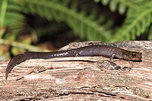

```{r setup, include=FALSE}
knitr::opts_chunk$set(echo = TRUE, message = FALSE, warning = FALSE)
```

## 1. Communautés d'insectes de cours d'eau

Le tableau de données [stream_composition.csv](stream_composition.csv) indique le nombre d'espèces de cinq ordres d'insectes présentes dans 20 cours d'eau, en fonction de la température et du pH. 

```{r}
stream <- read.csv("stream_composition.csv")
str(stream)
```

a) Estimez l'effet de la température et du pH sur le nombre d'espèces de plécoptères (`stonefly`), avec une régression de Poisson suivant la formule `stonefly ~ temperature + pH`. Vérifiez si les données sont surdispersées et corrigez vos estimés s'il y a lieu.

**Réponse**

La valeur du $\chi^2$ ne diverge pas significativement du modèle de Poisson, donc les données ne sont pas surdispersées.

```{r}
mod_plec <- glm(stonefly ~ temperature + pH, data = stream, family = poisson)

chi2 <- sum((stream$stonefly - fitted(mod_plec))^2 / fitted(mod_plec))
1 - pchisq(chi2, mod_plec$df.residual)
```

Le pH a un effet positif et significatif.

```{r}
summary(mod_plec)
```


b) Quelle portion de la variance du nombre d'espèces est expliquée par le modèle?

**Réponse**: Environ 23% selon le pseudo-$R^2$.

```{r}
1 - mod_plec$deviance / mod_plec$null.deviance
```


c) Si l'une des deux variables a un effet significatif, interprétez la valeur du coefficient.

**Réponse**

Lorsque le pH augmente d'une unité, le nombre moyen d'espèces de plécoptères augmente de 57%.

```{r}
exp(0.45)
```


d) Affichez le nombre d'espèces observées et les courbes de prédiction du modèle pour des valeurs du pH allant de 5.5 à 7.5 et pour trois valeurs de la température: 15, 17 et 19 degrés C.

**Truc**: Avec *ggplot*, pour que les courbes de prédiction relient les points ayant la même valeur d'une variable numérique (ex.: température), vous devez définir un groupe (ex.: `group = temperature`) dans la fonction `aes`.

**Réponse**

```{r}
stream_nouv <- expand.grid(pH = seq(5.5, 7.5, 0.2), temperature = c(15, 17, 19))
stream_nouv$pred <- predict(mod_plec, newdata = stream_nouv, type = "response")

library(ggplot2)
ggplot(stream, aes(x = pH, y = stonefly, color = temperature, group = temperature)) +
    geom_point() +
    geom_line(data = stream_nouv, aes(y = pred))
```


e) Répétez les étapes (a)-(d) pour un modèle du nombre d'espèces d'éphémères (`mayfly`).

**Réponse**

La valeur du $\chi^2$ indique une surdispersion significative. 

```{r}
mod_may <- glm(mayfly ~ temperature + pH, data = stream, family = poisson)

chi2 <- sum((stream$mayfly - fitted(mod_may))^2 / fitted(mod_may))
1 - pchisq(chi2, mod_may$df.residual)
c_hat <- chi2/mod_may$df.residual
c_hat
```

Puisque le paramètre de dispersion est inférieur à 4, nous pouvons tout de même utiliser le modèle en corrigeant les erreurs-types.

```{r}
summary(mod_may, dispersion = c_hat)
```

L'effet du pH est significatif. Une augmentation d'une unité de pH correspond à un doublement du nombre moyen d'espèces ($e^{0.71} = 2.0$).

Le pseudo-$R^2$ pour ce modèle est égal à $1 - 58.4 / 111 = 0.47$.

Voici les courbes de prédiction pour ce modèle:

```{r}
stream_nouv$pred_may <- predict(mod_may, newdata = stream_nouv, type = "response")

ggplot(stream, aes(x = pH, y = mayfly, color = temperature, group = temperature)) +
    geom_point() +
    geom_line(data = stream_nouv, aes(y = pred_may))
```


f) Quel est le nombre moyen d'espèces d'éphémères prédit par le modèle en (e) pour un cours d'eau avec une température de 17 degrés et un pH de 8.5? Cette prédiction est-elle fiable?

**Réponse**

```{r}
predict(mod_may, data.frame(pH = 8.5, temperature = 17), type = "response")
```

Les conditions de la prédiction se situent hors de la plage de pH observée dans les données (5.5 à 7.5) et la prédiction elle-même se situe au-delà de toutes les valeurs observées pour `mayfly` (maximum de 28 dans les données). Du point de vue biologique, les organismes ont une certaine zone de tolérance au pH, donc nous ne nous attendons pas à ce que le doublement du nombre d'espèces pour chaque augmentation d'une unité de pH continue à l'extérieur des valeurs observées.


## 2. Salamandres dans différents paysages forestiers


<small>*Photo: Bill Bouton*</small>

Le fichier [salamander.csv](salamander.csv) contient des données de Welsh et Lind (1995) sur le nombre de salamandres (`salaman`) de l'espèce *Plethodon elongatus* dans 47 placettes (`site`), en fonction du pourcentage de couvert forestier (`pct_cover`) et de l'âge du peuplement (`forest_age`).

```{r}
sal <- read.csv("salamander.csv")
str(sal)
```

a) À partir d'une régression de Poisson, estimez l'effet du couvert forestier (`pct_cover`) sur le nombre de salamandres par placette.

**Réponse**

Après avoir ajusté le modèle, nous vérifions la dispersion des résidus.

```{r}
mod_sal <- glm(salaman ~ pct_cover, data = sal, family = poisson)

chi2 <- sum((sal$salaman - fitted(mod_sal))^2 / fitted(mod_sal))
1 - pchisq(chi2, mod_sal$df.residual)
```

Les données sont surdispersées, donc il faut ajuster l'erreur-type des coefficients.

```{r}
disp <- chi2 / mod_sal$df.residual
summary(mod_sal, dispersion = disp)
```

D'après ces résultats, chaque augmentation de 1% de couvert forestier augmente le nombre moyen de salamandres d'environ 3% ($e^{0.032} = 1.032$).


b) Est-ce que l'ajout du prédicteur `forest_age` améliore le pouvoir prédictif de ce modèle?

**Réponse**

Nouveau modèle avec les deux prédicteurs:

```{r}
mod_sal2 <- glm(salaman ~ pct_cover + forest_age, data = sal, family = poisson)
summary(mod_sal2)
```

L'effet de l'âge du peuplement est presque zéro et non significatif. Comparons les deux modèles avec le QAIC.

```{r}
library(AICcmodavg)
disp <- c_hat(mod_sal2)
aictab(list(cover = mod_sal, cover_age = mod_sal2), c.hat = disp)
```

Le modèle incluant seulement le couvert forestier est meilleur.


c) Produisez un graphique du nombre de salamandres en fonction de l'âge du peuplement et superposez des points représentant les valeurs attendues (`fitted`) du modèle basé uniquement sur le couvert forestier. Qu'observez-vous?

**Réponse**

Même si la variable `forest_age` n'est pas dans le modèle, le nombre de salamandres attendu est plus élevé dans les forêts anciennes.

```{r}
# Valeurs observées en noir, attendues en bleu
ggplot(sal, aes(x = forest_age, y = salaman)) +
    geom_point() +
    geom_point(aes(y = fitted(mod_sal)), color = "blue") 
```


d) D'après ces résultats, croyez-vous que l'âge du peuplement influence directement la population de salamandres? Est-ce qu'il influence indirectement cette population?

**Réponse**

D'après notre régression en (b), l'âge du peuplement n'a aucun effet une fois qu'on a pris en compte le pourcentage de couvert forestier. Cependant, les vieilles forêts ont un plus grand pourcentage de couvert forestier, comme on le voit dans le graphique ci-dessous. Si on suppose que l'âge explique en partie le pourcentage de couvert, cette variable a donc un effet indirect sur la population de salamandres. 

```{r}
ggplot(sal, aes(x = forest_age, y = pct_cover)) + 
    geom_point()
```


