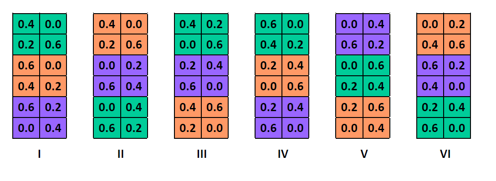

```{r setup, include=FALSE}
knitr::opts_chunk$set(echo = TRUE)
library(dplyr)
library(ggplot2)
library(cowplot)
```

# Rappel

Lors du dernier cours, nous avons vu différentes façons de traiter des données groupées dans le contexte d'une régression linéaire "classique": ignorer les groupes, estimer séparément des effets pour chaque groupe, ou tenir compte indirectement des groupes à partir de prédicteurs mesurés au niveau de ces groupes.

- D'une part, ignorer la structure groupée des données peut mener à une surestimation de la précision des inférences, car les tests de significativité et intervalles de confiance de la régression linéaire sont basés sur la supposition que les résidus sont tous indépendants; ce n'est pas le cas lorsque les résidus d'un même groupe sont corrélés.

- D'autre part, estimer des effets fixes pour chaque groupe peut mener à une surestimation des différences entre groupes, surtout lorsqu'on a peu d'observations par groupe; dans ce cas, une bonne partie des différences observées est due au hasard de l'échantillonnage.

Cette discussion nous a amené à considérer les *modèles linéaires mixtes* pour traiter ce type de données. 

- Contrairement à la régression linéaire qui n'inclut qu'un terme aléatoire (les résidus au niveau des observations individuelles), les modèles mixtes incluent la variation aléatoire partagée par les observations d'un même groupe. 

- Les modèles mixtes produisent aussi des estimés des coefficients de la régression pour chaque groupe, mais en supposant une distribution normale de ces coefficients centrée sur la moyenne des groupes. Comparé aux effets fixes de groupe, ces coefficients sont "contractés" vers la moyenne générale. Cela permet d'obtenir des estimés plus fiables même avec peu d'observations par groupe.


# Objectifs

- Comprendre comment les modèles mixtes traitent le cas de groupes non-équilibrés.

- Faire des prédictions à partir d'un modèle linéaire mixte.

- Créer des modèles avec l'effet aléatoire de plusieurs variables et l'effet aléatoire d'une variable sur plus d'un coefficient.

- Appliquer la sélection de modèles avec l'AIC aux modèles mixtes.


# Modèles mixtes pour groupes non-équilibrés

Dans les exemples vus la semaine dernière (richesse spécifique de sites intertidaux, rendement de variétés d'avoine, maladie des colonies d'abeilles), le nombre d'observations était équilibré entre les groupes. Les modèles mixtes ont aussi des propriétés intéressantes pour les cas où les groupes ne contiennent pas le même nombre d'observations, comme nous le verrons dans le prochain exemple.

## Exemple: Concentration de radon dans des maisons du Minnesota

Le jeu de données [radon.csv](../donnees/radon.csv), tiré du manuel de Gelman et Hill, contient des mesures de concentration de radon (`log_radon`, échelle logarithmique) prises dans 919 maisons réparties dans 85 comtés (`county`) de l'état américain du Minnesota. Le nombre de maisons par comté varie de 1 à 116. Ce jeu de données inclut un prédicteur au niveau de la maison, soit l'étage où la mesure a été prise (`floor`, avec 0 = sous-sol et 1 = rez-de-chaussée) et un prédicteur au niveau du comté, soit la concentration d'uranium du sol (`log_uranium`, échelle logarithmique).

```{r}
radon <- read.csv("../donnees/radon.csv")
head(radon)
```

Nous estimons les paramètres d'un modèle mixte avec des effets fixes de l'étage et de la concentration d'uranium, ainsi qu'une variation aléatoire de l'ordonnée à l'origine par comté.

```{r, message = FALSE, warning = FALSE}
library(lme4)
mm_radon <- lmer(log_radon ~ floor + log_uranium + (1 | county), radon)
summary(mm_radon)
```

Comment peut-on interpréter les effets fixes dans ce modèle?

- `(Intercept)` est la moyenne de `log_radon` si `floor` = 0 (dans un sous-sol) et `log_uranium` = 0.
- `floor` est la différence de `log_radon` si `floor` augmente de 1 (donc rez-de-chaussée comparé au sous-sol).
- `log_uranium` est l'effet d'une augmentation d'une unité de `log_uranium` sur `log_radon`. Dans le cas particulier où les deux variables sont sur une échelle logarithmique, on peut interpréter ce coefficient comme un effet multiplicatif: une augmentation de 1% de la concentration d'uranium du sol augmente la concentration de radon dans les maisons de 0.72%.

Utilisons maintenant le modèle pour prédire `log_radon` pour un sous-sol dans chacun des comtés. Pour commencer, nous extrayons le nom du comté, la concentration d'uranium et le nombre de maisons par comté (cette dernière valeur sera utilisée plus loin).

```{r}
comtes <- group_by(radon, county, log_uranium) %>%
    summarize(n = n()) %>%
    ungroup()
```

Voici le graphique des prédictions:

```{r}
comtes$floor <- 0 # sous-sol
comtes$mm_pred <- predict(mm_radon, comtes)

ggplot(comtes, aes(x = log_uranium, y = mm_pred)) +
    geom_point()
```


Ces prédictions dévient de la tendance linéaire moyenne en fonction des ordonnées à l'origine estimées pour chaque comté (effets aléatoires).

Comparons maintenant ces prédictions à ceux de deux régressions linéaires classiques, avec aucun effet de comté (mais avec l'effet de l'uranium) ou un effet fixe par comté.

```{r, warning = FALSE, message = FALSE}
lm_radon1 <- lm(log_radon ~ floor + log_uranium, radon)
lm_radon2 <- lm(log_radon ~ floor + county, radon)

comtes <- mutate(comtes, pred1 = predict(lm_radon1, comtes), 
                 pred2 = predict(lm_radon2, comtes))

ggplot(comtes, aes(x = log_uranium)) +
    labs(y = "log_radon") +
    geom_line(aes(y = pred1)) +
    geom_point(aes(y = pred2), shape = 1) +
    geom_point(aes(y = mm_pred))
```

La ligne représente la prédiction sans effet de comté, les points pleins indiquent les effets de comté du modèle mixte et les points vides indiquent les effets fixes par comté. Les prédictions du modèle mixte se rapprochent plus de la tendance moyenne, démontrant la contraction des coefficients pour le modèle mixte.

Regardons maintenant l'effet de la taille de l'échantillon $n$ dans chaque comté. Aux fins de clarté, les deux prédictions d'un même comté sont reliées par une ligne pointillée.

```{r}
ggplot(comtes, aes(x = log_uranium)) +
    labs(y = "log_radon") +
    geom_line(aes(y = pred1)) +
    geom_point(aes(y = pred2, size = n), shape = 1) +
    geom_point(aes(y = mm_pred, size = n)) +
    geom_segment(aes(xend = log_uranium, y = mm_pred, yend = pred2),
                 linetype = "dotted")
```

Ce résultat montre que plus l'échantillon est faible dans un comté, plus l'effet de contraction est important. Autrement dit, moins il y a de points dans un comté, plus la déviation observée entre ce comté et la tendance globale risque d'être due au hasard de l'échantillonnage et plus le modèle mixte doit "corriger" cette valeur en la ramenant près de la tendance générale.


# Prédictions à partir d'un modèle mixte

Au dernier cours, nous avons vu la représentation suivante pour un modèle mixte avec des prédicteurs mesurés au niveau individuel (observation $k$) et au niveau du groupe (groupe $j$), ainsi qu'une ordonnée à l'origine qui varie aléatoirement entre les groupes.

$$ y_k = \gamma_0 + \gamma_1 u_{1j[k]} + \beta_1 x_{1k} + \nu_{j[k]} + \epsilon_k $$

Dans notre exemple précédent, la valeur de $y_k$ est la somme de l'ordonnée à l'origine moyenne $\gamma_0$ (la valeur rapportée comme `Intercept` par R), des effets de prédicteurs individuels ($x_1$: étage) et de groupe ($u_1$: concentration d'uranium), de l'effet aléatoire de groupe $\nu$ et d'un résidu $\epsilon$. 

La fonction `fixef` nous donne les estimés des coefficients $\gamma_0$, $\gamma_1$ et $\beta_1$, tandis que `ranef` indique les estimés des effets aléatoires $\nu_j$. 

```{r}
eff_fixes <- fixef(mm_radon)
eff_fixes
eff_alea <- ranef(mm_radon)$county
head(eff_alea)
```

Plus tôt, lorsque nous avions fait une prédiction de la concentration de radon dans un sous-sol pour chaque comté, la fonction `predict` a utilisé à la fois les estimés des effets fixes et aléatoires. Autrement dit, la valeur prédite $\hat{y}$ pour un sous-sol $x_1 = 0$ du comté $j$ est donnée par:

$$ \hat{y} = \hat{\gamma_0} + \hat{\gamma_1} u_{1j} + \hat{\nu_{j}} $$ ,

où les accents circonflexes signifient que nous utilisons les valeurs estimées de chaque coefficient. Nous pourrions donc calculer manuellement les prédictions pour chaque comté de la façon suivante.

```{r}
pred_man <- eff_fixes["(Intercept)"] + 
    eff_fixes["log_uranium"] * comtes$log_uranium + eff_alea$`(Intercept)`
                
all.equal(pred_man, comtes$mm_pred)
```

## Prédictions pour un nouveau groupe

Si on tente de prédire la concentration de radon d'un sous-sol pour un groupe (comté) non inclus dans le modèle, R génère une erreur.

```{r, error = TRUE}
nouv_comte <- data.frame(county = "NOUVEAU", log_uranium = 0.5, floor = 0)
predict(mm_radon, nouv_comte)
```

Par défaut, la fonction `predict` appliquée au résultat de `lmer` tente d'utiliser l'ensemble des effets aléatoires. Pour effectuer une prédiction basée seulement sur les effets fixes, nous devons spécifier l'argument `re.form = ~0`.

```{r}
predict(mm_radon, nouv_comte, re.form = ~0)
```

On peut vérifier que cette prédiction est basée uniquement sur les effets fixes.

```{r}
eff_fixes["(Intercept)"] + eff_fixes["log_uranium"] * nouv_comte$log_uranium
```

Avec un modèle mixte, il est donc possible de faire des prédictions pour des groupes qui n'étaient pas dans les données originales, en utilisant la prédiction d'un groupe "moyen" (avec un effet aléatoire de groupe égal à 0). Bien sûr, l'incertitude associée à cette prédiction est plus grande que lorsqu'on prédit de nouvelles observations pour un groupe existant.

La fonction `predict` n'offre pas d'intervalles de confiance ou de prédiction pour des modèles mixtes. Ces intervalles peuvent être estimés en simulant des données à partir du modèle. Ces méthodes basées sur la simulation ne sont pas couvertes dans ce cours, mais font partie du cours Analyse des données complexes.


# Effets aléatoires multiples

## Exemple: Croissance des arbres de plusieurs espèces

Considérons de nouveau l'exemple vu au début du dernier cours. Nous souhaitons modéliser la croissance annuelle de différentes espèces d'arbres dans une parcelle de recherche. Pour cinq années consécutives, nous avons mesuré la croissance annuelle des mêmes 100 arbres en fonction de deux prédicteurs ($x_1, x_2$) qui varient pour chaque observation (arbre et année). Nous connaissons aussi l'espèce ce chaque arbre et la valeur d'un prédicteur ($u_1$) mesuré au niveau de l'espèce. Comment pourrions-nous représenter ces données avec un modèle linéaire mixte? 

Pour choisir les effets aléatoires du modèle, nous pouvons poser la question suivante: pour quels groupes d'observations la variation de la réponse serait-elle corrélée (entre observations d'un même groupe)? Dans ce cas-ci:

- les observations prises sur le même arbre d'une année à l'autre;
- les observations de deux arbres prises la même année; et
- les observations prises sur des arbres de la même espèce

risquent d'être corrélés. Nous incluons donc trois effets aléatoires dans le modèle (arbre, espèce et année).

La valeur de $y_k$, correspondant à la croissance de l'arbre $i$ de l'espèce $j$ lors de l'année $t$, est représentée par le modèle:

$$ y_k = \gamma_0 + \gamma_1 u_{1j[k]} + \beta_1 x_{1k} + \beta_2 x_{2k} + \nu_{j[k]} + \xi_{i[k]} + \tau_{t[k]} + \epsilon_k $$

Dans R, si `ombre` représente la tolérance à l'ombre de l'espèce et que les prédicteurs individuels sont `DHP` et `age`, ce modèle pourrait s'exprimer ainsi:

`croissance ~ ombre + DHP + age + (1 | espece) + (1 | id_arbre) + (1 | annee)`

Du point de vue de la structure d'un modèle, deux effets aléatoires peuvent être soit croisés, soit nichés.

- Les effets de l'arbre et de l'année sont croisés (*crossed*): chaque arbre est mesurée pour plusieurs années et plusieurs arbres sont mesurés chaque année. De même, les effets de l'espèce et de l'année sont croisés.

- Les effets de l'arbre et de l'espèce sont nichés (*nested*): chaque arbre fait partie d'une seule espèce.

Pour indiquer à R que l'effet A est niché dans l'effet B, on écrit par exemple `(1 | B/A)`. Dans ce cas-ci, la formule pourrait être ré-écrite:

`croissance ~ ombre + DHP + age + (1 | espece / id_arbre) + (1 | annee)`

Si les numéros d'identification des arbres ne sont pas répétés d'une espèce à l'autre, il n'est pas nécessaire de préciser les effets nichés: les deux formules sont équivalentes pour `lmer`. Cependant, si les arbres étaient numérotés 1, 2, ... pour chaque espèce, il serait nécessaire d'utiliser la formule avec l'effet niché: dans le cas contraire, R croirait que les arbres "1" de chaque espèce représenteraient le même individu.

## Exemple: Plan d'expérience en parcelles divisées

Le tableau de données `Oats` du package *nlme*, que nous avons utilisé au dernier laboratoire, présente les résultats d'une expérience agricole en parcelles divisées (*split-plot*). L'expérience est réalisée en six blocs (`Block`). Chaque bloc est divisé en trois sections où une variété différente d'avoine est semée (`Variety`), puis chaque section est divisée en quatre quadrants qui reçoivent chacun une concentration différente d'azote (`nitro`): 0, 0.2, 0.4 ou 0.6. La variable réponse est le rendement (`yield`) en avoine pour chacun des 72 quadrants (6 blocs x 3 variétés x 4 concentrations d'azote).

```{r, message = FALSE, warning = FALSE}
library(nlme)
# Changer le bloc en facteur non-ordonné
Oats$Block <- factor(Oats$Block, ordered = FALSE)
head(Oats)
```

Voici un exemple de configuration spatiale possible pour cette expérience. Les variétés plantées (couleur) sont assignées aléatoirement aux trois sections de chaque bloc et les concentrations d'azote (nombres) sont assignés aléatoirement aux quadrants de chaque section.



Le plan en parcelles divisées constitue une façon de répliquer deux traitements expérimentaux sur plusieurs blocs. Sa particularité est qu'un des traitements (ici, la variété d'avoine) est appliqué à une plus grande surface et un autre traitement (ici, la concentration d'azote) est niché dans le premier.

Dans le laboratoire, nous avions défini un effet aléatoire du bloc, qui représente le fait que la variance de la réponse est plus petite entre observations du même bloc qu'entre observations de différents blocs. Cela pourrait être dû par exemple à des gradients environnementaux non-mesurés dans la parcelle.

```{r}
mm_oats <- lmer(yield ~ nitro + Variety + (1 | Block), Oats)
```

Pour la même raison, il est possible que la variance soit plus petite entre quadrants d'une même section; nous pouvons tenir compte de ce deuxième niveau de groupement en incluant un effet aléatoire de la section (variété) niché dans celui du bloc.

```{r}
mm_oats2 <- lmer(yield ~ nitro + Variety + (1 | Block / Variety), Oats)
summary(mm_oats2)
```

À première vue, il apparaît contradictoire d'utiliser la même variable `Variety` comme effet fixe et comme effet aléatoire. Toutefois, l'effet aléatoire ne s'applique pas aux différences entre les 3 variétés (il serait incorrect d'écrire `(1 | Variety)`), mais plutôt aux différences entre les 18 sections représentées par les combinaisons d'un bloc et d'une variété. C'est d'ailleurs pourquoi cet effet aléatoire est noté comme une interaction `Variety:Block` dans le sommaire.

En consultant les intervalles de confiance de ces deux modèles, nous remarquons que le deuxième donne un intervalle de confiance plus large pour les effets fixes des variétés, mais moins large pour l'effet de l'azote.

```{r}
confint(mm_oats)
confint(mm_oats2)
```

Comment pouvons-nous expliquer ces différences?

- Dans le premier modèle, nous supposions que toutes les observations étaient indépendantes à l'intérieur d'un bloc. Dans le deuxième modèle, les observations d'une même section sont corrélées, donc nous n'avons pas vraiment 4 réplicats indépendants de chaque variété. Cela augmente l'incertitude sur l'effet des variétés.

- D'un autre côté, en considérant les effets aléatoires par section, la variance résiduelle entre observations d'une même section est réduite. Puisque les 4 niveaux de concentration d'azote sont répliqués dans chaque section, une plus petite variance résiduelle contribue à réduire l'incertitude sur l'effet de ce prédicteur.


# Modèle mixte avec pente aléatoire

Reprenons le jeu de données `rikz` vu au dernier cours, présentant la richesse spécifique de 45 sites intertidaux répartis sur 9 plages des Pays-Bas.  

```{r}
rikz <- read.csv("../donnees/rikz.csv")
# Corriger la représentation des variables catégorielles
rikz <- mutate(rikz, Beach = as.factor(Beach), 
               Exposure = as.factor(Exposure))
# Transformer la réponse
rikz <- mutate(rikz, srich = sqrt(Richness))
head(rikz)
```

Le modèle suivant inclut un effet fixe de la position du site par rapport au niveau moyen de la mer (NAP) et une variation aléatoire de l'ordonnée à l'origine entre les plages.

```{r}
mm_rikz <- lmer(srich ~ NAP + (1 | Beach), rikz)
```

*Note*: Pour éviter de compliquer le modèle, nous ignorons le prédicteur de groupe `Exposure` pour l'instant.

Nous pourrions aussi considérer un cas où l'effet du NAP sur la réponse varie d'une plage à l'autre. Notre modèle prendrait donc la forme:

$$ \hat{y_k} = \alpha_{j[k]} + \beta_{j[k]} x_k $$ ,

où l'ordonnée à l'origine et la pente de $y$ vs. $x$ varient toutes deux d'un groupe à l'autre. Dans ce cas, le modèle mixte suppose que $\alpha_j$ et $\beta_j$ suivent une distribution normale avec un écart-type de $\sigma_\alpha$ et $\sigma_\beta$, respectivement. Toutefois, le modèle ne suppose pas que les deux effets sont indépendants. Comme nous avons vu au dernier cours, l'ordonnée à l'origine et la pente d'une régression peuvent être corrélés, donc le modèle estime aussi leur corrélation $\rho_{\alpha \beta}$.

Dans R, pour représenter une variation aléatoire de l'effet d'un des prédicteurs, nous ajoutons ce prédicteur dans la partie gauche du terme d'effet aléatoire:

```{r}
mm_rikz2 <- lmer(srich ~ NAP + (1 + NAP | Beach), rikz)
summary(mm_rikz2)
```

Ici, la corrélation entre les effets aléatoires de l'ordonnée à l'origine et de la pente est de -0.41, tel qu'indiqué dans la colonne `Corr` du tableau des effets aléatoires. L'effet fixe du NAP représente maintenant la pente moyenne pour l'ensemble des plages.

Comme auparavant, les coefficients estimés par plage peuvent être consultés avec `coef`.

```{r}
coef(mm_rikz2)
```

Le graphique suivant montre la variation des droites de prédiction par plage pour ce modèle. Dû à l'effet de contraction, cette variation est moins prononcée que celle du modèle estimant des effets fixes d'interaction entre le NAP et la plage (voir notes du dernier cours).

```{r}
rikz$fit2 <- fitted(mm_rikz2)

ggplot(rikz, aes(x = NAP, y = srich, color = Beach)) +
    geom_point() + 
    geom_line(aes(y = fit2))
```


# Sélection de modèles

Le processus de comparaison et sélection de modèles est plus complexe pour les modèles mixtes, car il faut choisir à la fois les termes fixes et aléatoires.

Par exemple, comparons l'AICc des deux modèles précédents pour la richesse spécifique en fonction du NAP dans le tableau de données `rikz`: (1) le modèle avec effets aléatoires de plage sur l'ordonnée à l'origine et (2) le modèle avec effets aléatoires sur l'ordonnée à l'origine et la pente.

```{r, include = FALSE}
library(AICcmodavg)
```

```{r}
library(AICcmodavg)

aictab(list(mm_rikz = mm_rikz, mm_rikz2 = mm_rikz2))
```

Comme nous avons vu au dernier cours, la fonction `lmer` estime les paramètres du modèle mixte par la méthode du maximum de vraisemblance restreint (REML), afin d'obtenir des estimés non-biaisés des paramètres de variance. L'avertissement indique que l'AIC(c) calculé sur des modèles ajustés par REML est seulement valide pour la comparaison de modèles avec les mêmes effets fixes, mais différents effets aléatoires.

Dans leur manuel, Zuur et al. (2009) suggèrent le protocole suivant:

1. D'abord, inclure tous les effets fixes qui nous intéressent et choisir, si nécessaire, entre différentes versions des effets aléatoires. Cette étape est basée sur l'AIC des modèles ajustés par REML.

2. Conserver les effets aléatoires choisis à l'étape précédente et comparer différentes versions des effets fixes. Cette étape requiert de comparer les modèles ajustés selon le maximum de vraisemblance, pas le REML (avec l'option `REML = FALSE` de `lmer`).

3. Réajuster le meilleur modèle par REML pour obtenir les estimés finaux.

Ce protocole est basé sur l'idée qu'il est préférable de simplifier les effets aléatoires avant de simplifier les effets fixes, puisque c'est généralement l'estimation des effets fixes qui nous intéresse davantage.

Dans notre exemple, supposons que notre modèle complet du point de vue des effets fixes prend la forme `srich ~ NAP + Exposure`. Déterminons d'abord s'il faut inclure ou non l'effet aléatoire de la plage sur le coefficient NAP.

```{r}
mod_comp <- lmer(srich ~ NAP + Exposure + (1 | Beach), rikz)
mod_comp2 <- lmer(srich ~ NAP + Exposure + (1 + NAP | Beach), rikz)

aictab(list(mod_comp = mod_comp, mod_comp2 = mod_comp2))
```

Nous choisissons donc le premier modèle (effet aléatoire sur l'ordonnée à l'origine seulement). Ensuite, comparons les modèles avec ou sans indice d'exposition. Puisque nous comparons différents effets fixes, il faut réajuster les modèles avec ML plutôt que REML.

```{r}
mod_comp_ml <- lmer(srich ~ NAP + Exposure + (1 | Beach), rikz, REML = FALSE)
mod_nap_ml <- lmer(srich ~ NAP + (1 | Beach), rikz, REML = FALSE)

aictab(list(mod_comp_ml = mod_comp_ml, mod_nap_ml = mod_nap_ml))
```

En conclusion, le meilleur modèle inclut l'effet du NAP et de l'indice d'exposition, ainsi qu'un effet aléatoire de la plage sur l'ordonnée à l'origine.

## Effet fixe ou aléatoire?

Puisqu'une méthode différente est requise pour comparer les modèles avec différents effets aléatoires (REML) ou avec différents effets fixes (ML), on ne peut pas utiliser l'AIC pour déterminer si une variable devrait être considérée comme effet fixe ou aléatoire. Ex.: On ne peut pas comparer `srich ~ NAP + Beach` avec `srich ~ NAP + (1 | Beach)`. 

Il faut donc déterminer *a priori* quelles variables constituent des effets fixes ou aléatoires. Voici quelques lignes directrices pour choisir si une variable catégorielle devrait être incluse comme effet aléatoire:

- Si le but du modèle est d'estimer l'effet d'un ou plusieurs traitements spécifiques sur la réponse, la variable représentant ces traitements devrait être un effet fixe.

- Si la variable catégorielle a seulement deux niveaux (binaire), elle doit être considérée comme un effet fixe. Avec plus de deux niveaux, il est possible d'estimer un effet aléatoire; toutefois, plus le nombre de niveaux est petit, plus l'estimation de la variance entre groupes est incertaine, donc il y a moins d'avantages à utiliser un effet aléatoire.

- Avec plusieurs groupes et peu d'observations dans certains de ces groupes, il est préférable d'utiliser un effet aléatoire.

- Si on s'intéresse moins aux différences entre groupes particuliers, mais plutôt à décrire la variation entre groupes et possiblement étendre la portée du modèle à des groupes non-présents dans les données, il est préférable d'utiliser un effet aléatoire.

Finalement, il n'y a pas de mal à inclure un effet aléatoire même si cet effet n'explique pas une grande partie de la variance. Par exemple, dans le modèle `srich ~ NAP + Exposure + (1 | Beach)`, il y avait très peu de variation entre plages une fois que l'on contrôle pour la variable `Exposure`, comme l'indiquait la corrélation intra-classe de 0.06. Le but des effets aléatoires n'est pas de détecter des différences significatives entre groupes, mais plutôt de tenir compte de la structure hiérarchique de la variation de la réponse, afin d'obtenir des meilleurs estimés des effets fixes et de leur incertitude.

# Résumé

- Les modèles mixtes ajustent les estimés des effets aléatoires en fonction du nombre d'observations par groupe: moins il y a d'observations par groupe, plus son effet est contracté vers la moyenne générale.

- Pour prédire une nouvelle observation dans un groupe existant, nous utilisons l'effet aléatoire estimé pour ce groupe. Pour prédire une nouvelle observation dans un nouveau groupe, nous utilisons seulement les effets fixes (l'effet d'un groupe "moyen").

- Plusieurs effets aléatoires peuvent être inclus dans un même modèle. Ces effets peuvent être nichés ou croisés. Si les niveaux de la variable $A$ sont nichés dans ceux de la variable $B$, leur effet aléatoire est représenté par `(1 | B/A)` dans la formule du modèle.

- Une variable peut avoir un effet aléatoire sur l'ordonnée à l'origine et sur le coefficient (la pente) d'un prédicteur individuel. Cela indique que l'effet du prédicteur sur la réponse varie d'un groupe à l'autre, de façon semblable à une interaction dans un modèle linéaire classique.

- L'AIC(c) est une mesure valide pour la comparaison de modèles avec différents effets aléatoires et les mêmes effets fixes, ou avec différents effets fixes et les mêmes effets aléatoires. Ces modèles doivent être ajustés par REML dans le premier cas et par ML (`REML = FALSE`) dans le deuxième.


# Références

Article de synthèse sur l'application des modèles mixtes et la sélection de modèles en écologie:

- Harrison, X.A., Donaldson, L., Correa-Cano, M.E., Evans, J. Fisher, D.N., Goodwin, C.E.D., Robinson, B.S., Hodgson, D.J., Inger, R. (2018) A brief introduction to mixed effects modelling and multi-model inference in ecology. *PeerJ* 6: e4794.

Manuels mentionnés au dernier cours:

- Gelman, A. and Hill, J. (2006) *Data Analysis Using Regression and Multilevel/Hierarchical Models*. Cambridge, Cambridge University Press.

- Zuur, A.F., Ieno, E.N., Walker, N.J., Saveliev, A.A., Smith, G.M. (2009) *Mixed Effects Models and Extensions in Ecology with R*. New York, Springer-Verlag.

