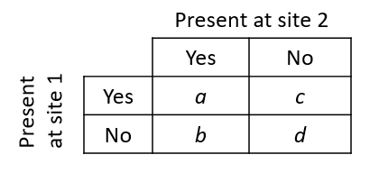

    
```{r setup, include=FALSE}
knitr::opts_chunk$set(echo = TRUE)
library(dplyr)
library(ggplot2)
library(cowplot)
```

# Objectives

- Apply appropriate dissimilarity measures between observations of ecological community matrices (abundance or presence / absence).

- Compare different methods for the ordination of community data: correspondence analysis, principal coordinate analysis (PCoA) and nonmetric multidimensional scaling (NMDS).

- Overlay environmental gradients to the results of an ordination of ecological communities.

- Use constrained ordination (redundancy analysis and canonical correspondence analysis) to represent the variation between observations explained by predictors.


# Species abundance or presence data

In ecology, multivariate data often takes the form of a table indicating the abundance (number of individuals, % cover) of different species on each of the sites studied.

```{r}
esp <- cbind(esp1 = c(2, 8, 0, 3), esp2 = c(1, 3, 0, 0), esp3 = c(0, 0, 1, 0))
rownames(esp) <- c("site1", "site2", "site3", "site4")
esp
```

In some cases, we do not have a numerical estimate of abundance, but only a binary presence (1) or absence (0) indicator for each species / site combination.

## Problems with Euclidean distance

Last week, we applied ordination (principal component analysis) and clustering methods to continuous numerical variables, such as climate data of a location or the chemical composition of a sample. For this type of variable, Euclidean distance was a good measure of distance between two observations in a multivariate space ($n$ observations of $p$ variables). That distance is the sum of the squared deviations between the two observations for each of the variables:

$$ d_{ij} = \sqrt{\sum_{k = 1}^p (y_{ik} - y_{jk})^2} $$

In this equation, $i$ and $j$ are indices denoting observations (rows) and $k$ is the index of the variable (column).

Principal component analysis, which orders the axes according to their contribution to the total variance, aims in particular to represent the Euclidean distances between the points, since the variance is based on squared deviations from the mean.

Euclidean distance is not a good measure for the dissimilarity of ecological communities between two sites. In the example above, this distance is 6.3 between sites 1 and 2, but only 2.4 between sites 1 and 3. Yet, 1 and 2 share the same species in similar proportions while 1 and 3 have no species in common.

```{r}
dist(esp)
```

Another problem with Euclidean distance is the way it treats zeros. All other things being equal, two sites where one species is absent (0) are more similar according to this measure than two sites where the species is present at slightly different levels. However, ecologists generally prefer not to treat the absence of a species at two sites as an indicator of similarity between these sites. According to the concept of ecological niche, each species is subject to several environmental constraints. If the presence of the same species at two sites may be indicative of habitat similarity, this is less true for a common absence, as the two sites may be unfavorable to the species for different reasons.

## Distance measurements for abundances

The **Bray-Curtis distance** $d_{ij (BC)}$ (often called Bray-Curtis dissimilarity) is a better measure for species abundance data:

$$ d_{ij(BC)} = \frac{\sum_{k=1}^p \left| y_{ik} - y_{jk} \right|}{y_{i \cdot} + y_{j \cdot}} $$

where $y_{i \cdot}$ and $y_{j \cdot}$ represent the total abundance (all species combined) of the sites $i$ and $j$. The Bray-Curtis distance thus measures the ratio between the sum of the differences (in absolute value) between the abundances for each species and the total number of individuals of all the species. It takes a minimum value of 0 when the observed abundance is the same for each species and a maximum value of 1 when the sites have no species in common.

This measure of distance, as well as several others used in ecology, can be calculated with the `vegdist` function of the *vegan* package, a specialized R package for community ecology.

```{r, warning = FALSE, message = FALSE}
library(vegan)

vegdist(esp, method = "bray")
```

Although it is not obvious in this example, the Bray-Curtis distance, like all the other distance measures in this section, is indifferent to species absent from both sites. However, it is sensitive to variations in total abundance between two sites (e.g. sites 1 and 2).

If we are interested in the relative abundance of species for a site (sometimes called site composition or profile) rather than raw abundances, we can divide abundances by their total for each site. By calculating the Euclidean distance between the obtained proportions, we obtain the distance between profiles:

$$ d_{ij(prof)} = \sqrt{\sum_{k = 1}^p \left( \frac{y_{ik}}{y_{i \cdot}} - \frac{y_{jk}}{y_{j \cdot}} \right)^2} $$

The **Hellinger distance** is similar to the distance between profiles, but it is calculated from the square root of the proportions:

$$ d_{ij(Hel)} = \sqrt{\sum_{k = 1}^p \left( \sqrt{\frac{y_{ik}}{y_{i \cdot}}} - \sqrt{\frac{y_{jk}}{y_{j \cdot}}} \right)^2} $$

The `decostand` function of *vegan* can perform several transformations on the community data matrices. With `method = "total"`, the function divides each row of the matrix by its sum (site profile); with `method = "hellinger"`, it applies the division then takes the square roots. The Hellinger distance can then be obtained by applying the function `dist` to the resulting matrix.

```{r}
esp_hel <- decostand(esp, method = "hellinger")
dist(esp_hel)
```

Note that the distance between sites 1 and 2 (which have almost the same profile but a different total abundance) is much smaller with this measure than with Bray-Curtis. The maximum value for the distance between profiles or the Hellinger distance, obtained when the sites have no species in common, is not 1 but rather $\sqrt{2}$ (about 1.414).

According to Legendre and Legendre (2012), the Hellinger distance responds more linearly to the changes in abundance of a species. The Hellinger transformation is therefore recommended if we want to carry out a PCA on abundance data. We will see in the next section other ordination methods for this type of data.

Finally, **the $\chi^2$ distance** is similar to the distance between profiles, except that the contribution of a species $k$ is divided by $p_k$, the fraction of all the individuals of all sites from that species. Compared to other measures, this distance increases the importance of rare species in the determination of dissimilarity between sites.

$$ d_{ij(\chi^2)} = \sqrt{\sum_{k = 1}^p \frac{1}{p_k} \left( \frac{y_{ik}}{y_{i \cdot}} - \frac{y_{jk}}{y_{j \cdot}} \right)^2} $$

In R, this distance is also calculated from a transformation with `decostand` followed by the calculation of the Euclidean distance on the transformed data.

```{r}
esp_chi2 <- decostand(esp, method = "chi.square")
dist(esp_chi2)
```

The maximum value of $d _{(\chi^2)}$ is equal to $\sqrt{2N}$ where $N$ is the sum of all entries in the matrix. This maximum value is reached only if each of the two sites compared is composed of a single species (and a different one).

Which of these distances to use in a cluster analysis, for example? It depends on the focus on different types of differences. In particular, we will choose:

- the Bray-Curtis distance if the absolute differences of abundance (number of individuals) between sites are important;
- the Hellinger distance if we are concerned about the relative differences in abundance (proportion of individuals) between sites and we want to give more emphasis to common species;
- the $\chi^2$ if we are concerned about relative differences and want to give greater importance to rare species.

## Distance measures for presence data

With data on the presence or absence of species, we can summarize the relationship between two sites by a 2x2 table.



In this table, $a$ represents the number of species present at both sites, $b$ the number of species present at site 1 but not at site 2, and so on.

The **Jaccard index** measures the similarity between two sites:

$$ J = \frac{a}{a + b + c} $$

That index takes values between 0 (no common species) and 1 (same species). The **Sorenson index** is similarly defined, except that species present at both sites are counted twice.

$$ S = \frac{2a}{2a + b + c} $$

To define a distance (dissimilarity) from these indices, we can apply the transformation $1 - J$ or $1 - S$. Note that neither index takes into account species absent from both sites ($d$ in the table above); as mentioned earlier, species in that group give little information on the similarity between sites.

The function `vegdist(..., method = "jaccard")` calculates the Jaccard distance ($1 - J$). As for $1 - S$, its value exactly matches the Bray-Curtis distance applied to a binary matrix.


# Ordination of ecological community matrices

## Correspondence analysis

If principal component analysis (PCA) is an ordination method adapted to continuous numeric data, **correspondence analysis** is an ordination adapted to contingency tables. Remember that a contingency table is a matrix representing the number of observations (the frequency $f$) for each combination of the levels of two categorical variables. In ecology, a community matrix (either abundance or presence / absence) can be considered as a contingency table for the categorical variables "site" and "species".

In the class on $\chi^2$ tests, we saw that the expected frequency for a cell $(i, j)$ of the table, if the two variables are independent, equals $\hat{f_ {ij}} = N_i N_j / N$, where $N_i$ is the sum of the frequencies in row $i$, $N_j$ is the sum of the $j$ column and $N$ is the total of all frequencies of the table. The $\chi^2$ statistic is based on a standardized version of the deviations between observed and expected frequencies:

$$ \chi_{ij} =  \frac{f_{ij} - \hat{f_{ij}}}{\sqrt{\hat{f_{ij}}}} $$

The $\chi^2$ is the sum of the squared $\chi_{ij}$ residuals. In an ecological context, a large positive residual indicates that the $i$ site is very favorable for the $j$ species, while a negative residual indicates an unfavorable site for this species.

Correspondence analysis performs an ordination of these $\chi_{ij}$ residuals to obtain orthogonal components that explain a decreasing fraction of the total $\chi^2$ of the contingency table. The maximum number of components is $\min(r - 1, c - 1)$ where $r$ and $c$ are the number of rows and columns of the matrix, respectively.

Whereas PCA makes a distinction between observations and variables, correspondence analysis is symmetrical; it simultaneously orders the sites according to the species and vice versa. This influences the interpretation of the results, as we will see in the following example.

If the PCA gives a good representation of the Euclidean distance between sites, the correspondence analysis gives a good representation of the $\chi^2$ distance. Compared to other ordinations, it gives a greater weight to rare species.

## Example with R

The `dune` data frame included with the *vegan* package contains abundance data for 30 plant species at 20 sites.

Correspondence analysis can be performed with the `cca` function of *vegan*; the name of this function is due to it also being the function for canonical correspondence analysis, which we will see later. Note that *vegan* functions can be applied to other types of data, even though the result always refers to columns as species and rows as sites.

```{r}
data(dune)

ac_dune <- cca(dune)
# display = "reg" to avoid printing all the species and sites coordinates
summary(ac_dune, display = "reg") 
```

The fraction of the total variation explained by components 1 and 2 may seem small (44%), but we must consider that we have reduced the dimensionality from 30 to 2 variables.

The `plot` function represents the species (in red) and the sites (in black) on the first two axes.

```{r}
plot(ac_dune)
```

In PCA, the variables were represented by vectors (arrows) and we interpreted the direction and length of these vectors. Here, species and sites are points, and we can interpret their position as follows:

1. Sites near each other host similar communities.
2. Species near each other are present at similar sites.
3. Species are located at the average position of sites where they are present, where each site is weighted by the species' abundance at that site. So for example, species *Empenigr* is only present at site 19, whereas *Airaprae* is present at 17 and 19. 

This third point corresponds to the default visualization in *vegan*. If we instead want each site to be at the average position of species found there, we can specify the `scaling = "sites` argument in the `plot` function.

The coordinates of species and sites can be extracted with the `scores (ac_dune)` function.

We can see the importance given to rare species in this ordination, since they are at the edges of the graph. In contrast, a species near the centre of the ordination is either present at many sites, or strongly associated with sites also near the centre. We cannot distinguish those two cases without going back to the original data matrix.

## Deformation of gradients

In general, the abundance of a species is not a linear function of an environmental gradient (e.g., temperature); the species reaches a maximum at an optimum value and its abundance decreases for larger or smaller values of the environmental variable. Due to this non-linearity, a series of sites ordered according to an environmental gradient may follow a curve on the ordination plot. This could be the case here, with a series of sites from the middle right to the bottom left and then up. Methods have been proposed to rectify these curves (detrended correspondence analysis or DCA), but these methods are not recommended, except in the rare cases where we know in advance that the ordination is dominated by a single large gradient. A better solution would be to superimpose the environmental gradient on the graph of ordination, as we will see later.

## Principal coordinate analysis

Principal coordinate analysis (PCoA) is a more general method that includes PCA and CA as specific cases. Whereas PCA aims to represent the true Euclidean distances between sites and CA is based on the $\chi^2$ distance, PCoA can work with different distance metrics.

We will use the `pcoa` function in the *ape* package to do a PCoA of the `dune` dataset, based on the Bray-Curis distance (the `correction` argument is explained later).

```{r}
library(ape)
dune_bray <- vegdist(dune, method = "bray")
pcoa_dune <- pcoa(dune_bray, correction = "lingoes")
```

The eigenvalues of the PCoA represent the part of the total distance between sites contained within each of the axes. Those values can be found in the `values` table of the object produced by `pcoa`.

```{r}
pcoa_dune$values
```

In that table, we notice that the last eigenvalues are negative. This can happen for certain distance measures like Bray-Curtis. The correction given as an argument in `pcoa` transforms the distances so that all values are positive (2nd column, `Corr_eig`). The *Rel_corr_eig* column can then be interpreted as the proportion of original distances between sites represented by that axis.

Let's now look at the position of sites on the first two axes.

```{r}
biplot(pcoa_dune)
```

That ordination is similar to that of correspondance analysis seen earlier, but sites 17 and 19 are closer to the others. Indeed, the Bray-Curtis distance gives less importance to rare species and sites with very few species.

By providing the original data matrix as a second argument in biplot, we can obtain arrows representing the position of species, similar to a PCA.

```{r}
biplot(pcoa_dune, dune)
```

We saw earlier in the class that certain distance measures are equivalent to the Euclidean distance in a transformed space. For example, the Hellinger distance is a Euclidean distance applied to data following a Hellinger transform. In that case, it is simpler to apply PCA to the missing data, which is equivalent to PCoA for the corresponding distance measure.

## Nonmetric multidimensional scaling

Another ordination method commonly applied in ecology is nonmetric multidimensional scaling (NMDS). Like PCoA, NMDS is based on a distance matrix between sites as a starting point, but uses a very different ordination technique.

The methods seen so far (PCA, CA, PCoA) perform a rotation in multivariate space so that the most important portion of the differences between sites can be found in the first axes. NMDS requires the user to specify how many axes to use (generally 2), then uses an iterative algorithm that places points randomly in space, and gradually moves them so that the distance between points in the reduced space is maximally related to their true distance in the full space. The difference between distances in the reduced space and the true distances is represented by a stress measure, which the method tries to minimize.

Since the method has no restriction on the positioning of points in space, it can produce a 2D graphic that is closer to the full distances between sites. Unlike other methods, NMDS does not include all axes, and does not provide a measure of the proportion of the total distance represented by each axis. Also, it relies on a heuristic algorithm that may not converge, or converge to different solutions based on the initial positions chosen prior to the analysis.

The `metaMDS` function addresses the latter issue by performing repeated runs of the algorithm from random initial configurations, in order to increase the chances of detecting the optimal result. The Bray-Curtis distance is often recommended for analyzing abundance data with this algorithm and is the default distance choice for `metaMDS`.

```{r, results = "hide"}
md_dune <- metaMDS(dune, distance = "bray")
```

During the execution of the function, R indicates the stress for each run of the algorithm and indicates in the end whether an optimal solution has been found. If the algorithm does not converge, you must repeat `metaMDS` by specifying a number of tries (`try` argument) greater than 20.

The `plot` function displays the result of NMDS in two dimensions. After NMDS orders the sites, the position of the species is determined according to the position of the sites where these species are found, similar to correspondance analysis. We specify the argument `type = "t"` to display the names of sites and species rather than points alone.

```{r}
plot(md_dune, type = "t")
```

The value of stress is 0.118 for this result. In general, a stress lower than 0.1 is excellent is a stress higher than 0.2 is bad. You can also use the `stressplot` function to check the level of correspondence between NMDS distances and the original distance matrix between sites.

```{r}
stressplot(md_dune)
```


# Effect of predictors on a multivariate response

So far, we have seen how to represent the variation between ecological communities present at various sites. This last section deals with methods for associating this variation with predictors measured for each site.

We will still use the `dune` data as an example, with the associated `dune.env` data frame that contains the values of five variables characterizing the 20 sites.

```{r}
data(dune.env)
head(dune.env)
```

This table contains a single numeric variable (*A1*, the thickness of the A1 soil horizon), two nominal categorical variables (*Management* and *Use*) and two ordinal categorical variables (*Moisture* and *Manure*) .

## Multivariate analysis of variance

There are several multivariate versions of ANOVA. The `adonis` function of *vegan* estimates the fraction of distances between sites explained by different predictors. For each independent variable, this method calculates a $F$-statistic similar to the univariate ANOVA. However, the $p$-value of this statistic is not based on a theoretical distribution, but rather by a permutation test: the function performs 999 random permutations of the values of the independent variable and calculates the $F$-statistic for each permutation. The resulting distribution represents the null hypothesis that the variable has no effect. This method is known as PERMANOVA (for permutational multivariate analysis of variance).

The formula given to the `adonis` function resembles that of a linear model in R, except that the response is a community matrix rather than a single variable. You can specify the distance measure to use; the default is the Bray-Curtis distance.

```{r}
adonis(dune ~ A1 + Moisture + Management + Use + Manure, dune.env)
```

Like the univariate ANOVA, this method considers the variables in the given order: *Moisture* gives the fraction of the distance explained after taking into account the effect of *A1*, *Management* the fraction explained after taking into account *A1* and *Moisture*, etc.

In univariate ANOVA, we first verified that the variance was constant between the groups before comparing the means. PERMANOVA does not assume equality of variances; however, a significant difference associated with a variable may represent either a difference in the "average" community composition according to this variable, or a difference in the variance of the composition. To interpret the results well, it may be useful to visualize the relationship between the variables and the sites placed on an ordination, as we will see in the next section.

## Superposition of predictors to ordination axes

A second technique for determining the effect of explanatory variables on a multivariate response is to first perform an ordination of the response and then correlate the variables to the ordination result.

If the principal components are orthogonal (which is the case for PCA, CA and PCoA, but not NMDS), a separate regression of each component can be performed according to the predictors. Another option is to simultaneously estimate the correlation between explanatory variables and each of the axes, which is done by the `envfit` function of *vegan*.

The `envfit` function requires two parameters, the result of an ordination and a data frame for the predictors. Here, we consider the relation between the PCoA components of `dune`, the A1 soil thickness (*A1*) and the type of management.

This time, we do not use `PCoA` from the *ape* package, but instead use the `wcmdscale` function from *vegan*, so that the output is compatible with `envfit`. The function name is an abbreviation of "weighted classical multidimensional scaling", which is synonymous with a PCoA. The `eig = TRUE` argument tells the function to save the eigenvalues, whereas `add = TRUE` performs the same correction as the "lingoes" method in `pcoa`.

```{r}
pcoa_dune2 <- wcmdscale(dune_bray, eig = TRUE, add = TRUE)
envf <- envfit(pcoa_dune2, select(dune.env, A1, Management))
envf
```

For the numeric variable *A1*, the result indicates the magnitude and direction of the effect of an increase of this variable on the two PCoA axes (hence a vector), as well as a $r^2$ value giving the portion of the variance explained by this correlation. For a categorical variable such as *Management*, the result indicates the average position (centroid) on the two axes of the sites corresponding to each category.

The $p$-values for the effect of each variable in `envfit` are determined by permutation test, as in PERMANOVA. The $p$-values and $r^2$ are different in each case, because PERMANOVA evaluated the effect of the variables on the total multidimensional variation, while `envfit` result measures the effect on the ordination in two dimensions.

If you draw the ordination graph first, you can add the vector *A1* and the centroids for each management type by applying the `plot` function to the `envfit` result.

```{r}
plot(pcoa_dune2)
plot(envf)
```

If more than one numeric variable was included, the length of the vectors would be representative of the importance of the effect of each variable, as measured by the $r^2$.

With `envfit`, we can overlay both the position of species and environmental variables, although that makes the graph more difficult to read.

```{r}
plot(pcoa_dune2)
plot(envfit(pcoa_dune2, dune), col = "red") # Add species
plot(envf)
```

The `envfit` function attempts to identify a linear correlation between a numeric variable and the ordination axes. To represent a nonlinear environmental gradient like a two-dimensional surface, we can use the `ordisurf` function. The estimated surface is represented by contour lines (like in a topographic map) on the axes of ordination. In the following example, we show the contour lines for the A1 soil thickness on the two PCoA axes, and then superimpose the vector obtained with `envfit`.

```{r, include = FALSE}
ords <- ordisurf(pcoa_dune2, dune.env$A1)
```

```{r, eval = FALSE}
ords <- ordisurf(pcoa_dune2, dune.env$A1)
```

```{r}
plot(ords)
plot(envf)
```

Puisque les lignes de contour sont parallèles et également espacées, l'effet d'*A1* semble effectivement être linéaire dans cette représentation. 

## Constrained ordination

The ordination methods we have seen so far are of the "unconstrained" type, that is, they structure the variation in the multivariate response without reference to explanatory variables. In constrained ordination, the choice of axes is based on the part of the answer explained by the given predictors. These methods include redundancy analysis and canonical correspondence analysis.

Consider a $Y$ response matrix containing $n$ observations of $p$ variables. Suppose we separately perform a linear regression for each of the $p$ variables according to the same set of predictors $x_1$, $x_2$, etc. For example, the regression of the variable $j$ gives a fitted value $\hat{y}_{ij}$ for each observation $i$ of this variable. We can then combine the fitted values of each regression into a matrix $\hat{Y}$.

$$  
\begin{bmatrix}
\hat{y}_{11} & \hat{y}_{12} & ... & \hat{y}_{1p} \\
\hat{y}_{21} & \hat{y}_{22} & ... & \hat{y}_{2p} \\
... & ... & ... & ... \\
\hat{y}_{n1} & ... & ... & \hat{y}_{np}
\end{bmatrix}
$$

**Redundancy analysis** (RDA) is equivalent to a principal component analysis performed not on the original multivariate response $Y$, but rather on $\hat{Y}$, which is the part of the response explained by the given predictors.

To perform redundancy analysis on the `dune` data, we first perform a Hellinger transformation, as seen in the first section of this class, then we call the` rda` function to model the composition based on variables *A1* and *Management*. As in `adonis`, the multivariate response data appears to the left of the formula.

```{r}
dune_hel <- decostand(dune, method = "hellinger")
dune_hel <- scale(dune_hel)
rda_dune <- rda(dune_hel ~ A1 + Management, dune.env)
rda_dune
```

The linear regression carried out in the first step of the RDA has 4 predictors here (1 for *A1* and 3 for the four-level factor *Management*). In this case, since the matrix $\hat{Y}$ is a linear combination of the predictors, it can only have 4 principal components. The result of the RDA names these 4 components "constrained axes" (RDA1 to RDA4). RDA also performs a separate PCA for regression residuals ($Y$ - $\hat{Y}$); that PCA results in 15 unconstrained axes for the 15 residual degrees of freedom.

The graph of a RDA is called a triplot because it represents observations (sites), response variables (species) and predictors (environmental conditions). Note that since RDA is based on PCA, species should be represented by vectors here (like the A1 numerical predictor), but the arrows are omitted by *vegan* to avoid crowding the graph; the species name is placed where the end of the arrow would be.

```{r}
plot(rda_dune)
```

The coordinates of the sites and species on the first two axes of the RDA can be obtained by calling the `scores(rda_dune)` function.

For comparison purposes, here is the biplot of the unconstrained ordination with the estimate of predictor effects obtained by `envfit`. Note that the `rda` function called with no predictor variables performs a PCA.

```{r}
acp_dune <- rda(dune_hel)
acp_envf <- envfit(acp_dune, select(dune.env, A1, Management))
plot(acp_dune)
plot(acp_envf)
```

What is the difference between these two approaches?

- With unconstrained ordination (PCA or CA), we summarize the variation of the multivariate *response* in a few axes, then we estimate the effect of the predictors on these axes. This approach is more parsimonious but runs the risk of "losing" the effect of a predictor if it is not related primarily to the first few principal components.

- With constrained ordination (RDA or CCA), we first perform the regression in the multivariate space, then summarize the *predictions* of this regression in a few axes. Since this approach performs as many univariate regressions as there are columns in the multivariate response, it is more likely to detect an effect due only to chance (overfitting).

If redundancy analysis is the combination of a regression and a PCA, **canonical correspondence analysis** (CCA) is the combination of a regression and a correspondence analysis. Like correspondence analysis, CCA is based on the $\chi_{ij}$ standardized residuals of a contingency table. A regression is applied to these residuals according to the predictors, then an ordination is applied to the fitted values estimated by this regression. Here is an example with the `cca` function of *vegan*:

```{r}
cca_dune <- cca(dune ~ A1 + Management, dune.env)
cca_dune
```

Here is the triplot corresponding to this analysis:

```{r}
plot(cca_dune)
```


# Summary

- The *vegan* package in R contains several tools for multivariate analysis of ecological community data. These data usually take the form of a matrix indicating the abundance or presence of species at each of the sites studied.

- Euclidean distance is not appropriate for ecological community data. We have presented in this class several distances designed for abundance data (Bray-Curtis, Hellinger, $\chi^2$) or presence-absence data (Jaccard, Sorenson).

- Correspondence analysis (CA) is a type of ordination similar to principal component analysis, but adapted to contingency tables, including abundance or presence data. In an ecological context, it emphasizes the rare species.

- Principal coordinate analysis (PCoA) and nonmetric multidimensional scaling (NMDS) are ordination methods based on a matrix of distances between sites. PCoA performs a linear transformation of the matrix to produce principal axes (similar to PCA), whereas NMDS uses an algorithm that moves the points in a number of dimensions chosen in advance to make their distances as close as possible at the real distance between them.

- The `envfit` function makes it possible to simultaneously estimate the effect of predictors on the main ordination axes.

- In constrained ordination, a regression is performed on the multivariate data and ordination is performed on the part of the response explained by the predictors. Redundancy analysis is a constrained ordination based on PCA, whereas canonical correspondance analysis is based on CA.


# References

- Legendre, P. and Legendre, L. (2012) *Numerical Ecology*, 3rd ed. Elsevier.

- [Tutorial](http://cc.oulu.fi/~jarioksa/opetus/metodi/vegantutor.pdf) for the *vegan* package by Jari Oksanen.


