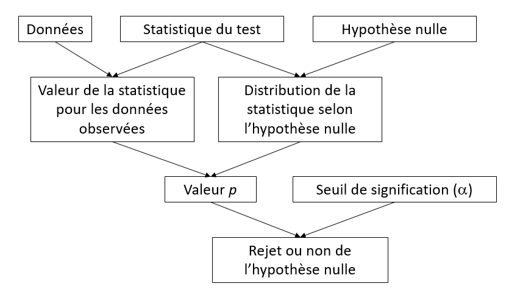
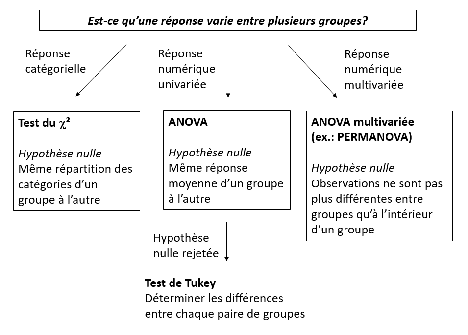
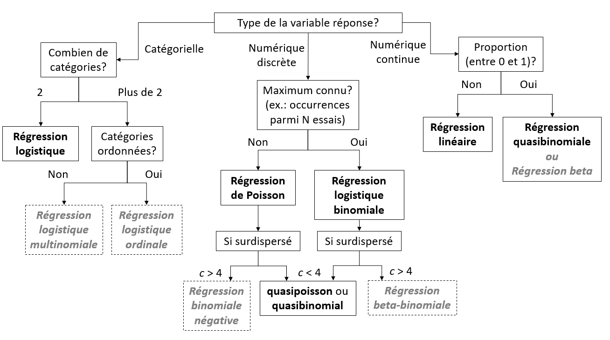

```{r setup, include=FALSE}
knitr::opts_chunk$set(echo = FALSE, fig.dim = c(4, 3))
library(dplyr)
library(ggplot2)
library(cowplot)
```


## Plans d'échantillonnage et d'expérience

### Échantillonnage

- Aléatoire simple: chaque individu a la même probabilité d'être échantillonné
- Systématique: à intervalles réguliers à partir d'une origine aléatoire
- Stratifié: division de la population en strates, échantillonnage aléatoire par strate
- Par grappe: échantilonner des groupes d'individus, prendre soit tous les individus d'un groupe, soit un échantillon aléatoire simple par groupe (multistade)

### Plan d'expérience

- Groupe témoin
- Assignation aléatoire des individus aux traitements
- Contrôle de la variation par des blocs
- Parcelles divisées: deuxième facteur varie à l'intérieur des réplicats du premier facteur 


## Structure d'un test statistique



### Exemples

| | test $t$ à un échantillon ($n$ individus) | ANOVA à un facteur ($m$ groupes de $n$ individus) |
|-+---------------------------+--------------------|
| Hypothèse nulle | La moyenne $\bar{x}$ est égale à $\mu$ | La moyenne est la même pour les $m$ groupes |
| Statistique | $t = (\bar{x} - \mu) / (s/\sqrt{n})$ | $F = MSA/MSE$
| Distribution | $t$ avec $n-1$ degrés de liberté | $F$ avec $m(n-1)$ et $(m - 1)$ degrés de liberté |

### Points clés sur les tests d'hypothèse

- Le seuil de signification est la probabilité de rejeter l'hypothèse nulle lorsqu'elle est vraie.

- Il faut choisir un test et un seuil de signification *avant* d'analyser les résultats. 

- Si on effectue plusieurs test dans une expérience, la probabilité de rejeter par erreur une des hypothèses nulles augmente (problème des comparaisons multiples).

- La puissance d'un test est la probabilité de rejeter l'hypothèse nulle si elle est fausse. Plus l'effet à détecter est faible par rapport à la variance de la réponse (faible ratio signal/bruit), puis $n$ doit être élevée pour avoir la même puissance.

- Avec un $n$ suffisamment grand, même un très petit effet sera jugé statistiquement significatif; cela ne signifie pas que l'effet est important.


## Estimation de paramètres

- Biais: écart systématique entre l'estimé d'un paramètre et sa valeur exacte.

- Erreur-type: écart-type de l'estimé d'un paramètre, dû à l'échantillonnage limité; diminue lorsque $n$ augmente.
    - Différent de l'écart-type de la réponse: mesure la variabilité entre individus, ne dépend pas de $n$.

- Intervalle de confiance: Dans X% des échantillons possibles, l'intervalle de confiance à X% de l'estimé d'un paramètre contient la vraie valeur de ce paramètre.

- Relation entre intervalle de confiance et test d'hypothèse: l'hypothèse $\theta = \theta_0$ peut être rejetée à un seuil $\alpha$ si l'intervalle de confiance à $100\%(1 - \alpha)$ de $\hat{\theta}$ n'inclut pas $\theta_0$.  


## Test de différences entre groupes




### Suppositions de l'ANOVA

- Indépendance: Les observations sont indépendantes.
- Normalité: La réponse suit une distribution normale dans chaque groupe.
- Homoscédasticité: La variance est la même dans chaque groupe.

L'ANOVA tolère bien des écarts modérés par rapport à la normalité, donc cette supposition est moins critique que les deux autres.

Avec seulement 2 groupes, le test $t$ permet des variances inégales.


## Modèles de régression



*Types de modèles en gris non vus dans ce cours.*

### Suppositions du modèle de régression linéaire

1. Effet linéaire et additif des prédicteurs sur la réponse
    - Sinon: transformer la réponse et/ou les prédicteurs, inclure des interactions, *modèles additifs généralisés (GAM)*

2. Indépendance des résidus
    - Sinon: modèles mixtes (données groupées), *modèles d'autocorrélation temporelle ou spatiale*

3. Uniformité de la variance (homoscédasticité)
    - Sinon: transformer la réponse, *régression linéaire pondérée*

4. Normalité
    - Sinon: transformer la réponse (seulement si très loin de la normalité)

*Modèles en italique non vus dans ce cours.*


## Interpréter les coefficients d'une régression

### Régression linéaire sans interaction

$$ y \sim w + x + z $$

$y$ est la réponse numérique, $w$ et $x$ sont des prédicteurs numériques, $z$ est un facteur avec codage de traitement (défaut dans R) et trois niveaux: A (référence), B et C.

Coefficients estimés:

- *(Intercept)*: Valeur moyenne de la réponse lorsque tous les prédicteurs sont à leur niveau de référence (0 pour les prédicteurs numériques).
- *w*: Effet sur $y$ d'une augmentation unitaire de $w$ si $x$ et $z$ restent constants.
- *x*: Effet sur $y$ d'une augmentation unitaire de $x$ si $w$ et $z$ restent constants.
- *zB*: Différence de $y$ entre les niveaux B et A de $z$, si $w$ et $x$ restent constant.
- *zC*: Différence de $y$ entre les niveaux C et A de $z$, si $w$ et $x$ restent constant.

### Interaction entre un prédicteur numérique et un facteur

$$ y \sim x * z $$

Coefficients estimés:

- *(Intercept)*: Même interprétation.
- *x*: Effet sur $y$ d'une augmentation unitaire de $x$ si $z$ = A.
- *zB*: Différence de $y$ entre les niveaux B et A de $z$ si $x$ = 0.
- *zC*: Différence de $y$ entre les niveaux C et A de $z$ si $x$ = 0.
- *x:zB*: Effet sur $y$ d'une augmentation unitaire de $x$ si $z$ = B.
- *x:zC*: Effet sur $y$ d'une augmentation unitaire de $x$ si $z$ = C.

### Interaction entre deux prédicteurs numériques

$$ y \sim w * x $$

Coefficients estimés:

- *(Intercept)*: Même interprétation.
- *w*: Effet sur $y$ d'une augmentation unitaire de $w$ si $x$ = 0.
- *x*: Effet sur $y$ d'une augmentation unitaire de $x$ si $w$ = 0.
- *w:x*: Effet sur la pente de $y$ vs. $x$ d'une augmentation unitaire de $w$, *OU* effet sur la pente de $y$ vs. $w$ d'une augmentation unitaire de $x$ (deux interprétations équivalentes).

### Modèles linéaires généralisés

- Dans ces modèles, la moyenne de $y$ n'est pas égale à la combinaison linéaire des prédicteurs $\eta$, mais à une transformation de $\eta$ selon une *fonction de lien*.

- L'interprétation des paramètres ci-dessus donne l'effet sur $\eta$. Pour obtenir l'effet sur la moyenne de $y$, il faut appliquer l'inverse de la fonction de lien.

    - Inverse du lien logit: $y = 1/(1 + \exp(- \eta))$
    - Inverse du lien log: $y = \exp(\eta)$

### Normalisation des prédicteurs numériques

- Normaliser un prédicteur en soustrayant la moyenne et en divisant par l'écart-type.

$$ x_{norm} = \frac{x - \mu_x}{\sigma_x} $$ 

- Puisque $x_{norm} = 0$ correspond à la moyenne de $x$, il est plus facile d'interpréter l'ordonnée à l'origine (*intercept*) dans tous les cas, et les coefficients dans le cas d'un modèle avec interactions.

- Puisqu'une augmentation unitaire de $x_{norm}$ correspond à augmenter $x$ d'un écart-type, la magnitude du coefficient donne une idée de l'importance de l'effet de ce prédicteur. On peut ainsi comparer des prédicteurs dont les échelles originales sont différentes.


## Sélection de modèles

- Choix entre modèles de différentes complexités: compromis entre sous-ajustement et surajustement.

- Sous-ajustement: effets importants non inclus dans le modèle.

- Surajustement: le modèle reproduit très bien les données utilisées pour son ajustement, mais performe moins bien sur de nouvelles données. 

- En l'absence de données indépendantes pour évaluer le pouvoir prédictif de différents modèles, on peut l'estimer avec l'AIC (et ses variantes).

### Points clés pour la sélection de modèles

- Comparer selon la même variable réponse et les mêmes observations.

- Le meilleur modèle n'est peut-être pas bon: vérifier l'ajustement.

- Si plusieurs modèles sont plausibles, la moyenne pondérée de leurs prédictions est souvent meilleure que les prédictions du meilleur modèle.

### Collinéarité

- Problème où deux ou plusieurs prédicteurs sont fortement corrélés.

- Différentes options:
    - Choisir *a priori* quels prédicteurs éliminer, d'après notre connaissance du système.
    - Utiliser l'AIC pour choisir entre différents modèles qui incluent des sous-ensembles non collinéaires des prédicteurs.
    - Effectuer une ordination des prédicteurs pour obtenir des axes non corrélés, puis effectuer une régression de la réponse en fonction de ces nouvelles variables.