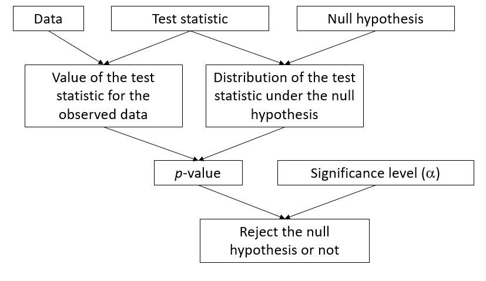
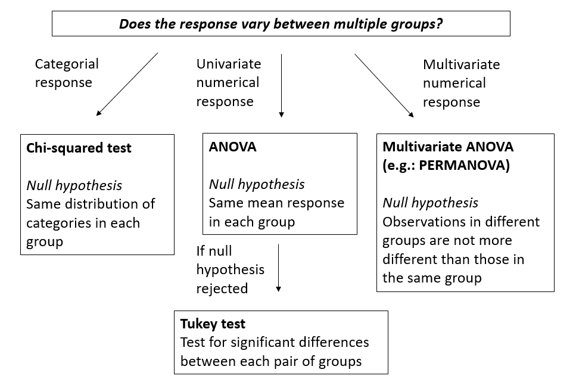
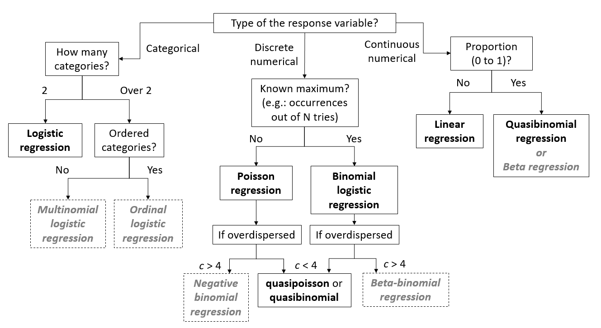

```{r setup, include=FALSE}
knitr::opts_chunk$set(echo = FALSE, fig.dim = c(4, 3))
library(dplyr)
library(ggplot2)
library(cowplot)
```


## Sampling and experiment design

### Sampling

- Simple random sampling: each individual has the same probability of being sampled
- Stratified sampling: division of population into strata, random sampling by stratum
- Cluster sampling: sample groups of individuals, take either all the individuals of a group, or a simple random sample by group (multistage)

### Experimental design

- Control group
- Random assignment of individuals to treatments
- Control of variation using blocks
- Split plots: second factor varies within replicates of the first factor


## Structure of a statistical test



### Examples

| | One-sample $t$-test ($n$ individuals) | One-factor ANOVA ($m$ groups of $n$ individuals) |
|-+---------------------------+--------------------|
| Null hypothesis | The mean $\bar{x}$ equals $\mu$ | Same mean in each of the $m$ groups |
| Statistic | $t = (\bar{x} - \mu) / (s/\sqrt{n})$ | $F = MSA/MSE$
| Distribution | $t$ with $n-1$ degrees of freedom | $F$ with $m(n-1)$ and $(m - 1)$ degrees of freedom |

### Key points for hypothesis testing

- The significance level is the probability of rejecting the null hypothesis when it is true.

- You must choose a test and a significance level *before* analyzing the results.

- If several tests are performed in an experiment, the probability of mistakenly rejecting one of the null hypotheses increases (multiple comparison problem).

- The power of a test is the probability of rejecting the null hypothesis if it is false. The smaller the effect to be detected compared to the variance of the response (low signal-to-noise ratio), the higher $n$ must be to have the same power.

- With a sufficiently large $n$, even a very small effect will be judged statistically significant; it does not mean that the effect is important.


## Parameter estimation

- Bias: systematic difference between the estimate of a parameter and its exact value.

- Standard error: standard deviation of the estimate of a parameter due to limited sampling; decreases when $n$ increases.
    - Different from the standard deviation of the response: measures the variability between individuals, does not depend on $n$.

- Confidence interval: In X% of the possible samples, the X% confidence interval of a parameter estimate contains the true value of this parameter.

- Relationship between confidence interval and hypothesis testing: the hypothesis $\theta = \theta_0$ can be rejected at a threshold $\alpha$ if the  $100 \% (1 - \ alpha)$ confidence interval of $\hat{\theta}$ does not include $\theta_0$.


## Test differences between groups




### Assumptions of the ANOVA

- Independence: The observations are independent.
- Normality: The response follows a normal distribution in each group.
- Homoscedasticity: The variance is the same in each group.

ANOVA tolerates moderate deviations from normality, so that assumption is less critical than the other two.

With only 2 groups, the $t$-test allows for unequal variances.


## Regression models



*Models in gray not seen in this course.*

### Assumptions of the linear regression model

1. Linear and additive effect of predictors on response
     - Otherwise: transform the response and / or predictors, include interactions, *generalized additive models (GAM)*

2. Independence of residuals
     - Otherwise: mixed models (grouped data), *temporal or spatial autocorrelation models*

3. Uniformity of the variance (homoscedasticity)
     - Otherwise: transform the response, *weighted linear regression*

4. Normality
     - Otherwise: transform the response (only if very far from normality)

*Model names in italics not seen in this course.*


## Interpreting regression coefficients

### Linear regression, no interactions

$$ y \sim w + x + z $$

$y$ is the numerical response, $w$ and $x$ are numerical predictors, $z$ is a factor with treatment coding (default in R) and three levels: A (reference), B, and C.

Estimated coefficients:

- *(Intercept)*: Mean value of the response when all predictors are at their reference level (0 for numerical predictors).
- *w*: Effect on $y$ of a unit increase of $w$ if $x$ and $z$ remain constant.
- *x*: Effect on $y$ of a unit increase of $x$ if $w$ and $z$ remain constant.
- *zB*: Difference of $y$ between levels B and A of $z$, if $w$ and $x$ remain constant.
- *zC*: Difference of $y$ between levels C and A of $z$, if $w$ and $x$ remain constant.

### Interaction of a numerical predictor and a factor

$$ y \sim x * z $$

Estimated coefficients:

- *(Intercept)*: Same interpretation.
- *x*: Effect on $y$ of a unit increase of $x$ if $z$ = A.
- *zB*: Difference of $y$ between levels B and A of $z$ if $x$ = 0.
- *zC*: Difference of $y$ between levels C and A of $z$ if $x$ = 0.
- *x:zB*: Effect on $y$ of a unit increase of $x$ if $z$ = B.
- *x:zC*: Effect on $y$ of a unit increase of $x$ if $z$ = C.

### Interaction of two numerical predictors

$$ y \sim w * x $$

Estimated coefficients:

- *(Intercept)*: Same interpretation.
- *w*: Effect on $y$ of a unit increase of $w$ if $x$ = 0.
- *x*: Effect on $y$ of a unit increase of $x$ if $w$ = 0.
- *w:x*: Effect on the slope of $y$ vs. $x$ of a unit increase in $w$, *OR* effect on the slope of $y$ vs. $w$ of a unit increase in $x$ (two equivalent interpretations).

### Generalized linear models

- In these models, the mean of $y$ is not equal to the linear combination of predictors $\eta$, but to a transformation of $\eta$ according to a *link function*.

- The interpretation of the parameters above indicates the effect on $\eta$. To obtain the effect on the mean of $y$, you must apply the inverse of the link function.

    - Inverse of the logit link: $y = 1/(1 + \exp(- \eta))$
    - Inverse of the log link: $y = \exp(\eta)$

### Standardization of numerical predictors

- Standardize a predictor by subtracting the mean and dividing by the standard deviation.

$$ x_{norm} = \frac{x - \mu_x}{\sigma_x} $$ 
- Since $x_{norm} = 0$ corresponds to the mean of $x$, it is easier to interpret the intercept in all cases, and the coefficients in the case of a model with interactions.

- Since a unit increase of $x_{norm}$ corresponds to increasing $x$ by one standard deviation, the magnitude of the coefficient gives an idea of the importance of the effect of this predictor. We can thus compare predictors with different original scales.


## Model selection

- Choice between models of different complexities: compromise between underfitting and overfitting.

- Underfitting: important effects not included in the model.

- Overfitting: the model reproduces very well the data used to fit it, but performs worse on new data.

- In the absence of independent data to evaluate the predictive power of different models, we can estimate it with the AIC (and its variants).

### Key points for model selection

- Compare models based on the same response variable and the same observations.

- The best model may not be good: check the fit.

- If several models are plausible, the weighted average of their predictions is often better than the predictions of the best model.

### Collinearity

- Problem where two or more predictors are strongly correlated.

- Different options:
    - Choose *a priori* which predictors to eliminate, according to our knowledge of the system.
    - Use AIC to choose between different models that include non-collinear subsets of predictors.
    - Perform an ordination of the predictors to obtain uncorrelated axes, then perform a regression the response according to these new variables.
