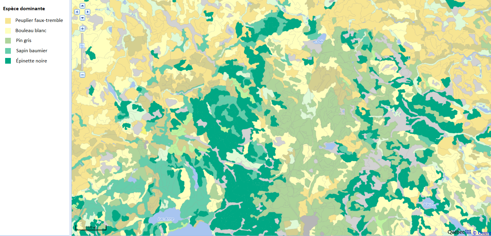

```{r setup, include=FALSE}
knitr::opts_chunk$set(echo = TRUE)
```

# Objectifs

- Choisir une méthode d'échantillonnage en fonction des caractéristiques de la population à étudier.

- Décrire les avantages et inconvénients de différentes méthodes d'échantillonnage.

- Différencier études d'observation et manipulations expérimentales.

- Connaître les éléments importants à considérer lors de la planification d'expériences.

- Décrire le principe et l'intérêt d'une expérience par blocs.


# Méthodes d'échantillonnage

Le méthodes d'échantillonnage définissent des critères pour obtenir un échantillon qui soit *représentatif* d'une population pour la variable qu'on souhaite mesurer. 

La représentativité peut être définie comme une absence de biais: même si la distribution des valeurs change d'un échantillon à l'autre, en moyenne, cette distribution correspond à celle de la population entière.

De plus, nous voulons une méthode d'échantillonnage *efficace*, c'est-à-dire qu'elle nous permet d'estimer une caractéristique de la population avec la précision maximale pour une quantité de ressources (temps, argent) donnée.

## Exemple

Le chaga (*Inonutus obliquus*) est un champignon parasite du bouleau qu’on retrouve en forêt boréale. Généralement préparé en infusion, il est recherché notamment pour sa grande concentration en antioxidants qui apporterait des bénéfices sur la santé.


Imaginez avoir la tâche de réaliser un plan d’échantillonnage pour estimer l’abondance du chaga et la possibilité de récolte commerciale dans une région de 120 km$^2$ (12 000 hectares) au nord-ouest de Rouyn-Noranda. Comment disposerez-vous vos unités d’échantillonnage (placettes) dans ce territoire? Vous avez à votre disposition une carte écoforestière montrant la distribution des peuplements forestiers par espèce dominante.



<br/>

## Échantilonnage aléatoire simple

Dans un échantillonnage aléatoire simple, chaque individu ou unité d'observation a la même probabilité de faire partie de l'échantillon. 
Pour ce type d'échantillonnage, la moyenne d'une variable dans l'échantillon est un estimateur non-biaisé de la moyenne de cette variable dans la population. (Nous discuterons du concept d'estimation plus en détail au prochain cours.)

Dans notre exemple, nous choisissons 20 points aléatoires dans l'aire d'étude pour y situer des placettes de 50 m x 50 m (l'unité d'échantillonnage). 


<br/>

*Avantages*

- C'est la méthode la plus simple permettant d'obtenir un échantillon représentatif. 

- Elle ne requiert pas de connaissances particulières sur la structure de la population.

*Inconvénients*

- Par hasard, les points d'un échantilon donné peuvent être concentrés dans une certaine partie de la population. 

- Comme nous allons le voir, d'autres méthodes peuvent être plus efficaces selon la situation.


## Échantillonnage stratifié

On divise la population ou l'aire d'étude en strates, puis on effectue un échantillonnage aléatoire simple dans chaque strate. 

Par exemple, au lieu de choisir placer aléatoirement 20 placettes dans l'aire d'étude, on pourrait en placer 4 dans chacun des 5 types de peuplement.

Cette méthode est utilisée lorsqu'on croit que la variable mesurée varie plus entre individus de strates différentes qu'entre individus d'une même strate.

Supposons qu'on divise la population en $m$ strates et qu'on calcule la moyenne de $x$ pour l'échantillon aléatoire pris dans chaque strate. Dans ce cas, l'estimateur de la moyenne globale de $x$ est un moyenne pondérée des moyennes de chaque strate.

$$\bar{x} = \sum_{j = 1}^{m} w_j \bar{x}_j$$

Dans cette équation, $\bar{x}_j$ est la moyenne des observations de la starte $j$ et $w_j$ est la fraction de la population ou de l'aire d'étude contenue dans cette strate, qu'on appelle le *poids* de la strate. Par exemple, si le quart de l'aire d'étude fait partie de la première strate, $w_1$ = 0.25.

En général, plus les valeurs de $x$ sont homogènes dans chaque strate et différentes entre les strates, plus l'échantillonnage stratifié sera efficace (estimation plus précise de la moyenne) par rapport à l'échantillonnage aléatoire simple avec le même $n$ total.

Toutefois, cette efficacité dépend aussi du choix de la taille de l'échantillon dans chaque strate. 

- On peut échantillonner chaque strate en proportion de son poids $w_j$ dans la population. Si la variance est la même dans chaque strate, ce choix maximise la précision de la moyenne estimée.

- Si on sait que la variable varie davantage dans certaines strates, on peut sur-échantillonner celles-ci par rapport à leur poids $w_j$.

- Si certaines strates sont plus difficiles ou coûteuses à échantillonner, il est possible qu'on doive les sous-échantillonner par rapport à leur poids.

- Si on s'intéresse non seulement à la moyenne globale, mais aussi à la moyenne par strate, il faut un nombre suffisant d'échantillons dans chaque strate, donc les plus petites strates seront sur-échantillonnées par rapport à leur poids $w_j$.

*Avantages de l'échantillonnage stratifié*

- Estimation plus efficace lorsque la distribution de la variable mesurée diffère de façon importante entre les strates.

- Avec un échantillon suffisant, on obtient non seulement un bon estimé de la moyenne globale, mais aussi par strate. 

*Inconvénients*

- Cette méthode demande une certaine connaissance de la variation de la variable dans la population afin d'établir des strates pertinentes.

- Le résultat peut être biaisé si les poids utilisés ne correspondent pas aux proportions réelles de chaque strate dans la population. 


## Échantillonnage systématique

Pour cette méthode, les points d'échantillonnage sont pris à intervalles réguliers dans l'espace, sur une grille. Il est important de choisir aléatoirement (autant que possible) l'origine de la grille.

Dans notre exemple, nous choisissons un premier point aléatoire dans un carré de 2 km x 2 km au nord-ouest de l'aire d'étude, puis nous plaçons les points subséquents sur une grille avec 2 km entre points successifs.  


<br/>

Imaginons que la variable qui nous intéresse est influencée par un gradient spatial, par exemple une variation de température, de pente ou d'humidité graduelle d'un bout à l'autre de l'aire d'étude. Dans ce cas, les valeurs de $x$ varient davantage entre points éloignés qu'entre points rapprochés. Ainsi, on a avantage à disperser les points suffisamment dans l'espace, spécialement le long du gradient, pour obtenir un échantillon représentatif de l'aire d'étude en entier. 

Le principe est semblable à l'échantillonnage stratifié, où l'on répartissait les points entre strates pour que chaque strate soit bien représentée. Pour l'échantillonnage systématique, on répartit les points le long des axe $x$ et $y$ pour que toutes les portions du gradient spatial de l'aire d'étude soient bien représentées. 

*Avantages*

- Plus efficace que l'échantillonnage aléatoire simple si la variable est influencée par un gradient spatial.

*Désavantages*

- Il n'est parfois pas pratique de placer les points à intervalles réguliers (ex.: aire d'étude de forme irrégulière, endroits inaccessibles).

- Si on veut une estimation non seulement de la moyenne, mais aussi de la variance de $x$, alors il faut répéter l'échantillonnage systématique avec une autre grille (origine aléatoire différente).

- Cette situation est rare, mais si l'habitat varie de façon périodique, ce type d'échantillonnage peut être non représentatif. Par exemple, avec une série de collines et vallées, chaque point pourrait tomber dans une vallée; ou dans un paysage agricole, les points successifs pourraient toujours être au milieu du champ plutôt qu'en bordure.


## Échantillonnage par grappe et multi-stade

Pour une grande aire d'étude, le transport entre sites peut représenter un temps et un coût considérable. Afin de diminuer les coûts tout en conservant une sélection aléatoire des placettes, on peut utiliser un échantillonnage par grappe (*cluster sampling*) et multi-stade (*multistage sampling*). 

Dans cette méthode, on divise la population ou l'aire d'étude en grappes. On choisit d'abord aléatoirement un nombre de grappes. Ensuite, on peut échantillonner tous les individus des grappes choisies, ou plus fréquemment, prendre un échantillon aléatoire de chaque grappe choisie (échantillonnage multi-stade). 

Pour notre exemple, nous divisons l'aire d'étude en grappes de 500 x 500 m et en choisissons 6 aléatoirement. Ensuite, nous choisissons aléatoirement 5 placettes de 50 x 50 m dans chacune des grappes choisies (total de 30 placettes).


<br/>

En réduisant les coûts et le temps associés au déplacement entre unités d'observation, cette méthode permet en principe d'échantillonner plus d'individus pour le même nombre de ressources. 

Si $x$ varie beaucoup à l'intérieur des grappes mais que sa distribution est semblable d'une grappe à l'autre, l'efficacité de cette méthode s'approche de celle de l'échantillonnage aléatoire simple. Toutefois, comme nous avons vu plus tôt, deux points rapprochés l'un de l'autre ont souvent des caractéristiques plus homogènes que deux points éloignés. Dans ce cas, l'échantillonnage par grappe (ou multi-stade) est moins efficace que les autre méthodes.

*Avantages*

- Réduit les coûts liés à l'échantillonnage, permettant d'augmenter la taille de l'échantillon pour un budget donné.

*Désavantages*

- Échantillonnage moins efficace (estimation moins précise) si la région d'étude est hétérogène. Ce désavantage peut être en partie compensé par l'augmentation de $n$.


## Échantillonnage adaptatif

Si on veut échantillonner une espèce rare, les méthodes vues précédemment peuvent être inefficaces dû à l'absence de l'espèce dans la plupart des placettes sélectionnées aléatoirement. 

Dans ce cas, on peut avoir recours à l'échantillonnage adaptatif par grappes (*adaptive cluster sampling*). On commence par échantillonner une nombre de placettes indépendantes, mais lorsqu'on détecte l'espèce voulue, on poursuit l'échantillonnage avec des placettes adjacentes à celle où l'espèce a été détectée.

Puisque l'échantillonnage est concentré sur les régions où l'espèce est abondante, il faut appliquer une correction statistique pour bien estimer l'abondance sur l'ensemble de l'aire d'étude. J'ai inclus quelques articles dans la section références pour plus d'information sur cette méthode.


## Autres méthodes d'échantillonnage

Dans ce cours, nous avons vu quelques stratégies d'échantillonnage générales. D'autres méthodes existent pour répondre au besoin de domaines précis.

Par exemple, en écologie animale, les individus sont mobiles et souvent difficiles à détecter. Des méthodes comme l'estimation d'occupation des sites et la capture-marquage-recapture ont été développées pour tenir compte de l'impossibilité de détecter tous les individus lors d'une seule visite à un site.


# Plans expérimentaux

S'il n'est pas toujours possible de manipuler les variables d'un système dans une expérience contrôlée, cela demeure la façon la plus sure d'isoler une relation de cause à effet entre deux variables.

Par exemple, supposons que nous souhaitons déterminer l'effet de la température sur la croissance des semis d'épinette noire. Nous pourrions mesurer la croissance de semis le long d'un gradient de température nord-sud. Toutefois, d'autres variables importantes vont aussi changer le long de ce gradient, notamment la longueur de la journée. Si nous essayions plutôt de mesurer la croissance des semis d'une même population lors d'années plus chaudes et plus froides, nos résultats seraient influencés par d'autres variables, comme la précipitation, qui varient aussi d'année en année. 

Ainsi, la manipulation expérimentale vise à éliminer l'effet d'autres variables qui pourraient être *confondus* avec l'effet qu'on souhaite mesurer.

Dans cet exemple, une manipulation expérimentale possible serait de faire croître des semis provenant de la même population dans des chambres à température contrôlée, en gardant les autres variables constantes (ex.: lumière, humidité, type de sol). Pour manipuler la température de l'air, il est ici nécessaire de créer un milieu artificiel, mais d'autres types de manipulations expérimentales peuvent être réalisées en milieu naturel, comme nous verrons dans les prochains exemples.

## Exercice

a) Après avoir modifié la composition de l'engrais appliqué à plusieurs champs de maïs dans une région, des agronomes notent que le rendement moyen est significativement supérieur à celui de l'an dernier dans les mêmes champs. Ces résultats vous convainquent-ils que le nouvel engrais est supérieur?

b) Pour comparer l'effet de deux méthodes de préparation du sol sur la regénération d'une forêt après coupe, vous mesurez la croissance moyenne de semis sur deux parterres de coupe, un où a été appliquée la méthode 1 et l'autre où a été appliquée la méthode 2. Est-il utile de délimiter plusieurs parcelles sur chaque parterre afin d'augmenter la taille de votre échantillon?

## Principes de la planification d'expériences

Dans cette section, le **traitement** est une manipulation expérimentale dont on veut mesurer l'effet sur une variable **réponse**. On peut tester différentes options ou intensités de traitement dans la même expérience (par exemple, l'effet de plusieurs types de sols, ou de différents taux d'humidité du sol, sur la croissance).

En biologie, on s'attend à ce que la réponse à un traitement varie d'un individu à un autre. Ainsi, on s'intéresse généralement à estimer l'effet moyen du traitement à partir des réponses mesurées sur un groupe d'individus. Aujourd'hui, nous présentons seulement les principes de la planification d'expérience. Dans les prochaines semaines, nous discuterons des méthodes statistiques pour estimer l'effet des traitements.

Les principes ci-dessous datent des premiers ouvrages traitant de la planification d'expériences (tel que *The Design of Experiments*, publié par R.A. Fisher en 1935) et visent à isoler l'effet de la variable étudiée tout en contrôlant les autres sources de variation.

### Groupe témoin

Pour s'assurer que le traitement est bien la cause de la réponse observée chez les individus traités, il faut comparer cette réponse à celle d'un groupe témoin (ou contrôle) non-traité, placé dans les mêmes conditions environnementales. Parfois, il est nécessaire d'étabir plus d'un groupe témoin.

Par exemple, supposons qu'on souhaite mesurer l'effet d'un insecte herbivore sur la croissance et la survie de semis en milieu forestier. Pour ce faire, nous couvrons certains des semis d'un filet à mailles assez petites pour exclure l'insecte voulu. Dans ce cas, le traitement est l'exclusion de l'insecte. Toutefois, pour vérifier que le filet n'a pas lui-même un effet sur la réponse mesurée, on pourrait définir deux groupes témoin: un sans filet, et l'autre où on utilise un filet à mailles un peu plus grandes que l'insecte.

L'état d'un système avant le traitement est rarement un bon témoin, comme nous avons vu dans la partie (a) de l'exercice ci-dessus, car le système est affecté par d'autres variables qui changent d'une période à l'autre. Si on veut comparer un site avant et après un traitement, il est donc préférable de faire le suivi d'un site témoin durant la même période. Ce type de plan est connu sous l'acronyme BACI (*before-after-control-impact*) et est notamment utilisé pour les études d'impact de perturbations anthropiques sur les écosystèmes. Dans ce cas, un changement dans le temps observé sur le site perturbé, mais pas sur le site témoin, constitue une meilleure preuve d'impact.

Lorsque les traitements visent à comparer l'effet de différents niveaux d'une variable (ex.: pH bas, moyen ou élevé), le concept de témoin ne s'applique pas.

Dans le texte qui suit, nous considérons l'absence de traitement comme un traitement; par exemple, l'expression "chaque traitement" inclut également le témoin.

### Assignation aléatoire

L'échantillonnage aléatoire simple, comme nous l'avons vu plus tôt, donne à chaque individu la même probabilité de faire partie de l'échantillon.

Dans un contexte expérimental, l'assignation aléatoire des différents traitements (incluant l'absence de traitement) donne à chaque individu la même chance d'obtenir l'un ou l'autre des traitements. Comme pour l'échantillonnage aléatoire, le but est d'éliminer les sources de biais. 

Idéalement, la seule source de différence systématique entre les deux groupes devrait être le traitement appliqué. Si un autre facteur variait systématiquement entre le groupe témoin et le groupe traité, l'effet de ce facteur serait confondu avec celui du traitement. 

Dans un contexte d'assignation aléatoire, il est possible d'obtenir par (mal)chance une association entre le traitement et une autre caractéristique de la population; cette probabilité est plus grande lorsque l'échantillon est petit. L'expérience par blocs (voir ci-dessous) est une façon de remédier à ce problème pour un nombre restreint de facteurs confondants. 

### Réplication

En principe, l'assignation aléatoire permet d'estimer sans biais l'effet d'un traitement pour la population où l'expérience est réalisée. Toutefois, afin de vérifier si l'effet se généralise à plusieurs sites, il est utile d'effectuer plusieurs réplicats du dispositif expérimental.

Si les réplicats d'un traitement sont plus semblables entre eux qu'avec ceux des autres traitements, ils ne peuvent pas être considérés comme des observations indépendantes. En écologie, ce type de **pseudoréplication** (voir l'article à ce sujet dans les références) est souvent dû à une proximité des sites dans l'espace. Par exemple, dans la partie (b) de l'exercice précédemment, la délimitation de plusieurs parcelles sur le site témoin et le site traité ne constitue pas une réplication indépendante. 

### Expériences par blocs

L'assignation aléatoire des traitements vise à assurer que les groupes d'individus recevant un traitement ou l'autre possèdent, en moyenne, des caractéristiques semblables. Avec un échantillon assez grand, on peut donc contrôler l'effet d'autres variables affectant la réponse, sans même connaître ces variables. 

Il arrive aussi qu'on sache d'avance que certaines caractéristiques des individus puissent influencer leur réponse au traitement. Dans ce cas, il est préférable de regrouper les individus en *blocs* plus homogènes et assigner aléatoirement les divers traitement dans chaque bloc. 

Pour une expérience avec un seul traitement et un groupe témoin, des paires d'individus semblables peuvent constituer un bloc. Par exemple, supposons que nous voulons tester l'efficacité d'un nouveau composé pour prévenir la défoliation du peuplier faux-tremble par la livrée des forêts. Chez cette espèce, chaque arbre peut donner naissance à plusieurs clones. Dans ce cas, nous pouvons choisir des paires de clones et pour chaque paire, appliquer le traitement à un des deux clones choisis au hasard. Ainsi, nous éliminons la variation génétique comme source de différence pouvant être confondue à l'effet du traitement.

## Plan d'expérience à blocs complets aléatoires

Dans une expérience à blocs complets aléatoires, les individus sont divisés en blocs et chacun des traitements est assigné de façon aléatoire à un nombre égal d'individus par bloc.

Exemple: Nous plantons dans une même placette des érables provenant de diverses populations et souhaitons mesurer l'effet d'une variation du pH du sol sur leur productivité. Nous appliquons trois traitements: + pH (T1), - pH (T2), et témoin (C). Les arbres d'une même population sont plus proches génétiquement et peuvent partager certaines adaptations. Nous définissons donc des blocs pour chaque population d'origine et assignons aléatoirement 1/3 des individus de chaque population à C, 1/3 à T1 et 1/3 à T2, tel que montré dans le schéma suivant. (Pour simplifier, seulement trois arbres sont illustrés par population.)


Comme nous avons mentionné dans la section sur la réplication, les conditions environnementales sont généralement plus semblables pour deux points rapprochés que deux points plus éloignés l'un de l'autre. Dans ce cas, pour éviter de confondre les conditions environnementales locales avec l'effet d'un traitement, il est avantageux de disperser les traitements dans l'espace, surtout s'il y a un gradient environnemental connu (pente, proximité de l'eau, etc.). Dans le schéma ci-dessous, les arbres sont organisés en blocs le long de l'axe du gradient.


Lorsque les blocs sont organisés d'après un gradient spatial, les individus d'un même bloc doivent être assez rapprochés pour que les conditions environnementales soient homogènes, mais pas tant que les traitements "contaminent" les individus adjacents. 

Nous verrons comment analyser les données d'expériences par blocs dans le cours sur l'analyse de variance (ANOVA).

## Plan d'expérience à plusieurs facteurs

Jusqu'à maintenant, nous avons présenté des plans d'expérience où les traitements pouvaient être considérés comme différentes valeurs d'une seule variable, aussi appelée *facteur*. L'exercice suivant montre un cas où nous souhaitons mesurer simultanément l'effet de deux facteurs.

### Exercice

Vous êtes responsable d'une expérience visant à déterminer si la croissance de semis de quatre espèces d'arbres (érable rouge, pin gris, sapin baumier et tremble) dépend de la texture du sol (sableuse, limoneuse ou argileuse). Vous avez la capacité de planter 144 semis dans 12 placettes. Décrivez un plan pour organiser les placettes dans l'espace et les traitements (espèces d'arbres et type de sol) dans les placettes.

### Plan factoriel

Pour une expérience avec plusieurs facteurs, un plan factoriel consiste à assigner chacune des combinaisons possibles des traitements. Par exemple, s'il y a trois traitements possibles pour la variable 1 et cinq pour la variable 2, le plan factoriel requiert au minimum 3 x 5 = 15 unités d'observation. Idéalement, nous voudrions un multiple de 15 afin que chaque combinaison de traitements soit répliquée.

### Plan en parcelles divisées

Un plan à parcelles divisées (*split-plot design*) est une façon d'organiser un dispositif expérimental multi-factoriel lorsqu'un des facteurs est plus difficile à contrôler. Par exemple, supposons que nous voulons mesurer l'effet d'un changement de la concentration de CO$_2$ sur l'activité photosynthétique de différentes variétés de peuplier. Le contrôle de la concentration de CO$_2$ requiert d'isoler les arbres dans des chambres de croissance. Dans ce cas, le facteur difficile à contrôler est répliqué un petit nombre de fois (ex.: deux chambres à basse concentration et deux à haute concentration), tandis que l'autre facteur est niché dans le premier (ex.: 8 semis de chaque variété disposés aléatoirement dans chacune des 4 chambres).


Nous verrons comment analyser les données d'un plan en parcelles divisées dans le cours sur les modèles mixtes.

**Question**: Comment appliqueriez-vous un plan en parcelles divisées dans l'exercice précédent?


# Références

*Échantillonnage adaptatif*

Smith, D.R., Brown, J.A. et Lo, N.C.H. (2004) Application of Adaptive Sampling to Biological Populations, dans Thompson, W.L. (ed.) Sampling Rare and Elusive Species. Island Press, Washington. pp. 75-122.  

Talvitie, M., Leino, O. et Holopainen, M. (2006) Inventory of Sparse Forest Populations Using Adaptive Cluster Sampling. *Silva Fennica* 40, 101-108.


*Plans expérimentaux*

Hurlbert, S.H. (1984) Pseudoreplication and the Design of Ecological Field Experiments. *Ecological Monographs* 54, 187-211.


