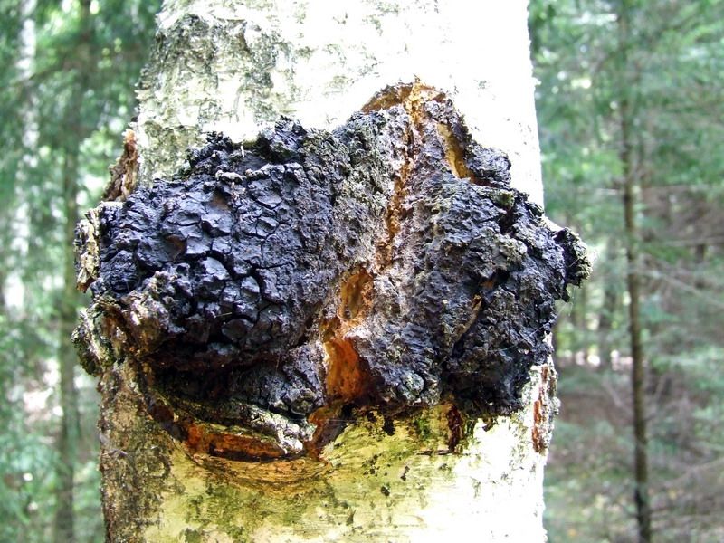
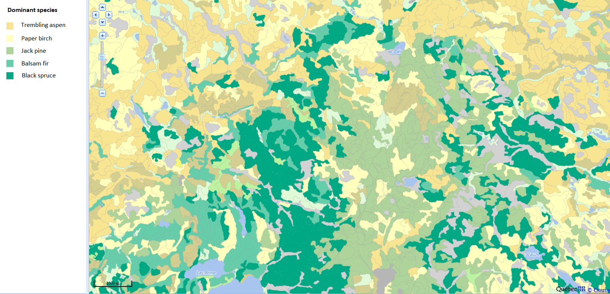
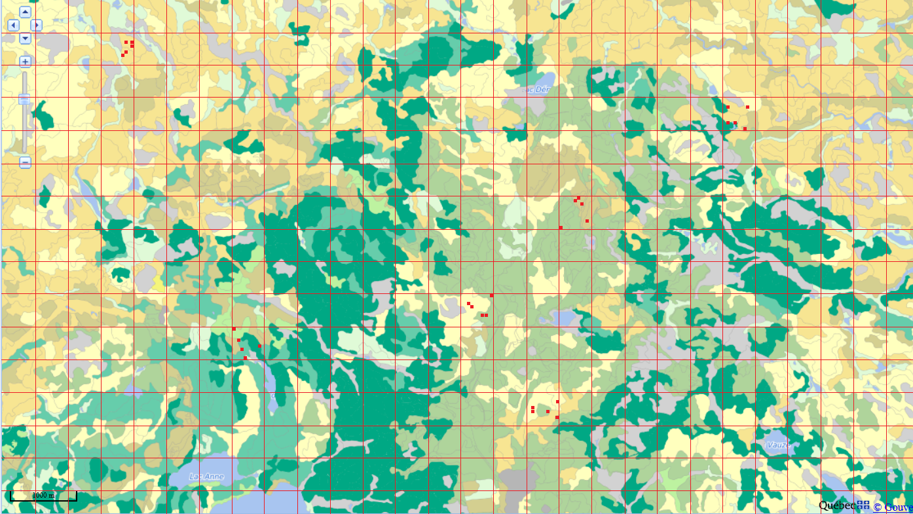

```{r setup, include=FALSE}
knitr::opts_chunk$set(echo = TRUE)
library(tidyverse)
library(cowplot)
theme_set(theme_cowplot())
set.seed(7102)
```

# Objectives

- Estimate the mean and variance of a population from a sample.

- Define the bias and standard error of an estimator.

- Calculate the properties of an estimator by simulation.

- Describe the advantages and disadvantages of different sampling methods.

- Choose a sampling method according to the characteristics of the population to be studied.


# Statistics, parameters and estimators

At the last class, we saw a series of descriptive statistics: mean, variances, quantiles and others. In general, a *statistic* is a quantity calculated from observations of random variables.

A *parameter* is a characteristic of the population that is not directly measured. As we will see next week, these parameters are often part of a statistical model to describe the variation of a random variable.

In this class, our main goal will be to determine to which extent a statistic calculated from observations is a good *estimator* of a given parameter.

For example, if we measure the weight of red squirrels and calculate the mean (a statistic), what is our estimate of the mean weight of the red squirrel population (a parameter)? What is its margin of error?

> In general, a parameter is a theoretical quantity. In our example, even if we could census all the squirrels, the weight of the individuals varies constantly and the composition of the population too (because of the births, deaths and migrations).


# Parameter estimation

## Estimation of the mean

Suppose we measure a variable $x$ on a sample of $n$ individuals randomly selected from a population, i.e. where each individual has the same probability of being included in the sample. 

We use the sample mean:

$$\bar{x} = \frac{1}{n} \sum_{i = 1}^{n} x_i$$
as the estimator of $\mu$, the mean of $x$ in the whole population.

> Note: Following a common convention in statistics, parameters are represented by Greek letters and variables or statistics are represented with Latin letters.

One way to study the properties of an estimator is to *simulate* the sampling process from a known population.

For this example, imagine that the 1161 trees in the Kejimkujik dataset represent the entire population, and that we sample some of those trees.

```{r}
kejim <- read.csv("../donnees/cours1_kejimkujik.csv")
dhp <- kejim$dhp
paste("The population has a mean DBH of", round(mean(dhp), 2), "cm with a standard deviation of", round(sd(dhp), 2), "cm.")
```

In R, the `sample` function draws a random sample from the elements of a vector.

```{r}
mean(sample(dhp, 20)) # mean DBH for a sample of n = 20 trees
```

The `replicate` function repeats the same instruction a number of times; therefore we can easily generate multiple means from different possible random samples.

```{r}
# the first argument for replicate gives the number of replications
replicate(5, mean(sample(dhp, 20)))  
```

The sample mean is therefore also a random variable. As we simulate more and more samples, the resulting values become more representative of the probability of obtaining different values of that mean.

The histograms below show the distributions (out of 10,000 replicates) of the mean DBH with a sample size $n$ = 10, 20 or 40.

```{r echo = FALSE, message = FALSE, warning = FALSE}
df <- data.frame(n = c(10, 20, 40)) %>%
    mutate(x = map(n, ~ replicate(1E4, mean(sample(dhp, size = .))))) %>%
    unnest()

ggplot(df, aes(x = x)) +
     geom_histogram(color = "white") +
     labs(x = "Sample mean of DBH", y = "Number of replicates") +
     scale_y_continuous(expand = c(0, 0)) +
     facet_wrap(~ n, labeller = function(x) label_both(x, sep = " = ")) +
     theme(strip.background = element_blank(), strip.text = element_text(face = "bold"))
```

As the sample size increases, the distribution becomes less dispersed, but also more symmetrical. Next week, we will see that it approaches a normal distribution if $n$ is large enough.

For a variable $x$ that is distributed with a mean $\mu$ and a variance $\sigma^2$, we can prove that $\bar{x}$ has a mean equal to $\mu$ and a variance equal to $\sigma^2 / n$. The standard deviation of $\bar{x}$, which in this context is called the *standard error*, is therefore inversely proportional to the square root of $n$.

Standard error of the mean: $$\sigma_{\bar{x}} = \frac{\sigma_{x}}{\sqrt{n}}$$

The mean and standard error of $\bar{x}$ calculated from the 10,000 samples simulated above are consistent with the theoretical predictions.

|  n|  Mean (cm)| Standard error (cm)| $\sigma / \sqrt{n}$|
|--:|--------:|-----------:|--------:|
| 10|    21.77|        3.86| 3.87|
| 20|    21.76|        2.74| 2.74|
| 40|    21.76|        1.89| 1.94|

Since the mean of the estimator is equal to the value of the estimated parameter $\mu$, $\bar{x}$ is an *unbiased* estimator of $\mu$.

## Standard deviation or standard error

It is important not to confuse the standard deviation of $x$ with the standard error of an estimator, such as $\bar{x}$. The standard deviation of $x$ measures the dispersion of the individual values of the variable relative to their mean. The standard error of $\bar{x}$ measures the dispersion of the sample mean relative to the population mean. The standard error decreases with the size of the sample.

Since the standard error decreases according to $\sqrt{n}$ rather than $n$, if we want to reduce this standard error by half, we must increase the sample size by a factor of 4.

```{r echo = FALSE}
ggplot(NULL, aes(x = c(10, 100))) +
    stat_function(fun = function(x) x^(-0.5), geom = "line", size = 1) +
    labs(x = "n", y = expression(1/sqrt(n))) +
    geom_segment(aes(x = 0, xend = 20, y = 1/sqrt(20), yend = 1/sqrt(20)),
                 linetype = "dotted") +
    geom_segment(aes(x = 20, xend = 20, y = 0, yend = 1/sqrt(20)),
                 linetype = "dotted") +
    geom_segment(aes(x = 0, xend = 40, y = 1/sqrt(40), yend = 1/sqrt(40)),
                 linetype = "dotted") +
    geom_segment(aes(x = 40, xend = 40, y = 0, yend = 1/sqrt(40)),
                 linetype = "dotted") +
    geom_segment(aes(x = 0, xend = 80, y = 1/sqrt(80), yend = 1/sqrt(80)),
                 linetype = "dotted") +
    geom_segment(aes(x = 80, xend = 80, y = 0, yend = 1/sqrt(80)),
                 linetype = "dotted") +
    scale_x_continuous(breaks = seq(10, 80, 10), limits = c(0, 90), expand = c(0, 0)) +
    scale_y_continuous(breaks = seq(0, 0.3, 0.05), limits = c(0, 0.35), expand = c(0, 0))
    
```

Note also that the standard error depends only on the size of the sample, not on the population size. This is true as long as the sample is small relative to the population. When sampling a significant fraction of the population (say more than 5%), the actual standard error is smaller than $\sigma / \sqrt{n}$.

## Estimation of the variance

To estimate the variance $\sigma^2$ of a variable $x$, one could calculate the variance of the sample with the equation seen at the last class.

$$s^2 = \frac{1}{n} \sum_{i = 1}^n \left( x_i - \bar{x} \right)^2  $$

Here, we $s^2$ for the variance of a sample to differentiate from the population parameter $\sigma^2$.

As before, we test this estimator by simulating 10,000 samples from the DBH vector with $n$ = 10, 20, and 40. The following table shows the mean of $s^2$ and its ratio to the popultion parameter $\sigma^2$ (150.1 cm$^2$).

|  n| Mean of $s^2$ (cm$^2$)| Mean of $s^2$ / $\sigma^2$ |
|--:|--------:|-----------:|
| 10|    136.3|        0.90|
| 20|    143.1|        0.95|
| 40|    146.6|        0.97|

This result shows that the calculated variance of the sample systematically underestimates the variance of the population. It is therefore a *biased* estimator. Why is this the case?

The problem is that the estimator $s^2$ is not based on the population mean, but on its estimate $\bar{x}$ calculated from the same sample. By definition, the sample is always centered on $\bar{x}$, but $\bar{x}$ is at some distance from $\mu$. Therefore, the squared deviations from $\mu$ are slightly larger than the deviations from $\bar{x}$.

In fact, the estimator defined above underestimates the variance of the population by a ratio $(n-1)/n$, as shown in the last column of the table (0.9 = 9/10, 0.95 = 19/20). In that case, the bias can be corrected by multiplying the estimator by $n / (n-1)$, giving the unbiased estimator:

$$s^2 = \frac{1}{n - 1} \sum_{i = 1}^n \left( x_i - \bar{x} \right)^2$$

Its square root provides an estimator for the population standard deviation:

$$s = \sqrt{\frac{1}{n - 1} \sum_{i = 1}^n \left( x_i - \bar{x} \right)^2}$$

Unlike $s^2$, the $s$ estimator for the standard deviation is biased, but it remains the most commonly used one, since there is no simple and unbiased formula for standard deviation.

Finally, we also use $s$ as the $\sigma$ estimator for calculating the standard error of $\bar{x}$, so that standard error is estimated as $s / \sqrt{n}$.

## Degrees of freedom

Another way to explain the division by ($n - 1$) in the calculation of $s^2$ is based on the concept of degrees of freedom.

The number of degrees of freedom is the number of independent data used in the calculation of a statistic. Here, $s^2$ is computed from the deviations between each observation of $x$ and its mean ($x_i - \bar{x}$). As we saw in the first class, the definition of $\bar{x}$ ensures that the sum of these deviations is equal to 0. In this case, when we know the first $n - 1$ deviations, we can automatically deduce the last, which is not an independent data point.

## Bias and standard error of an estimator

The notions of bias and standard error were briefly presented in the previous section.

More generally, if we estimate a parameter $\theta$ (e.g. $\mu$) with an estimator $\hat{\theta}$ (e.g. $\bar{x}$), we can divide the *mean square error* between $\hat {\theta}$ and $\theta$ into two components. (In the equation below, the function $E[]$ is another way of representing the mean.)

$$E[(\hat{\theta} - \theta)^2] = E[(\hat{\theta} - E[\hat{\theta}])^2] + (E[\hat{\theta}] - \theta)^2$$

This equation tells us that the mean square deviation between an estimator and the parameter is the sum of:

- the mean square deviation between the estimator and its mean (that is, the variance of the estimator, or the square of its standard error);

- the square of the difference between the mean of the estimator and the parameter (this difference is the bias);

So, we have the following relation: *Mean square error = (Standard error)$^2$ + (Bias)$^2$*.

These two sources of error have different properties. The standard error is due to the limited size of the sample and decreases as $n$ increases. Bias is a systematic error that does not depend on the size of the sample, but may be due to a biased estimator or unrepresentative sampling of the population.

## Exercise

In order to estimate the mean wood density of jack pine on a site, you first sample 9 trees, which have a mean wood density of 450 kg/m$^3$ with a standard deviation of 90 kg/m$^3$.

(a) What is the standard error of this mean?

(b) If you wanted to know the mean with a standard error of no more than 10 kg/m$^3$, how many trees do you expect to sample?


# Sampling methods

Sampling methods define criteria to obtain a sample that is *representative* of a population for the variable of interest.

Representativeness can be defined as an absence of bias: even if the distribution of values changes from one sample to another, on average, this distribution corresponds to that of the entire population.

In addition, we want an *effective* sampling method, that is, it allows us to estimate the desired parameters with the greatest precision for a given amount of resources (time, money).

## Example

The chaga (*Inonutus obliquus*) is a fungal parasite of birch trees found in the boreal forest. Generally consumed as a herbal tea, it is particularly sought after for its high concentration of antioxidants which could provide health benefits.



Imagine you were charged with creating a sampling plan to estimate the abundance of chaga and its commercial harvest potential in a 120 km$^2$ (12 000 ha) region north-west of Rouyn-Noranda. How would you place your sampling units (plots) in that landscape? You have a map of forest types showing the distribution of stands identified by their dominant species.



<br/>

## Simple random sampling

In simple random sampling, each individual or unit of observation has the same probability of being sampled.

For this type of sampling, the sample mean of the variable is an unbiased estimator of its population mean and its standard error is given by the formula seen above.

In our example, we select 20 random points in the study area to locate 50 m x 50 m plots (the sampling unit). 


<br/>

*Advantages*

- This is the simplest method to obtain a representative sample.

- It does not require any particular knowledge about the structure of the population.

*Disadvantages*

- By chance, the points of a given sample may be concentrated in a certain part of the population.

- As we will see, other methods may be more effective depending on the situation.


## Stratified sampling

The population or study area is divided into strata, followed by simple random sampling in each stratum.

For example, instead of choosing to randomly place 20 plots in the study area, 4 could be placed in each of the 5 stand types.

This method is used when we believe that the measured variable varies more between individuals of different strata than between individuals of the same stratum.

Suppose we divide the population into $m$ strata and calculate the mean of $x$ for the random sample taken in each stratum. In this case, the estimator for the overall mean of $x$ is a weighted mean of the means for each stratum.

$$\bar{x} = \sum_{j = 1}^{m} w_j \bar{x}_j$$

The standard error of that mean is given by:

$$s_{\bar{x}} = \sqrt{\sum_{j = 1}^{m} w_j^2 \frac{s_j^2}{n_j}}$$

In these equations, $n_j$ is the number of observations in stratum $j$, $\bar{x}_j$ is their mean and $s_j$ is their variance. Note that the fraction $s_j^2 / n$ is the variance of the mean of stratum $j$.

Le *poids* $w_j$ d'une strate est la fraction de la population ou de l'aire d'étude contenue dans cette strate. Par exemple, si le quart de l'aire d'étude fait partie de la première strate, $w_1$ = 0.25.

The *weight* $w_j$ of a stratum is the fraction of the population or study area contained in that stratum. For example, if one quarter of the study area is in the first stratum, $w_1$ = 0.25.

The more the values of $x$ are homogeneous within each stratum and different between strata, the more efficient stratified sampling will be (greater precision of the mean) compared with simple random sampling for the same total $n$.

However, this efficiency also depends on the choice of sample size in each stratum.

- Each stratum can be sampled in proportion to its weight $w_j$ in the population. If the variance is the same in each stratum, this choice maximizes the precision of the estimated mean.

- If we know that the variable varies more in certain strata, we can oversample them relative to their weight $w_j$.

- If some strata are more difficult or expensive to sample, it may be necessary to undersample them relative to their weight.

- If we are interested not only in the overall mean, but also in the mean of each stratum, we need a sufficient number of samples in each stratum, so the smallest strata will be oversampled compared to their weight $w_j$.

*Advantages of stratified sampling*

- More efficient estimation when the distribution of the measured variable differs significantly between strata.

- With a sufficiently large sample, we obtain not only a good estimate of the overall mean, but also the mean of each stratum.

*Disadvantages*

- This method requires some knowledge of the variation of the variable in the population in order to establish relevant strata.

- The result may be biased if the weights used do not correspond to the actual proportions of each stratum in the population.


## Systematic sampling

For this method, sampling points are taken at regular intervals in space, on a grid. It is important to choose randomly (as much as possible) the origin of the grid.

In our example, we choose a first random point in a 2 km x 2 km square northwest of the study area, then we place the subsequent points on a grid with 2 km between successive points.  


<br/>

Imagine that the variable of interest is influenced by a spatial gradient, such as a gradual change in temperature, slope, or humidity across the study area. In this case, the values of $x$ vary more between distant points than between close points. Thus, it is advantageous to spread out the points sufficiently in space, especially along the gradient, to obtain a representative sample of the entire study area.

The principle is similar to stratified sampling, where the points are distributed between strata so that each stratum is well represented. For systematic sampling, the points along the $x$ and $y$ axes are distributed so that all portions of the spatial gradient of the study area are well represented.

*Advantages*

- More efficient than simple random sampling if the variable is influenced by a spatial gradient.

*Disadvantages*

- It is sometimes not practical to place points at regular intervals (e.g. irregularly shaped study area, inaccessible places).

- If we want an estimate not only of the mean, but also of the variance of $x$, then we have to repeat the systematic sampling with another grid (different random origin).

- This situation is rare, but if the habitat varies periodically, this type of sampling may be unrepresentative. For example, with a series of hills and valleys, each point could fall into a valley; or in an agricultural landscape, successive points could always be in the middle of the field rather than at the edge.


## Cluster and multistage sampling

For a large study area, transportation between sites can be time consuming and costly. In order to reduce costs while maintaining a random sampling of plots, we can use cluster or multistage sampling.

In this method, the population or study area is divided into clusters. We first randomly choose a number of clusters. Then, we can sample all the individuals from the chosen clusters, or more frequently, take a random sample from each chosen cluster (multistage sampling).

In our example, we divide the study area into clusters of 500 x 500 m and choose six of them at random. Then we randomly select five 50 x 50 m plots in each of the selected clusters (total of 30 plots).



<br/>

By reducing the costs and time associated with moving between observation units, this method allows in principle to sample more individuals for the same number of resources.

While $x$ varies a lot within clusters but has a similar distribution from cluster to cluster, the efficiency of this method approaches that of simple random sampling. However, as we saw earlier, two points close together often have more homogeneous characteristics than two distant points. In this case, cluster (or multistage) sampling is less efficient than other methods.

*Advantages*

- Reduces the costs associated with sampling, allowing us to increase the sample size for a given budget.

*Disadvantages*

- Less efficient sampling (less precise estimate) if the study area is heterogeneous. This disadvantage may be partially offset by the increase of $n$.


## Adaptive sampling

If we want to sample a rare species, the methods seen previously may be ineffective due to the absence of the species in most randomly selected plots.

In this case, adaptive cluster sampling can be used. A number of independent plots are first sampled, but when the desired species is detected, sampling is continued with plots adjacent to the one where the species was detected.

Since sampling is concentrated in areas where the species is abundant, a statistical correction must be applied to properly estimate abundance in the entire study area. I have included some articles in the references section for more information on this method.

- Smith, D.R., Brown, J.A. and Lo, N.C.H. (2004) Application of Adaptive Sampling to Biological Populations, in Thompson, W.L. (ed.) Sampling Rare and Elusive Species. Island Press, Washington. pp. 75-122.  

- Talvitie, M., Leino, O. and Holopainen, M. (2006) Inventory of Sparse Forest Populations Using Adaptive Cluster Sampling. *Silva Fennica* 40, 101-108.

## Other sampling methods

In this class, we have seen some general sampling strategies. Other methods exist to meet the need for specific fields of study.

For example, in animal ecology, individuals are mobile and often difficult to detect. Methods such as site occupancy estimation and capture-mark-recapture have been developed to account for the inability to detect all individuals in a single visit to a site.


# Summary

- An estimator is biased when its mean over all possible samples differs from the value of the parameter to be estimated.

- The standard error measures the dispersion of an estimator from one sample to another, and decreases with the size of the sample.

In addition to simple random sampling, there are other techniques that may be more effective depending on the structure of the population / study area:

- stratified sampling when groups (strata) can be defined where the variable being measured varies greatly from one group to another;

- systematic sampling when there is a spatial gradient that affects the variable being measured;

- cluster or multi-stage sampling when it is more practical to sample clusters of individuals in different locations;

- adaptive sampling to estimate the abundance of a rare species.


