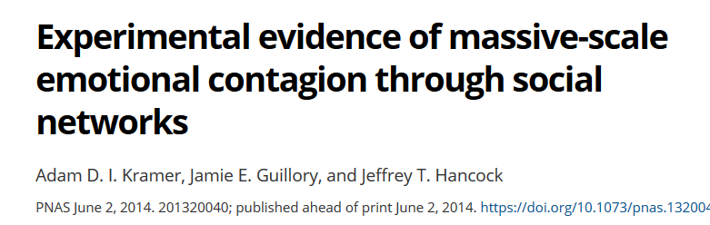
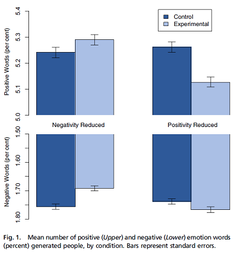

```{r setup, include=FALSE}
knitr::opts_chunk$set(echo = TRUE)
library(ggplot2)
library(cowplot)
```

# Objectifs

- Décrire le fonctionnement général d'un test d'hypothèse statistique.
- Définir des concepts liés à la précision d'un test: seuil de signification, puissance, erreurs de type I et II.
- Utiliser le test $t$ pour comparer la moyenne de deux échantillons indépendants ou appariés.


## Comparer la moyenne d'un échantillon à une valeur de référence

Dans cet exemple, nous voulons vérifier l'absence de biais d'un humidimètre, en mesurant l'humidité relative du sol à 9 endroits dans une placette de 1 m$^2$. Avec un appareil plus précis, nous avons déterminé que l'humidité moyenne dans cette parcelle est de 50%. Voici les 9 valeurs obtenues avec l'appareil à tester, leur moyenne et l'erreur-type de cette moyenne.

```{r}
humidite <- c(47, 50, 48, 50, 54, 49, 56, 52, 51)
humid_moy <- mean(humidite)
humid_et <- sd(humidite) / sqrt(length(humidite))
paste("Moyenne de", round(humid_moy, 2), "et erreur-type de", round(humid_et, 2))
```

Supposons que ces mesures suivent une distribution normale. Si l'appareil n'était pas biaisé ($\mu$ = 50), quelle serait la probabilité que la moyenne de l'échantillon $\bar{x}$ soit aussi éloignée de la valeur de référence $\mu$?

Durant le cours sur les intervalles de confiances, nous avons vu que l'écart entre $\bar{x}$ et $\mu$, divisé par l'erreur-type, suit une distribution $t$ avec $n - 1$ degrés de liberté:

$$ t_{n-1} = \frac{\bar{x} - \mu}{s / \sqrt{n}} $$

Souvenez-vous que la distribution $t$ remplace la distribution normale centrée réduite lorsque que l'écart-type $s$ est estimé à partir de l'échantillon. 

La statistique $t$ pour cet échantillon, si $\mu$ = 50, est égale à:
```{r}
humid_t <- (humid_moy - 50) / humid_et
humid_t
```

La distribution $t$ cumulative (fonction `pt` dans R) nous donne la probabilité d'observer une valeur plus petite ou égale à une valeur donnée. Dans ce cas, la probabilité d'obtenir une valeur de la statistique $t$ plus grande que celle observée pour notre échantillon, si $\mu$ est bien égale à 50, est calculée ainsi:

```{r}
1 - pt(humid_t, df = 8)
```

Cette probabilité (21.9%) correspond à la portion de l'aire sous la courbe coloriée dans le graphique ci-dessous:

```{r echo = FALSE}
ggplot(NULL, aes(x = seq(-4, 4, 0.1))) +
    labs(x = "t", y = "p(t)") +
    stat_function(fun = function(x) dt(x, df = 8)) +
    stat_function(fun = function(x) ifelse(x > humid_t, dt(x, df = 8), NA), geom = "area", fill = "red") +
    scale_y_continuous(expand = c(0, 0))
```

Puisque notre question était: "Quelle est la probabilité de la moyenne de l'échantillon soit aussi éloignée de la valeur de référence?", il faut aussi considérer la probabilité d'obtenir un écart négatif plus grand que l'écart positif observé, i.e. une valeur de la statistique $t$ inférieure à -0.815. Comme la distribution $t$ est symétrique, cette probabilité est aussi égale à 21.9%, donc la probabilité d'avoir obtenu une moyenne plus éloignée de 50 que celle observée est de 43.8%, tel qu'illustré sur le graphique suivant.

```{r echo = FALSE}
ggplot(NULL, aes(x = seq(-4, 4, 0.1))) +
    labs(x = "t", y = "p(t)") +
    stat_function(fun = function(x) dt(x, df = 8)) +
    stat_function(fun = function(x) ifelse(abs(x) > humid_t, dt(x, df = 8), NA), geom = "area", fill = "red") +
    scale_y_continuous(expand = c(0, 0))
```

Ainsi, l'écart observé entre la moyenne de l'échantillon et la valeur attendue ($\mu$ = 50) est très probable vu la variation entre les mesures. Dans le contexte des tests d'hypothèse, la probabilité d'obtenir un résultat plus extrême que celui observé se nomme **valeur *p*** (*p-value*). Dans ce cas, la valeur *p* associée à l'hypothèse $\mu$ = 50 est de 0.438.  

Dans les prochaines sections, nous verrons de façon plus formelle les éléments d'un test d'hypothèse statistique.


# Tests d'hypothèse statistique

De façon générale, un test d'hypothèse statistique vise à déterminer si une variation observée dans un échantillon de données est compatible avec un modèle "par défaut" (l'hypothèse nulle), ou si les observations sont si improbables selon cette hypothèse nulle qu'elle doit être rejetée au profit d'une hypothèse alternative.

## Hypothèse nulle et hypothèse alternative

L'hypothèse nulle tire son nom du fait qu'elle correspond souvent à une absence d'effet: aucune différence entre deux traitements, absence de corrélation entre deux variables, etc. 

Dans notre exemple précédent, l'hypothèse nulle ($H_0$) correspondait à l'absence de biais de l'humidimètre ($\mu = 50$). L'hypothèse alternative ($H_a$) est la négation logique de l'hypothèse nulle, donc $\mu \neq 50$.

### Exercice

Quelle est l'hypothèse nulle correspondant à chacune des hypothèses alternatives suivantes?

- La densité des semis de sapins varie selon la pente dans une parcelle.

- Ce nouvel insecticide est plus efficace que le traitement existant contre l'agrile du frêne.

## Test unilatéral ou bilatéral

Le deuxième exemple de l'exercice constitue un test unilatéral. Si $\mu_T$ est l'effet du nouveau traitement et $\mu_R$ celui du traitement de référence, alors l'hypothèse nulle est $\mu_T \leq \mu_R$ et l'hypothèse alternative est $\mu_T > \mu_R$. 

Dans notre premier l'exemple, nous voulions tester la présence d'un biais positif ou négatif dans les mesures de l'humidimètre. Il s'agit d'un test bilatéral, où l'hypothèse alternative $\mu \neq 50$ est équivalente à l'union de deux hypothèse unilatérales ($\mu < 50$ ou $\mu > 50$).

Le choix d'un test unilatéral ou bilatéral doit être fait à l'avance et dépend de la question qui nous intéresse.

### Exercice

Quel serait un exemple d'hypothèse nulle et d'hypothèse alternative dans votre domaine de recherche?

## Hypothèse scientifique et hypothèse statistique

Dans le contexte d'évaluation de traitements expérimentaux (en médecine, en agronomie ou sylviculture, etc.), l'hypothèse nulle correspond généralement à l'absence d'effet du traitement étudié par rapport à un traitement de référence ou un groupe témoin. Dans ce cas, l'hypothèse alternative correspond à l'hypothèse scientifique qui intéresse réellement les chercheurs. On fait l'hypothèse que le traitement a un effet, donc on vérifie si cet effet peut être détecté (c'est-à-dire, si l'hypothèse nulle est rejetée par l'expérience).

Dans d'autres contextes, l'hypothèse nulle est basée sur les prédictions d'un modèle qu'on souhaite tester. Par exemple, est-ce que les jours de pluie observés dans une année correspondent aux probabilités de précipitation prévues par les modèles météorologiques? Dans ce cas, le rejet de l'hypothèse nulle signifie que les observations sont incompatibles avec le modèle et donc que ce modèle doit être amélioré.

## Éléments d'un test d'hypothèse

À partir d'une hypothèse nulle donnée, la construction d'un test statistique requiert trois principaux éléments:

- une statistique qui mesure l'écart des observations par rapport à l'hypothèse nulle;
- la distribution de cette statistique sous l'hypothèse nulle; et
- un seuil de signification.

Dans l'exemple vu au début de ce cours, nous avons calculé la statistique $t$ dont nous connaissons la distribution théorique, ce qui nous a permis de déterminer une valeur $p$, soit la probabilité d'obtenir un écart plus élevé que celui observé si l'hypothèse nulle était vraie. 

Le seuil de signification ($\alpha$) correspond à une probabilité qu'on considère assez petite pour rejeter l'hypothèse nulle si $p \leq \alpha$. Pour des raisons historiques, le seuil le plus souvent utilisé dans est $\alpha = 0.05$. Cela correspond à une probabilité de 5% de rejet erroné de l'hypothèse nulle. 

Le seuil $\alpha$ doit être choisi avant l'analyse des données.

## Test unilatéral ou bilatéral

Pour un test bilatéral, on rejette une fraction $\alpha / 2$ de chaque extrême de la distribution (comme pour l'intervalle de confiance). Pour un test unilatéral, on rejette une fraction $\alpha$ d'une extrême de la distribution. Voici une illustration des deux cas avec $\alpha = 0.05$.

```{r echo = FALSE}
p1 <- ggplot(NULL, aes(x = seq(-4, 4, 0.1))) +
    labs(x = "t", y = "p(t)") +
    stat_function(fun = function(x) dt(x, df = 8)) +
    stat_function(fun = function(x) ifelse(abs(x) > qt(0.975, df = 8), dt(x, df = 8), NA), 
                  geom = "area", fill = "red") +
    scale_y_continuous(expand = c(0, 0))

p2 <- ggplot(NULL, aes(x = seq(-4, 4, 0.1))) +
    labs(x = "t", y = "p(t)") +
    stat_function(fun = function(x) dt(x, df = 8)) +
    stat_function(fun = function(x) ifelse(x > qt(0.95, df = 8), dt(x, df = 8), NA), 
                  geom = "area", fill = "red") +
    scale_y_continuous(expand = c(0, 0))

plot_grid(p1, p2, nrow = 1)
```

# Types d'erreur et puissance d'un test

## Erreurs de type I et II

Voici les quatre scénarios possibles selon que $H_0$ soit vraie ou fausse et qu'elle soit rejetée ou non:

|            |  On ne rejette pas $H_0$ | On rejette $H_0$ |
|----------- |--------------------------+------------------|
|$H_0$ vraie |    décision correcte     | erreur de type I |
|$H_0$ fausse|    erreur de type II     | décision correcte|


*Note*: La vérité d'$H_0$ pour une hypothèse nulle du type $\mu = 0$ est plutôt une abstraction. En pratique, la différence entre deux traitements peut être très faible, mais ne sera jamais parfaitement nulle. Néanmoins, on peut concevoir une hypothèse nulle qui soit vraie à une certaine précision.

Une **erreur de type I** survient lorsqu'on rejette $H_0$ bien que celle-ci soit vraie. Le seuil de signification $\alpha$ correspond à la probabilité de ce type d'erreur si $H_0$ est vraie.

Une **erreur de type II** survient lorsqu'on ne rejette pas $H_0$ même si celle-ci est fausse. La probabilité de ce type d'erreur est désignée par $\beta$. Plus souvent, on s'intéresse à ($1 - \beta$), soit la probabilité de rejeter $H_0$ lorsque celle-ci est fausse (de détecter un écart significatif lorsqu'il y en a un). Cette probabilité se nomme la **puissance** du test.

### Question

Dans notre exemple du début du cours, pourrions-nous calculer la puissance du test, soit la probabilité de détecter un biais de l'appareil avec l'échantillon de 9 mesures? De quelle information supplémentaire avons-nous besoin?

## Puissance d'un test

Contrairement au seuil de signification $\alpha$ qui est choisi par l'analyste, la puissance d'un test dépend (entre autres) de la valeur réelle de l'effet. Dans notre exemple, pour un $\alpha$ et un plan d'expérience fixes, il est plus facile de détecter un grand biais qu'un plus petit biais.

Le calcul de la puissance d'un test $t$ est un problème assez complexe; dans R, vous pouvez utiliser les fonctions du package **pwr** pour effectuer ce calcul. 

Ici, nous simplifierons en supposant que la statistique de test suit une distribution normale (ce qui est approximativement correct si la taille de l'échantillon $n$ est élevé).

Par exemple, calculons la puissance de notre test sur les données d'humidité (hypothèse nulle: $\mu = 50$), si le biais réel est de 2, l'erreur-type est de 1 et le seuil $\alpha = 0.05$. Dans ce cas, le biais réel correspond à une valeur centrée réduite $z = 2$, soit 2 erreurs-types au-dessus de la moyenne prévue par l'hypothèse nulle. 

Puisque $\alpha = 0.05$ et que notre test est bilatéral, l'hypothèse nulle sera rejetée pour les valeurs de $z$ correspondant à une probabilité cumulative < 0.025 et > 0.975.

```{r echo = FALSE}
ggplot(NULL, aes(x = seq(-3, 3, 0.1))) +
    labs(x = "z", y = "p(z)") +
    stat_function(fun = dnorm) +
    stat_function(fun = function(x) ifelse(abs(x) > qnorm(0.975), dnorm(x), NA),
                  geom = "area", fill = "red") +
    scale_y_continuous(expand = c(0, 0))
```

Concentrons-nous pour l'instant sur la limite supérieure. La **valeur critique** de $z$ au-delà de laquelle on rejette l'hypothèse nulle peut être déterminée avec `qnorm`.

```{r}
qnorm(0.975)
```

En raison du biais, la moyenne mesurée à partir de l'échantillon suivra une distribution normale avec le même écart-type, mais centrée sur $z = 2$. Cette distribution est la courbe en bleu sur le graphique ci-dessous.

```{r echo = FALSE}
ggplot(NULL, aes(x = seq(-3, 5, 0.1))) +
    labs(x = "z", y = "p(z)") +
    stat_function(fun = dnorm) +
    stat_function(fun = function(x) ifelse(abs(x) > qnorm(0.975), dnorm(x), NA),
                  geom = "area", fill = "red") +
    stat_function(fun = function(x) dnorm(x, mean = 2), color = "blue") +
    stat_function(fun = function(x) ifelse(abs(x) > qnorm(0.975), dnorm(x, mean = 2), NA),
                  geom = "area", fill = "blue", alpha = 0.5) +
    scale_y_continuous(expand = c(0, 0))
```

La section coloriée en bleu correspond à la probabilité que l'hypothèse nulle soit rejetée, si la moyenne réelle est 2 erreurs-types au-dessus de celle prévue. Cette probabilité, la puissance du test, est d'environ 50%. La valeur exacte peut être calculée ainsi: 1 - (Probabilité que la moyenne obtenue soit plus petite que la valeur critique de $z$ selon l'hypothèse nulle).

```{r}
1 - pnorm(qnorm(0.975), mean = 2)
```

### Question

- Pour le même $\alpha$, la puissance d'un test unilatéral (hypothèse alternative: $\mu > 50$) est-elle plus petite, égale ou plus grande à celle d'un test bilatéral?

- Si vous réalisez le test illustré par ce graphique et que vous obtenez un résultat significatif (rejet de l'hypothèse nulle), est-ce que le biais mesuré serait un bon estimé du biais réel de l'appareil? Pourquoi?

Si on prend seulement la section coloriée en bleu du graphique ci-dessus, la moyenne de $z$ est égale à 2.77. Donc, dans les cas où l'on détecte un effect significatif, cet effet est surestimé.

Voici un cas plus extrême, lorsque le biais réel est à $z = 0.5$ (l'effet réel est la moitié de l'erreur-type).

```{r echo = FALSE}
ggplot(NULL, aes(x = seq(-3, 5, 0.1))) +
    labs(x = "z", y = "p(z)") +
    stat_function(fun = dnorm) +
    stat_function(fun = function(x) ifelse(abs(x) > qnorm(0.975), dnorm(x), NA),
                  geom = "area", fill = "red") +
    stat_function(fun = function(x) dnorm(x, mean = 0.5), color = "blue") +
    stat_function(fun = function(x) ifelse(abs(x) > qnorm(0.975), dnorm(x, mean = 0.5), NA),
                  geom = "area", fill = "blue", alpha = 0.5) +
    scale_y_continuous(expand = c(0, 0))
```

Dans ce cas, nous avons:

- une probabilité de 92% de ne détecter aucun effet;
- une probabilité de 7% de détecter un effet, mais celui-ci sera fortement sur-estimé;
- une probabilité de 1% de détecter un effet de signe opposé à l'effet réel.

Gelman et Carlin (2014) qualifient ces deux derniers cas d'erreurs de type M (erreur sur la magnitude de l'effet) et de type S (erreur sur le signe).

<small>Gelman, A. et Carlin, J. (2014) Beyond power calculations: Assessing type S (sign) and type M (magnitude) errors.</small>

## Augmenter la puissance d'un test

- Un seuil de signification $\alpha$ plus élevé diminue le nombre d'erreurs de type II (meilleure puissance), mais augmente le nombre d'erreurs de type I (et de type S... détection erronée d'effets contraires).

- La seule façon de réduire tous ces types d'erreurs est d'augmenter la taille de l'échantillon. La taille d'échantillon appropriée dépend à la fois de la magnitude de l'effet qu'on souhaite mesurer et de la variabilité des données. 

- On ne peut *pas* calculer la puissance après coup à partir de l'effet mesuré. Comme nous avons vu, cet effet peut êter fortement biaisé si la puissance réelle est faible.


# Applications du test t

## Comparer la moyenne d'un échantillon à une valeur de référence

La première application du test $t$ consiste à comparer la moyenne d'un échantillon à une valeur fixe (par exemple, une prédiction théorique ou une valeur de référence très précise).

Répétons notre premier exemple, une comparaison d'un échantillon de 9 valeurs d'humidité à une moyenne de référence de 50, en utilisant cette fois-ci la fonction `t.test` dans R.

```{r}
humidite <- c(47, 50, 48, 50, 54, 49, 56, 52, 51)
t.test(humidite, mu = 50)
```

### Question

1. Que signifie chacun des éléments de ce résultat de la fonction `t.test`?

2. Quel est la relation entre un intervalle de confiance et un test d'hypothèse? Qu'est-ce que l'intervalle de confiance à 95% de $\bar{x}$ nous dit sur le résultat du test de l'hypothèse nulle $\mu = 50$ avec un seuil $\alpha = 0.05$?

## Comparer les moyennes de deux échantillons indépendants

Le tableau de données `InsectSprays` inclus avec R contient les données d'une expérience de Geoffrey Beall (1942) sur le nombre d'insectes (`count`) sur des placettes traitées avec différents insecticides (`spray`), avec 12 mesures indépendantes par type d'insecticide. 

```{r}
ggplot(InsectSprays, aes(x = spray, y = count)) + 
    geom_boxplot()
```

Considérons un sous-ensemble des données composé des placettes traitées avec les produits A et B, et testons l'hypothèse nulle selon laquelle les deux produits ont la même efficacité: $\mu_A = \mu_B$, ou de façon équivalente, $\mu_A - \mu_B = 0$. 

Pour deux échantillons indépendants suivant chacun une distribution normale, la différence des moyennes $\bar{x}_A - \bar{x}_B$ divisée par son erreur-type suit aussi une distribution $t$:

$$t = \frac{\bar{x}_A - \bar{x}_B}{\sigma_{\bar{x}_A - \bar{x}_B}}$$
Il reste à déterminer l'erreur-type de la différence entre deux moyennes et le nombre de degrés de liberté de cette distribution $t$.

La variance d'une différence entre deux variables aléatoires indépendantes est égale à la somme des variances des variables prises séparément. Ainsi, on peut relier l'erreur-type de la différence à la variance et à la taille de chacun des deux échantillons.

$$\sigma_{\bar{x}_A - \bar{x}_B}^2 = \sigma_{\bar{x}_A}^2 + \sigma_{\bar{x}_B}^2$$
$$\sigma_{\bar{x}_A - \bar{x}_B}^2 = \frac{s_A^2}{n_A} + \frac{s_B^2}{n_B}$$
$$\sigma_{\bar{x}_A - \bar{x}_B} = \sqrt{\frac{s_A^2}{n_A} + \frac{s_B^2}{n_B}}$$

Le calcul du nombre de degrés de liberté est plus complexe. Selon l'approximation de Welch:

$$df = \frac{\left(s_A^2 / n_A + s_B^2 / n_B \right)^2}{\frac{\left( s_A^2 / n_A \right) ^2}{n_A - 1} + \frac{\left( s_B^2/n_B \right)^2}{n_B - 1}}$$

Voici le code pour comparer la moyenne des échantillons traités par les produits A et B avec `t.test`.

```{r, message = FALSE, warning = FALSE}
library(dplyr)
insectesAB <- filter(InsectSprays, spray %in% c("A", "B"))
t.test(count ~ spray, data = insectesAB)
```

Le premier argument de `t.test` est la formule `count ~ spray`. Ces formules sont utilisées dans plusieurs fonctions R pour définir des modèles statistiques. La variable précédent le symbole `~` est la variable dépendante (réponse), tandis que la variable suivant ce symbole est la variable indépendante (prédicteur, traitement).

Si on sait que la variance de chaque groupe est égale, on peut spécifier `var.equal = TRUE`.

```{r}
t.test(count ~ spray, data = insectesAB, var.equal = TRUE)
```

Dans ce cas-ci, le résultat est quasiment identique, sauf pour une légère augmentation du nombre de degrés de liberté, et donc une légère réduction de la largeur de l'intervalle de confiance. Lorsque les groupes sont de même taille et que leurs variances sont semblables, les deux versions du test donnent des résultats semblables.

La fonction `t.test` choisit `var.equal = FALSE` par défaut et dans le doute, il est préférable de supposer que les variances sont différentes.  Il existe des tests pour déterminer si la variance de deux échantillons est identique, mais ces tests sont moins fiables que les tests comparant les moyennes, surtout lorsque la distribution de la variable n'est pas exactement normale.

### Question

Si on s'intéresse seulement au cas où l'insecticide B est plus efficace que A, quelle est l'hypothèse nulle et l'hypothèse alternative sur la valeur de $\bar{x}_A - \bar{x}_B$?


Pour faire un test unilatéral, il faut définir l'argument `alternative` de `t.test` comme étant `less` ou `greater`. Dans le cas où notre hypothèse alternative est $\bar{x}_A - \bar{x}_B > 0$, on spécifie `alternative = "greater"`.

```{r}
t.test(count ~ spray, data = insectesAB, alternative = "greater")
```

## Comparaison de la moyenne de deux groupes appariés

Supposons que nous souhaitons comparer les mesures d'humidité du sol prises par deux appareils aux mêmes 9 points sur une placette. Notre hypothèse nulle est que la moyenne des mesures est la même pour les deux appareils.

```{r}
humi <- data.frame(
    point = 1:9,
    mesureA = c(50.0, 51.1, 48.0, 50.0, 51.1, 55.7, 54.3, 46.0, 50.7),
    mesureB = c(49.6, 52.2, 48.3, 50.2, 52.0, 56.1, 54.5, 46.8, 51.7)
)
humi
```

Il s'agit de mesures appariées (une paire de mesures par point), donc nous utilisons l'argument `paired = TRUE` de la fonction `t.test`.

```{r}
t.test(humi$mesureA, humi$mesureB, paired = TRUE)
```

Notez que ce test est équivalent à un test $t$ à un échantillon, qui comparerait la moyenne des neufs différences (une par paire) à la valeur 0.

```{r}
humi <- mutate(humi, diff = mesureA - mesureB)
t.test(humi$diff)
```

### Exercice

Interprétez le résultat du test apparié ci-dessus et comparez-le au test suivant qui suppose que les deux échantillons sont indépendants.

```{r}
t.test(humi$mesureA, humi$mesureB)
```

Lorsque deux groupes sont appariés, le nombre de degrés de liberté du test $t$ est plus petit, puisque nous avons 9 paires indépendantes plutôt que 18 points indépendants. Malgré cela, la puissance du test augmente si l'utilisation de paires permet de séparer l'effet du traitement d'autres sources de variation qui influencent la réponse entre les paires. Ici, on veut séparer la différence de mesure de l'humidité entre les deux appareils de la variation de l'humidité entre différents points de la placette. 


# Validité des résultats du test t

## Suppositions du test t

Le test $t$ requiert que:

- les observations soient indépendantes les unes des autres (pour les groupes appariées, les paires d'observations doivent être indépendantes); et

- les observations proviennent d'une distribution normale.

L'indépendance des observations dépend de l'échantillonnage ou du plan d'expérience (échantillonnage aléatoire ou assignation aléatoire des traitements).

## Normalité des données

- Le test $t$ est plutôt robuste, c'est-à-dire que ses conclusions sont peu affectées par des déviations faibles à modérées de la supposition de normalité.

- Il existe des tests de la normalité d'un échantillon (ex.: test de Shapiro-Wilk). Toutefois, ceux-ci sont rarement nécessaires.
    * Avec un échantillon de grande taille, la distribution de la moyenne de l'échantillon est presque normale (théorème de la limite centrale) même si les données ne le sont pas.
    * Avec un échantillon de petite taille, la puissance du test de normalité est faible.
    
- Le test $t$ est moins fiable lorsque la distribution est fortement asymétrique ou comporte des valeurs extrêmes aberrantes (*outliers*). 
    * Dans le premier cas, une transformation (ex.: logarithmique) peut produire une distribution plus symétrique qui convient au test $t$.
    * Dans le deuxième cas, on a recours à des méthodes moins sensibles aux valeurs extrêmes (plus robustes). 

## Autres options en alternative au test t

Le test de **Wilcoxon-Mann-Whitney** est basé le rang des observations. Pour le test bilatéral avec deux échantillons A et B indépendants, l'hypothèse nulle est qu'en tirant au hasard un élément de chaque groupe $x_A$ et $x_B$, les probabilités $P(x_A > x_B)$ et $P(x_A < x_B)$ sont égales. Habituellement, cela équivaut à affirmer que la médiane est la même pour les deux groupes.

Ce test est effectué par la fonction `wilcox.test` dans R, dont la structure est semblable à `t.test`.

Puisque le test est basé sur l'ordre des observations plutôt que leur valeur, il est moins sensible aux valeurs extrêmes, comme la médiane est moins sensible aux valeurs extrêmes que la moyenne.

Toutefois, étant un test non-paramétrique (qui ne dépend pas d'une distribution spécifique des observations), le test de Wilcoxon-Mann-Whitney ne fournit qu'une valeur $p$, sans estimer la taille de l'effet ou son intervalle de confiance. De plus, il n'est pas conçu pour comparer deux échantillons de variance inégale.

D'autres méthodes non-paramétriques sont basées sur un ré-échantillonnage des observations afin d'obtenir un intervalle de confiance. Ce type de méthodes, dont le *bootstrap*, feront partie du cours avancé de statistiques (ECL 8202, offert à la session hiver).


# Rappel

- Concepts généraux des tests d'hypothèese
    * Hypothèse nulle et alternative
    * Test unilatéral et bilatéral
    * Statistique, distribution de référence et seuil de signification
    * Puissance d'un test
    
- Utilisation du test t
    * Comparer la moyenne d'un échantillon à une valeur de référence
    * Comparer la moyenne de deux échantillons indépendants ou appariés
    * Suppositions: indépendance des observations, distribution normale de la moyenne
    


# Présentation et interprétation des tests d'hypothèse

Les tests d'hypothèse sont souvant mal utilisés dans la littérature scientifique. Cette dernière section présente donc quelques points à surveiller au sujet de l'utilisation et de l'interprétation de ces tests.

## Éviter les tests inutiles

Pour justifier la présentation d'un test d'hypothèse, l'hypothèse nulle doit être plausible. Par exemple, s'il n'y a aucun doute qu'une variable a un effet sur la réponse mesurée, il suffit d'estimer cet effet et indiquer son intervalle de confiance.

## La valeur p n'est qu'une partie du résultat

Le graphique ci-dessous montre l'estimation de deux effets avec leur intervalle de confiance à 95%. Les deux effets sont significativement différents de zéro avec une valeur $p$ = 0.01.

```{r echo = FALSE}
df <- data.frame(x = c("Expérience 1", "Expérience 2"), y = c(6.97, 1.16), 
                 ymin = c(6.97-5.88, 1.16-0.98),
                 ymax = c(6.97+5.88, 1.16+0.98))
ggplot(df, aes(x = x, y = y, ymin = ymin, ymax = ymax)) +
    labs(x = "", y = "x") +
    geom_pointrange()
```

Une petite valeur $p$ indique qu'il est très improbable d'avoir observé un effet donné si l'hypothèse nulle est vraie. Elle n'indique pas la magnitude de l'effet sur la variable mesurée. C'est pourquoi il est important de non seulement indiquer le résultat du test d'hypothèse avec sa valeur $p$, mais aussi une estimation de la taille de l'effet avec un intervalle de confiance.

Dans le graphique suivant, les deux effets ont le même intervalle de confiance. Toutefois, la distribution des valeurs observées (points) est différente.

```{r echo = FALSE}
df <- data.frame(x = c("Expérience 1", "Expérience 2"), y = c(5, 5), 
                 ymin = c(3, 3),
                 ymax = c(7, 7))
df2 <- data.frame(x = c(rep("Expérience 1", 10), rep("Expérience 2", 40)), 
                  y = c(rnorm(10, 5, 1), rnorm(40, 5, 2)))
ggplot(df2) +
    labs(x = "", y = "x") +
    geom_point(data = df2, aes(x = x, y = y), alpha = 0.5, 
               position = position_jitter(width = 0.1)) +
    geom_pointrange(data = df, aes(x = x, y = y, ymin = ymin, ymax = ymax), 
                    color = "red", position = position_nudge(x = 0.2))
```

 En résumé, il faut communiquer au moins trois résultats d'un test statistique:
 
 - la probabilité que l'effet mesuré soit dû au hasard (valeur $p$);
 - l'estimé et l'intervalle de confiance de l'effet mesuré; et
 - la magnitude de l'effet comparée à la variance des données individuelles.

## (Statistiquement) significatif n'égale pas important

En réalité, il est rare que l'effet d'un traitement soit exactement zéro. Dans ce cas, avec un échantillon assez grand et un seuil $\alpha$ constant, on pourra toujours détecter un effet significatif. 

Par exemple, en 2014, une étude controversée produite par des statisticiens de Facebook avait montré qu'une manipulation expérimentale des sujets négatifs et positifs apparaissant sur le fil de nouvelles des abonnés au site pouvait affecter le nombre de mots positifs et négatifs des les messages écrits par ces mêmes abonnés. La taille de l'échantillon est immense ($n$ d'environ 700,000) et les effets mesurés sont minuscules.




Aussi, notez qu'un diagramme à barres doit *toujours* inclure le zéro de l'axe. Dans le cas contraire, comme on voit ici, la différence entre la longueur des barres surestime la magnitude de l'effet.

Si un test statistique démontre qu'un effet n'est pas dû au hasard de l'échantillonnage, il en revient aux chercheurs de déterminer si l'effet estimé est important dans le contexte du sujet d'étude.

## Attention aux comparaisons multiples

Par définition, un test d'hypothèse réalisé avec $\alpha$ = 0.05 va commettre une erreur de type I une fois sur 20. Ainsi, lorsqu'on effectue plusieurs tests dans une même étude, la probabilité qu'un des tests détecte un effet dû seulement au hasard de l'échantillonnage augmente. Nous verrons certaines solutions au problème des comparaisons multiples dans le prochain cours.

Aussi, rappelons-nous qu'un taux d'erreur de type I de 5% n'est pas négligeable, surtout lorsqu'on considère le nombre d'études publiant des tests d'hypothèses à chaque année. La publication d'une étude montrant avec $p < 0.05$ ne signifie pas que l'hypothèse nulle est définitivement rejetée. De plus, comme nous l'avons vu plus haut, lorsque la puissance statistique est faible, les résultats qui dépassent le seuil de signification tendent peuvent fortement surestimer l'effet réel. Il est donc prudent de faire preuve de scepticisme envers une étude montrant un effet plus grand que prévu si la taille de l'échantillon est faible. La réplication du résultat significatif sur un autre site est un bon moyen de confirmer l'existence d'un effet.

